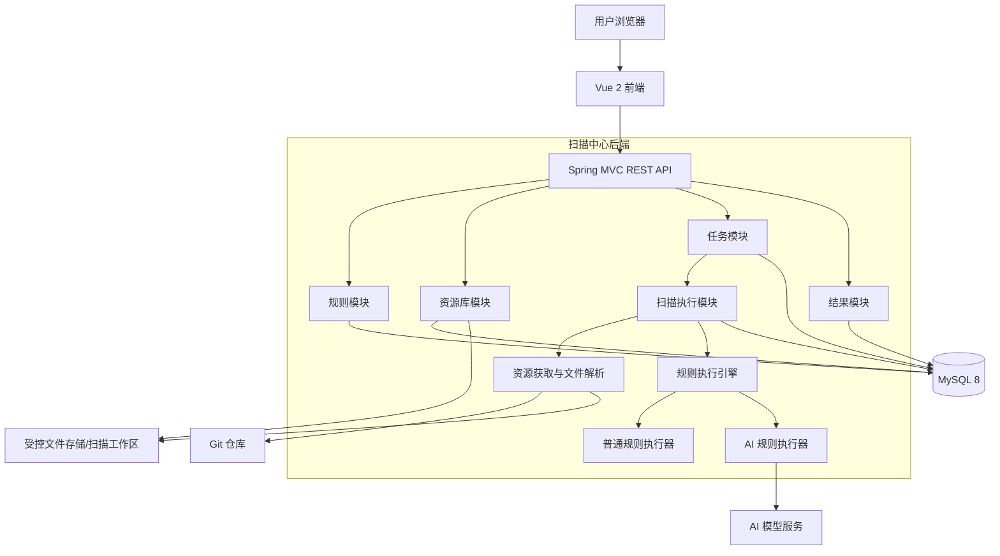
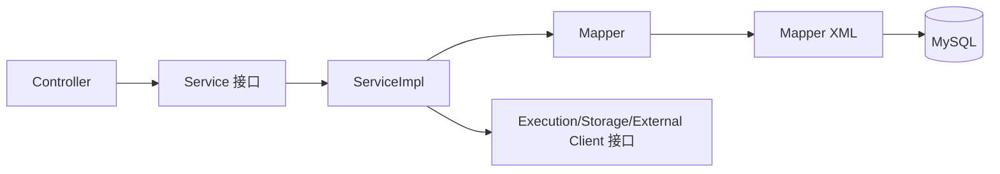
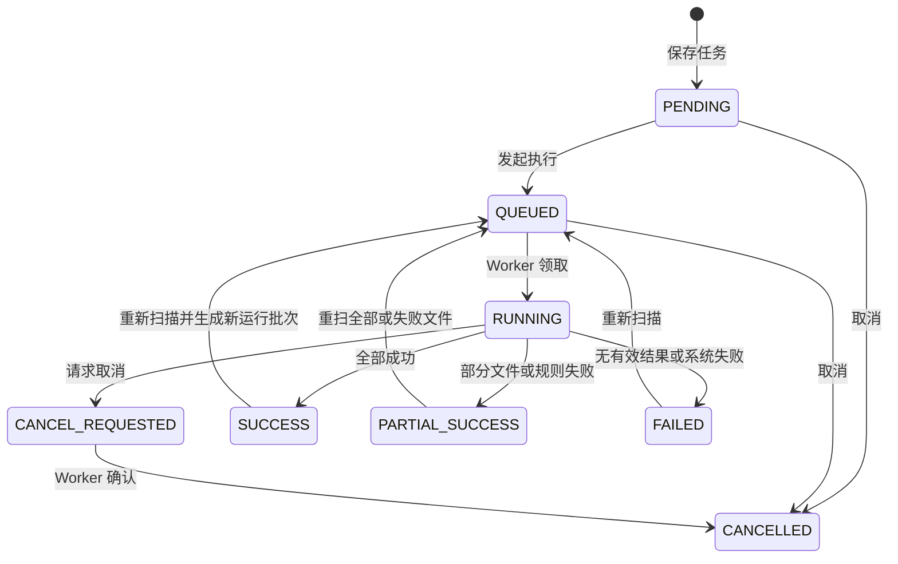
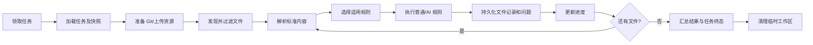
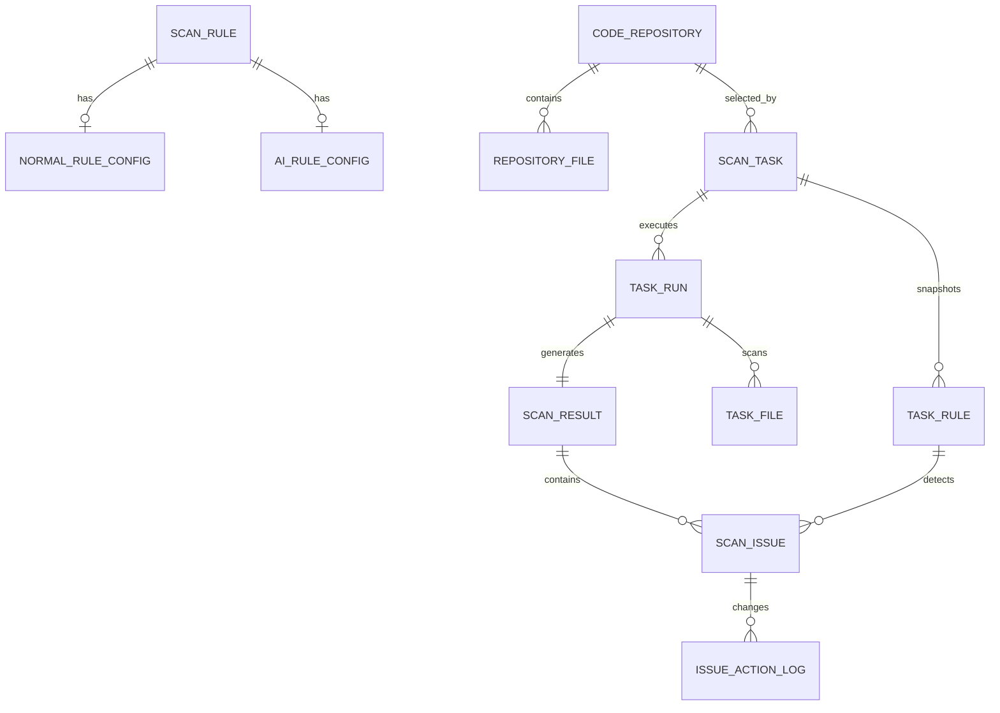
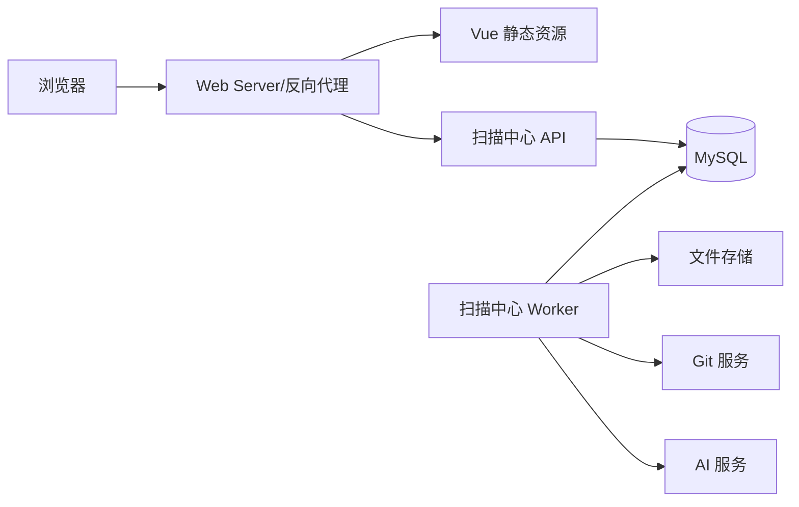

# 扫描中心代码架构

## 1. 文档目的

本文档基于《代码规约》和《扫描中心-总体方案》，定义扫描中心的总体代码架构、工程组织、模块边界、核心执行流程、数据模型和接口设计原则，作为后续详细设计、编码、测试和部署的统一依据。

本文档重点回答以下问题：

- 前后端工程如何拆分和组织；
- 规则、代码库、扫描任务和结果四个业务域如何落到代码模块；
- 普通规则与 AI 规则如何通过统一扫描框架执行；
- 长耗时扫描任务如何异步执行、取消、重试并记录进度；
- 数据、文件、凭据以及 AI 调用如何隔离和保护；
- 各层之间允许和禁止的依赖关系。

## 2. 架构约束与设计原则

### 2.1 技术基线

| 层次 | 技术选型 | 约束 |
| --- | --- | --- |
| 后端 | Spring Boot 2.0.x、Java 8 | 不使用 Spring Boot 3、Jakarta 命名空间或 Java 8 不支持的语法 |
| Web | Spring MVC、Bean Validation | RESTful JSON API，统一响应结构 |
| 持久层 | MyBatis、XML Mapper | Mapper 接口与 XML 一一对应，不使用 `SELECT *` |
| 数据库 | MySQL 8.x、InnoDB、utf8mb4 | SQL 兼容 MySQL 8 默认模式 |
| 前端 | Vue 2.x、Vue Router、Vuex、Axios | 使用 Options API，不引入 Vue 3 写法 |
| 工程管理 | Maven、npm | 前后端分别构建 |

### 2.2 核心原则

1. **前后端分离**：浏览器只通过 RESTful API 与后端交互。
2. **单体分模块起步**：首期采用模块化单体，避免在业务规模尚未明确时引入分布式复杂度；扫描执行能力保留独立进程部署边界。
3. **严格分层**：后端调用方向为 `Controller -> Service -> Mapper -> MySQL`，禁止 Controller 直接访问 Mapper。
4. **领域隔离**：规则、资源库、任务、执行、结果按业务职责划分，跨模块通过 Service 接口协作。
5. **同步管理、异步执行**：规则和资源库维护使用同步请求；实际扫描使用异步任务，避免占用 HTTP 请求线程。
6. **策略可扩展**：普通规则、AI 规则、不同文件解析器和不同资源来源均通过接口扩展，不在流程中堆叠大量条件分支。
7. **任务快照化**：任务创建时保存资源范围和规则快照，避免规则或资源库后续修改影响历史任务的可追溯性。
8. **执行可恢复**：任务、文件、规则三个层级均记录执行状态，支持失败定位、取消和失败文件重试。
9. **安全默认开启**：凭据不明文返回、不写日志；上传包防路径穿越；AI 调用前执行敏感信息控制。
10. **可观测可审计**：关键状态变化、外部调用、失败原因和问题处理动作均可追踪。

## 3. 总体架构



### 3.1 运行形态

首期建议采用一个后端代码工程、两种运行角色：

- **API 角色**：提供管理接口、参数校验、任务创建、查询和问题处理；
- **Worker 角色**：领取待执行任务并完成资源准备、文件解析、规则执行、结果汇总和清理。

在开发或小规模部署中，两种角色可运行于同一 Spring Boot 进程；业务量增加后，可使用同一代码包以不同配置分别启动 API 与 Worker。这样既保持首期简单，又避免未来拆分时重写核心代码。

MySQL 作为业务事实和任务状态的唯一持久化来源。首期不强制引入消息队列，Worker 可使用定时领取加数据库状态抢占；若后续吞吐量明显增长，再将任务分发替换为消息队列，而不改变业务模块与扫描引擎接口。

## 4. 工程与目录结构

### 4.1 仓库顶层结构

```text
ScanningCenter/
├── pom.xml                         # 后端 Maven 工程
├── src/
│   ├── main/
│   │   ├── java/com/scan/center/
│   │   └── resources/
│   └── test/
│       ├── java/com/scan/center/
│       └── resources/
├── web/                            # Vue 2 前端工程
│   ├── package.json
│   ├── public/
│   ├── src/
│   └── tests/
├── db/
│   ├── migration/                  # 正向数据库脚本
│   └── rollback/                   # 对应回滚脚本
├── deploy/                         # 部署模板和环境说明，不存放密钥
└── ai-agent/
    ├── rule/
    └── spec/
```

当前仓库仅有根 `pom.xml`，首期可以保持单 Maven 模块。只有当 Worker 需要独立发布或模块编译边界变得必要时，再升级为 Maven 多模块工程，避免过早拆分。

### 4.2 后端包结构

```text
com.scan.center
├── ScanningCenterApplication.java
├── common
│   ├── api                         # ApiResponse、PageResult、错误码
│   ├── constant                    # 通用常量
│   ├── enums                       # 通用枚举
│   └── context                     # 当前用户、请求上下文
├── config                          # MVC、MyBatis、异步线程池、JSON 等配置
├── exception                       # BusinessException、全局异常处理
├── security                        # 认证上下文、鉴权、敏感数据处理
├── rule                            # 规则维护领域
│   ├── controller
│   ├── service
│   │   └── impl
│   ├── mapper
│   └── model
│       ├── entity
│       ├── dto
│       ├── query
│       └── vo
├── repository                      # 代码仓库/文档来源领域
│   ├── controller
│   ├── service
│   │   └── impl
│   ├── mapper
│   └── model
├── task                            # 任务创建、状态与进度领域
│   ├── controller
│   ├── service
│   │   └── impl
│   ├── mapper
│   └── model
├── result                          # 扫描结果、问题处理与导出领域
│   ├── controller
│   ├── service
│   │   └── impl
│   ├── mapper
│   └── model
├── execution                       # 不直接暴露管理接口的扫描执行内核
│   ├── coordinator                 # 任务领取、编排、取消、汇总
│   ├── source                      # Git、上传文件等资源适配器
│   ├── parser                      # 文本、Markdown、Word、PDF、压缩包解析
│   ├── engine                      # 规则选择和执行调度
│   ├── executor                    # 普通规则、AI 规则执行器
│   ├── client                      # Git/AI 等外部系统客户端
│   └── model                       # 扫描上下文、标准命中结果
├── storage                         # 文件存储与临时工作区抽象
├── audit                           # 操作审计
└── util                            # 无业务状态工具类

src/main/resources
├── mapper
│   ├── rule
│   ├── repository
│   ├── task
│   ├── result
│   └── execution
├── application.yml
├── application-dev.yml
├── application-test.yml
└── logback-spring.xml
```

包结构采用“按业务模块优先、模块内再分层”的方式，既满足 MVC 分层规约，也避免所有 Controller、Service、Mapper 混在超大公共包中。

### 4.3 前端目录结构

```text
web/src
├── api
│   ├── rule.js
│   ├── repository.js
│   ├── task.js
│   └── result.js
├── assets
├── components
│   ├── common                     # 通用分页、状态标签、确认框等
│   ├── rule
│   ├── repository
│   ├── task
│   └── result
├── layout                         # 主框架、菜单、导航
├── router
│   └── index.js
├── store
│   ├── index.js
│   └── modules                    # 用户、权限及必要的跨页状态
├── utils
│   ├── request.js                 # Axios 统一封装
│   ├── auth.js
│   ├── validate.js
│   └── format.js
├── views
│   ├── rule
│   │   ├── RuleList.vue
│   │   ├── RuleEdit.vue
│   │   └── RuleTest.vue
│   ├── repository
│   │   ├── RepositoryList.vue
│   │   ├── RepositoryEdit.vue
│   │   └── RepositoryDetail.vue
│   ├── task
│   │   ├── TaskList.vue
│   │   ├── TaskCreate.vue
│   │   └── TaskDetail.vue
│   └── result
│       ├── ResultList.vue
│       ├── ResultDetail.vue
│       ├── IssueList.vue
│       └── IssueDetail.vue
├── App.vue
└── main.js
```

页面组件负责组合查询、表单和业务组件；接口 URL 只能出现在 `api` 目录；请求拦截、错误转换和认证头统一放在 `utils/request.js`。

## 5. 后端分层职责与依赖规则



| 层次 | 职责 | 禁止事项 |
| --- | --- | --- |
| Controller | 接收请求、Bean Validation、调用 Service、返回 DTO/VO | 业务判断、事务、直接调用 Mapper、直接操作文件 |
| Service | 定义业务用例和模块间协作接口 | 暴露数据库细节 |
| ServiceImpl | 业务校验、状态流转、事务边界、对象转换 | 在数据库事务中执行长耗时 Git/AI 调用 |
| Mapper/XML | 数据读写、查询和结果映射 | 业务流程、拼接用户输入、无条件更新或删除 |
| Execution | 扫描编排、文件解析、规则执行、进度上报 | 直接依赖 Controller 或前端模型 |
| Client/Adapter | 封装 Git、AI、文件存储等外部能力 | 泄漏供应商特有结构到业务层 |

跨业务模块调用只能依赖目标模块的 Service 接口，不允许直接调用目标模块的 Mapper。Entity 只在持久层和 Service 实现内部使用，对外统一使用 DTO、Query 和 VO。

## 6. 业务模块设计

### 6.1 规则模块 `rule`

负责普通规则和 AI 提示词规则的维护、复制、启停、删除校验和测试。

核心接口建议：

```java
public interface ScanRuleService {
    Long createRule(ScanRuleCreateDTO dto);
    void updateRule(Long ruleId, ScanRuleUpdateDTO dto);
    void changeStatus(Long ruleId, boolean enabled);
    Long copyRule(Long ruleId);
    void deleteRule(Long ruleId);
    RuleTestResultVO testRule(RuleTestDTO dto);
}
```

设计要点：

- `rule_code` 全局唯一；
- 普通规则与 AI 规则共享基础字段，不同配置分别存放，避免单表堆积大量互斥字段；
- 启用前必须完成配置合法性校验；正则表达式需预编译验证；
- 已被任务引用的规则不可物理删除，只能停用；
- 规则测试复用正式扫描引擎，但使用隔离的测试上下文，不产生正式任务和结果；
- 任务关联中保存规则名称、类型、风险等级和配置快照。

### 6.2 资源库模块 `repository`

负责 Git 仓库、上传文件和预留文档库来源的统一管理。

核心抽象：

```java
public interface SourceProvider {
    boolean supports(SourceType sourceType);
    ConnectionTestResult testConnection(SourceConfig config);
    PreparedSource prepare(ScanSourceContext context);
    void cleanup(PreparedSource source);
}
```

首期实现：

- `GitSourceProvider`：按任务快照中的仓库地址、分支和凭据拉取代码；
- `UploadSourceProvider`：从受控存储加载用户上传的文件或压缩包；
- `DocumentLibrarySourceProvider`：作为后续外部文档库接入扩展点。

设计要点：

- 数据库保存文件元数据和存储键，不保存大文件正文；
- 访问令牌必须加密存储，列表和详情接口仅返回是否已配置，不返回原文；
- 测试连接只返回脱敏后的成功信息或可理解的错误类型；
- 仓库删除前校验是否存在任务引用，历史任务存在时仅允许停用或逻辑删除；
- 工作目录按 `taskId/runId` 隔离，禁止不同任务复用可写目录。

### 6.3 任务模块 `task`

负责创建任务、保存扫描范围与规则快照、发起执行、取消、重扫、查询状态和进度。

任务状态：



状态变更必须通过任务 Service 的专用方法完成，更新 SQL 同时带当前状态条件，防止并发覆盖。例如 Worker 领取任务时执行等价于：

```sql
UPDATE scan_task
SET status = 'RUNNING', worker_id = #{workerId}, start_time = NOW()
WHERE id = #{taskId} AND status = 'QUEUED';
```

受影响行数为 1 才代表领取成功。

设计要点：

- “保存并立即执行”应先在事务内保存任务、扫描范围、规则快照，再在事务提交后投递执行；
- 每次重扫生成新的 `task_run`，不覆盖历史执行记录；
- 取消使用协作式取消：API 写入 `CANCEL_REQUESTED`，Worker 在文件和规则执行边界检查；
- 进度由完成文件数计算，不以日志文本作为状态来源；
- 失败文件重试只复制失败文件清单，并继续使用原任务规则快照；
- 同一任务只允许一个活动运行批次。

### 6.4 扫描执行模块 `execution`

扫描执行模块是系统核心，采用“资源准备—文件发现—内容解析—规则执行—结果归一—汇总”的流水线。



核心上下文模型建议：

```java
public class ScanContent {
    private String fileName;
    private String relativePath;
    private String fileType;
    private String content;
    private List<ContentPosition> positions;
}

public interface RuleExecutor {
    boolean supports(RuleType ruleType);
    List<RuleMatch> execute(RuleSnapshot rule, ScanContent content);
}
```

执行器实现：

- `KeywordRuleExecutor`：关键字匹配；
- `RegexRuleExecutor`：正则匹配，设置输入大小与执行超时保护，防止灾难性回溯拖垮 Worker；
- `FileConditionRuleExecutor`：文件名、路径、类型和存在性规则；
- `AiPromptRuleExecutor`：组装提示词、调用 AI 网关、校验结构化结果并转换为统一 `RuleMatch`。

所有执行器只返回标准命中模型，由统一结果写入器生成问题记录，避免每种规则自行操作数据库。

### 6.5 文件解析模块 `parser`

```java
public interface ContentParser {
    boolean supports(String fileName, String mediaType);
    ScanContent parse(Path file);
}
```

首期支持范围：

| 类型 | 处理方式 | 定位信息 |
| --- | --- | --- |
| 代码、文本、Markdown | 按统一字符集策略读取，保留行映射 | 起止行、列 |
| Word | 提取段落文本 | 段落序号；能稳定获得页码时再提供页码 |
| PDF | 按页提取文本 | 页码、页内片段 |
| ZIP | 安全解压后递归发现支持文件 | 内部相对路径 |

解析失败必须形成文件级失败记录，不能导致整个任务无条件终止。加密 PDF、损坏文档、不支持的二进制文件应返回明确错误码。

### 6.6 AI 调用模块

AI 能力通过内部 `AiModelClient` 抽象，不让具体模型供应商参数进入规则 Service：

```java
public interface AiModelClient {
    AiScanResponse scan(AiScanRequest request);
}
```

设计要求：

- 使用结构化 JSON 输出协议，响应必须进行 JSON 解析、字段校验和数量限制；
- 配置连接超时、读取超时、单次最大输入、最大输出和有限重试；
- 仅对超时、限流、临时网络故障进行重试，参数错误和内容拒绝不盲目重试；
- 记录请求追踪号、耗时、Token 用量和结果状态，不记录完整凭据及默认不记录完整文件内容；
- 超长文件按可定位的分段切片，问题位置映射回原文件；
- AI 输出属于不可信外部输入，存储和展示前进行长度限制和 HTML 转义；
- 是否允许源代码或文档发送到外部模型，由部署配置和权限策略控制。

### 6.7 结果模块 `result`

负责结果汇总查询、问题详情、问题状态处理、批量处理和导出。

问题状态：

```text
PENDING（待处理） -> CONFIRMED（已确认） -> RESOLVED（已处理）
PENDING（待处理） -> IGNORED（已忽略）
CONFIRMED（已确认） -> IGNORED（已忽略）
```

处理动作必须记录操作者、时间、处理前后状态和说明。批量更新限制单次记录数，并在 Service 中校验所有问题是否存在、是否有权限及状态转换是否合法。

导出采用流式写出或临时文件方式，避免一次性将大量问题加载到 JVM 内存；导出查询条件与列表查询使用同一 Query 模型和数据权限规则。

## 7. 核心数据模型

### 7.1 实体关系



### 7.2 核心表建议

| 表名 | 说明 | 关键字段 |
| --- | --- | --- |
| `scan_rule` | 规则基础信息 | `id`、`rule_code`、`rule_type`、`target_type`、`risk_level`、`enabled`、`deleted` |
| `normal_rule_config` | 普通规则配置 | `rule_id`、`match_type`、`match_content`、`case_sensitive`、文件过滤配置 |
| `ai_rule_config` | AI 规则配置 | `rule_id`、提示词、检查目标、判定要求、输出约束 |
| `code_repository` | 扫描对象 | `id`、`source_type`、`repository_url`、`default_branch`、`credential_id`、`enabled` |
| `repository_file` | 上传文件元数据 | `repository_id`、`storage_key`、`file_name`、`media_type`、`size`、`checksum` |
| `credential` | 加密凭据 | `id`、`credential_type`、`encrypted_value`、`masked_hint` |
| `scan_task` | 任务定义 | `id`、`task_no`、`repository_id`、范围快照、`status`、`active_run_id` |
| `task_rule` | 任务规则快照 | `task_id`、`rule_id`、规则基础与配置快照 |
| `task_run` | 单次执行批次 | `id`、`task_id`、`run_no`、`status`、计数字段、开始/结束时间、`worker_id` |
| `task_file` | 文件执行记录 | `run_id`、路径、版本、大小、校验值、状态、失败码和失败原因 |
| `scan_result` | 执行汇总 | `run_id`、扫描文件数、成功/失败数、各风险问题数 |
| `scan_issue` | 问题明细 | `result_id`、`task_rule_id`、文件路径、位置、命中内容、说明、建议、状态 |
| `issue_action_log` | 问题处理历史 | `issue_id`、原状态、新状态、说明、操作者、操作时间 |

所有业务表统一包含 `create_time`、`create_by`、`update_time`、`update_by`；需要逻辑删除的维护类数据增加 `deleted`。执行记录和审计记录原则上不做逻辑删除，不允许通过普通业务接口修改历史事实。

### 7.3 索引原则

- `scan_rule`：唯一索引 `uk_rule_code(rule_code)`；列表索引按 `deleted, enabled, rule_type, target_type` 的实际组合查询设计；
- `code_repository`：按 `deleted, enabled, source_type` 建立查询索引；
- `scan_task`：唯一索引 `uk_task_no(task_no)`，列表索引建议 `(status, create_time, id)` 和 `(repository_id, create_time, id)`；
- `task_run`：唯一索引 `(task_id, run_no)`，领取索引 `(status, create_time, id)`；
- `task_file`：唯一索引 `(run_id, relative_path)`，状态索引 `(run_id, status)`；
- `scan_issue`：根据结果页与问题中心的高频条件建立 `(result_id, risk_level, status)`、`(repository_id, status, create_time)` 等联合索引；
- 所有分页查询使用稳定排序，例如 `create_time DESC, id DESC`；数据量大时使用游标/锚点分页替代深分页。

## 8. REST API 规划

统一前缀建议为 `/api/v1`。正常响应结构：

```json
{
  "code": 0,
  "message": "success",
  "data": {}
}
```

分页 `data`：

```json
{
  "list": [],
  "pageNum": 1,
  "pageSize": 20,
  "total": 0
}
```

### 8.1 规则接口

| 方法 | 路径 | 用途 |
| --- | --- | --- |
| GET | `/api/v1/rules` | 分页查询规则 |
| POST | `/api/v1/rules` | 新增规则 |
| GET | `/api/v1/rules/{ruleId}` | 查询详情 |
| PUT | `/api/v1/rules/{ruleId}` | 修改规则 |
| DELETE | `/api/v1/rules/{ruleId}` | 删除未被引用规则 |
| POST | `/api/v1/rules/{ruleId}/copies` | 复制为新规则资源 |
| PUT | `/api/v1/rules/{ruleId}/status` | 启用或停用 |
| POST | `/api/v1/rule-tests` | 测试规则 |

### 8.2 资源库接口

| 方法 | 路径 | 用途 |
| --- | --- | --- |
| GET/POST | `/api/v1/repositories` | 查询/新增资源库 |
| GET/PUT/DELETE | `/api/v1/repositories/{repositoryId}` | 详情/修改/删除 |
| PUT | `/api/v1/repositories/{repositoryId}/status` | 启用或停用 |
| POST | `/api/v1/repository-connection-tests` | 测试尚未保存或已保存的连接配置 |
| POST | `/api/v1/repositories/{repositoryId}/files` | 上传资源文件 |

### 8.3 任务接口

| 方法 | 路径 | 用途 |
| --- | --- | --- |
| GET/POST | `/api/v1/tasks` | 查询/创建任务 |
| GET | `/api/v1/tasks/{taskId}` | 查询任务详情与当前批次 |
| DELETE | `/api/v1/tasks/{taskId}` | 删除未执行任务 |
| POST | `/api/v1/tasks/{taskId}/runs` | 发起执行或重新扫描，创建运行批次 |
| PUT | `/api/v1/tasks/{taskId}/cancellation` | 请求取消活动批次 |
| GET | `/api/v1/tasks/{taskId}/progress` | 查询轻量进度 |

### 8.4 结果与问题接口

| 方法 | 路径 | 用途 |
| --- | --- | --- |
| GET | `/api/v1/results` | 查询结果列表 |
| GET | `/api/v1/results/{resultId}` | 查询结果详情与统计 |
| GET | `/api/v1/results/{resultId}/issues` | 查询某结果的问题 |
| POST | `/api/v1/results/{resultId}/exports` | 创建结果导出 |
| GET | `/api/v1/issues` | 全局问题查询 |
| GET | `/api/v1/issues/{issueId}` | 问题详情 |
| PUT | `/api/v1/issues/{issueId}/status` | 单条问题状态处理 |
| PUT | `/api/v1/issues/status` | 批量问题状态处理 |

路径使用名词。执行、取消、复制和导出均建模为子资源或状态资源，避免在 URL 中散落无约束动词。

### 8.5 接口通用约定

- HTTP 状态码表示传输结果，业务 `code` 表示业务结果；
- 参数错误返回 400，未认证返回 401，无权限返回 403，资源不存在返回 404，状态冲突返回 409，系统异常返回 500；
- Java `Long` 类型 ID 序列化为字符串，前端始终按字符串处理；
- 日期格式统一为 `yyyy-MM-dd HH:mm:ss`，系统配置统一时区；
- Controller 入参使用 Bean Validation，文件上传同时校验扩展名、MIME、大小和内容特征；
- 错误码按模块划分，例如规则 `10xxx`、资源库 `20xxx`、任务 `30xxx`、结果 `40xxx`、系统 `90xxx`；
- 接口禁止直接返回 Entity、凭据密文、工作区绝对路径和异常堆栈。

## 9. 异步执行、并发与一致性

### 9.1 Worker 领取机制

Worker 周期性查询少量 `QUEUED` 任务，并通过带状态条件的更新抢占。单次只领取线程池当前可承载的任务，避免将大量任务预取到 JVM 内存。

建议分别配置：

- 任务级并发数；
- 单任务文件并发数；
- AI 调用并发数和速率限制；
- Git/文件解析/AI 的超时；
- 单文件大小、任务总文件数、解压总大小和目录深度限制。

线程池必须有界，拒绝策略不能静默丢任务。任务并发和 AI 并发分池隔离，防止 AI 调用阻塞普通规则扫描。

### 9.2 事务边界

- 规则、资源库、任务定义和问题状态变更：在 Service 公共方法上开启短事务；
- Git 拉取、文件解析和 AI 调用：禁止包裹在数据库长事务内；
- 单文件扫描结果：以文件为小事务写入问题、文件状态和进度；
- 最终汇总：单独事务校验文件状态并生成 `scan_result`、更新 `task_run` 与 `scan_task`；
- 事务提交后触发的执行动作使用 `afterCommit` 机制，避免任务数据尚未提交就被 Worker 获取。

### 9.3 幂等与恢复

- 文件问题写入使用 `run_id + task_rule_id + file_path + position + fingerprint` 形成业务唯一性约束或幂等键；
- Worker 异常退出后，通过心跳时间和超时策略回收长期无心跳的 `RUNNING` 批次；
- 恢复时只处理未成功的文件，已成功文件不重复写入；
- 汇总数据可以从文件记录和问题明细重新计算，不把不可重建的状态只保存在内存；
- 外部调用重试采用有限次数和退避，重试结果记录在执行明细中。

## 10. 文件存储与工作区

文件能力分为持久存储和临时工作区：

- **持久存储**：保存用户上传的原始文件、必要的导出文件；数据库只保存存储键和元数据；
- **临时工作区**：保存某次运行拉取的 Git 仓库、解压内容和处理中间文件，任务结束后按策略清理。

安全要求：

- 文件名由系统生成，原始文件名只作为元数据；
- 规范化路径后必须确认目标仍位于任务工作区内，防止 `../` 和绝对路径逃逸；
- ZIP 解压限制单文件大小、总大小、文件数和压缩比，拒绝符号链接及目录穿越；
- 默认跳过二进制、生成目录和超限文件，并记录跳过原因；
- 工作区不可通过 Web 服务器直接访问；下载必须经过权限校验；
- 持久文件可配置保留周期和清理任务，历史结果需保留文件校验值及版本信息以便追溯。

## 11. 安全设计

### 11.1 认证与授权

扫描中心接入现有统一认证体系；若暂无统一体系，后端仍需保留认证过滤器和当前用户上下文接口。建议权限粒度：

- 规则查看/维护/启停；
- 资源库查看/维护/凭据配置；
- 任务查看/创建/执行/取消；
- 结果查看/导出；
- 问题确认/处理/忽略；
- 系统配置和审计查看。

前端按钮权限只用于体验优化，所有权限必须在后端再次校验。资源库、任务和结果还需根据组织或项目范围执行数据权限过滤。

### 11.2 敏感信息

- Git Token、密码、AI 密钥只以加密形式持久化，密钥来自部署环境或密钥管理服务；
- 日志对仓库 URL 中凭据、Authorization、Token 和正文片段进行脱敏；
- API 详情不返回密文，只返回 `credentialConfigured` 和脱敏提示；
- 更新资源库时，凭据字段为空表示保持不变，显式清除使用独立字段，避免误覆盖；
- AI 外发前可配置敏感信息检测、脱敏或禁止外发策略。

### 11.3 输入与输出安全

- MyBatis 全部使用 `#{}` 参数绑定；动态排序字段使用后端白名单映射；
- 正则、提示词、文件路径、URL 和说明字段均限制长度和格式；
- 禁止执行被扫描仓库中的脚本、构建命令和宏；扫描过程只读取内容；
- 前端不使用未经可信处理的 `v-html` 展示 AI、代码或文档内容；
- 命中片段展示和导出时进行公式注入、HTML 注入等防护。

## 12. 配置与外部依赖

配置统一使用带业务前缀的配置项：

```yaml
scan-center:
  worker:
    enabled: true
    task-concurrency: 2
    file-concurrency-per-task: 4
  workspace:
    root: ${SCAN_CENTER_WORKSPACE_ROOT}
    retention-hours: 24
  upload:
    max-file-size: 50MB
    max-archive-expanded-size: 500MB
  git:
    connect-timeout-seconds: 10
    operation-timeout-seconds: 120
  ai:
    enabled: false
    connect-timeout-seconds: 10
    read-timeout-seconds: 120
    max-concurrency: 2
```

仓库中只提交非敏感默认值和环境变量占位符。数据库密码、Git 凭据、AI Key 等由部署环境注入。外部客户端必须统一封装超时、错误分类和日志，不允许业务代码直接散落 HTTP 调用。

## 13. 日志、监控与审计

### 13.1 日志

日志使用统一框架和参数化输出。每次请求和任务运行至少携带：

- `traceId`：HTTP 请求链路标识；
- `taskId`、`runId`：扫描执行标识；
- `repositoryId`：资源来源标识；
- `filePathHash` 或受控相对路径：文件定位；
- `ruleId`：规则执行定位。

异常日志记录错误码、必要上下文和堆栈，但不记录凭据、完整文件内容或完整 AI 请求。

### 13.2 核心指标

- 排队、运行、成功、部分成功、失败和超时任务数；
- 任务等待时间、执行时间、文件处理吞吐；
- 按解析器和规则执行器统计的成功率与耗时；
- AI 调用成功率、限流次数、超时、Token 用量；
- Worker 活跃数、线程池队列长度、数据库连接池使用率；
- 工作区和持久文件存储占用量。

### 13.3 审计

规则变更、资源库凭据变更、任务执行与取消、结果导出、问题状态处理均写入审计日志。审计内容包含对象、动作、操作者、时间和变更摘要，不保存敏感值原文。

## 14. 前端架构

### 14.1 页面与路由

```text
/rules
/rules/create
/rules/:ruleId/edit
/rules/:ruleId/test
/repositories
/repositories/create
/repositories/:repositoryId
/tasks
/tasks/create
/tasks/:taskId
/results
/results/:resultId
/issues
/issues/:issueId
```

### 14.2 状态管理

- 登录用户、权限、全局字典等跨页面共享状态放入 Vuex；
- 查询条件、分页、表单步骤和加载状态保留在页面组件；
- 页面跳转需要保存的任务创建草稿可放入专用 Vuex 模块，并在提交或取消后清理；
- 不将接口返回的所有列表无差别复制到 Vuex。

### 14.3 请求与进度展示

Axios 统一处理 `baseURL`、超时、认证头、业务错误和 HTTP 错误。页面提交时设置 loading 并禁用重复提交。

任务详情首期使用定时轮询 `/progress`，运行中建议每 2～5 秒查询一次，页面不可见或任务进入终态后停止。后续若实时性要求提高，可将实现替换为 SSE，但页面消费的进度模型保持不变。

### 14.4 大内容展示

- 问题列表只返回摘要，完整上下文在详情接口按需加载；
- 代码片段使用纯文本代码查看组件并限制最大显示长度；
- 大列表采用后端分页，筛选条件由 Query 对象统一传递；
- 导出由后端生成，前端不拉取全部数据后自行拼装。

## 15. 测试架构

| 测试层次 | 重点范围 |
| --- | --- |
| 单元测试 | 状态机、规则适用性、关键字/正则匹配、文件过滤、快照生成、问题状态转换 |
| Service 测试 | 事务、删除引用校验、任务创建、取消、重试、权限和幂等 |
| Mapper 集成测试 | 动态查询、稳定分页、并发领取、汇总 SQL、边界和空结果 |
| Controller 测试 | 参数校验、认证授权、统一响应、异常映射、文件上传限制 |
| 扫描集成测试 | Git/上传资源准备、ZIP 安全、各文件解析器、普通规则到结果落库全链路 |
| AI 契约测试 | 请求组装、超时、限流、非法 JSON、字段缺失、超长响应和降级处理 |
| 前端测试 | 页面加载、查询、分步建任务、重复提交、轮询停止、错误提示和权限控制 |

测试数据不得包含真实凭据和敏感文档。外部 Git 与 AI 服务使用可控的 Stub/Mock；至少保留一组不依赖外网的端到端扫描样例。

## 16. 构建、部署与环境

### 16.1 构建产物

- 后端：Maven 构建可执行 JAR；
- 前端：npm 构建静态资源；
- 数据库：版本化正向与回滚 SQL；
- 部署配置：按环境提供模板，不包含密钥。

### 16.2 建议部署拓扑



开发环境可合并 API 与 Worker；测试和生产环境建议将 Worker 独立运行，以隔离文件解析、正则匹配和 AI 调用对 API 延迟的影响。API 与 Worker 使用相同版本发布，数据库脚本先执行兼容性变更，再滚动更新应用。

## 17. 关键编码约定

### 17.1 命名示例

| 类型 | 示例 |
| --- | --- |
| Controller | `ScanTaskController` |
| Service | `ScanTaskService`、`ScanTaskServiceImpl` |
| Mapper | `ScanTaskMapper`、`ScanTaskMapper.xml` |
| Entity | `ScanTaskEntity` |
| DTO | `ScanTaskCreateDTO`、`IssueStatusUpdateDTO` |
| Query | `ScanTaskPageQuery`、`ScanIssuePageQuery` |
| VO | `ScanTaskDetailVO`、`ScanIssueDetailVO` |
| 枚举 | `TaskStatus`、`RuleType`、`RiskLevel` |

### 17.2 对象转换

Controller 不组装 Entity。DTO 到 Entity、Entity 到 VO 的转换放在对应业务模块内的转换器或 Service 实现中。转换代码不得通过反射式工具无差别复制安全敏感字段。

### 17.3 枚举与状态

数据库存储稳定编码，Java 使用枚举集中定义，不在业务代码中散落字符串或数字。非法状态转换统一抛出业务异常，由全局异常处理器返回 409 或对应业务错误码。

## 18. 分阶段落地建议

### 18.1 第一阶段：形成最小业务闭环

- 规则、资源库、任务、结果四个模块的基础 CRUD；
- Git 与文件上传两种来源；
- 文本、代码、Markdown 与 ZIP；
- 关键字、正则、文件条件普通规则；
- 单 Worker 异步执行、进度查询、取消；
- 结果汇总、问题查询和状态处理；
- 基础权限、审计、日志与文件安全控制。

### 18.2 第二阶段：文档与 AI 能力

- Word、PDF 解析和定位；
- AI 提示词执行器、结构化输出、切片和调用治理；
- 失败文件重试、结果导出；
- Worker 心跳和异常任务恢复；
- 完整监控指标。

### 18.3 第三阶段：规模化扩展

- 多 Worker 水平扩展；
- 按实际负载评估消息队列；
- SSE 实时进度；
- 对象存储、文档库适配器；
- 规则版本管理、增量扫描和结果趋势分析。

## 19. 架构决策总结

| 决策 | 结论 | 原因 |
| --- | --- | --- |
| 应用形态 | 模块化单体，API/Worker 可分角色运行 | 符合现有技术栈，控制首期复杂度，同时保留扩展边界 |
| 扫描执行 | 异步任务流水线 | 扫描、Git 和 AI 均可能长耗时，不能占用 HTTP 请求线程 |
| 任务分发 | 首期数据库状态抢占 | 减少基础设施依赖；吞吐提升后可替换消息队列 |
| 规则扩展 | `RuleExecutor` 策略接口 | 普通规则和 AI 规则统一输入输出，便于扩展 |
| 来源扩展 | `SourceProvider` 适配器接口 | 隔离 Git、上传文件和未来文档库差异 |
| 文件处理 | 持久存储与任务工作区分离 | 兼顾追溯、安全隔离和任务后清理 |
| 历史一致性 | 任务规则和范围快照 | 保证规则修改后历史扫描仍可复现和解释 |
| 前端进度 | 首期轮询，预留 SSE | Vue 2 实现简单稳定，后续可无损升级实时通道 |

本架构在不突破既定 Spring Boot 2.0.x、Java 8、MyBatis、MySQL 8 和 Vue 2 技术约束的前提下，覆盖了扫描中心从规则维护、资源准备、任务执行到结果处理的完整代码边界，可作为详细数据库设计、接口设计和工程初始化的上层依据。
