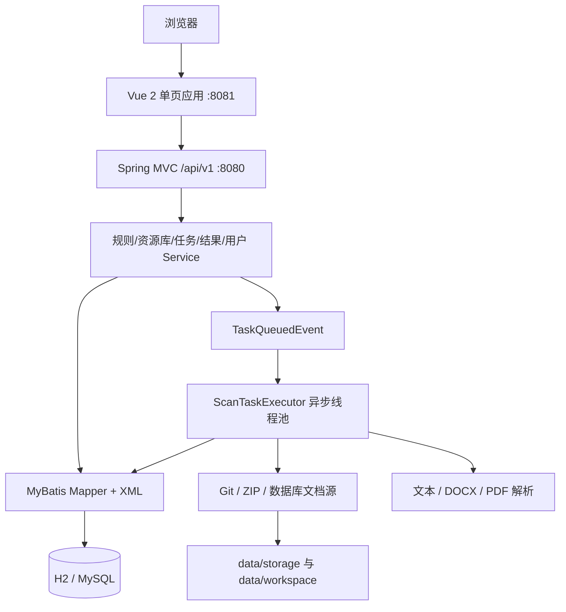
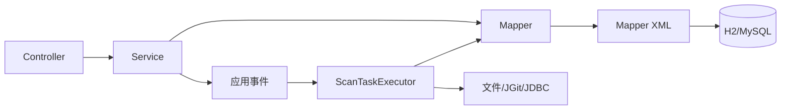
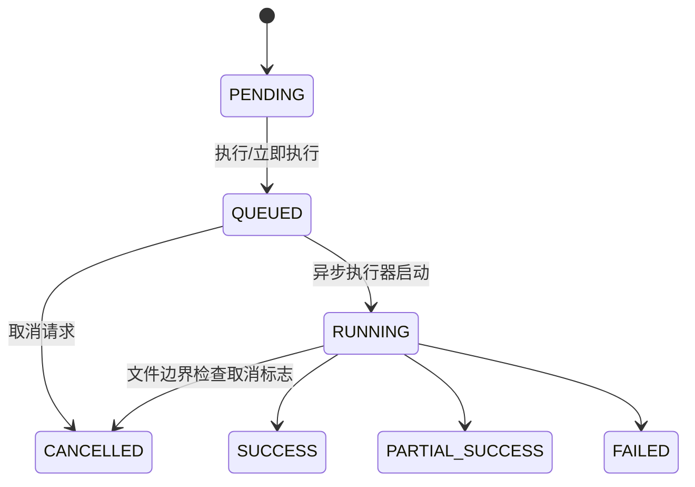
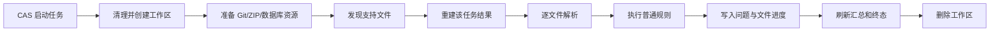
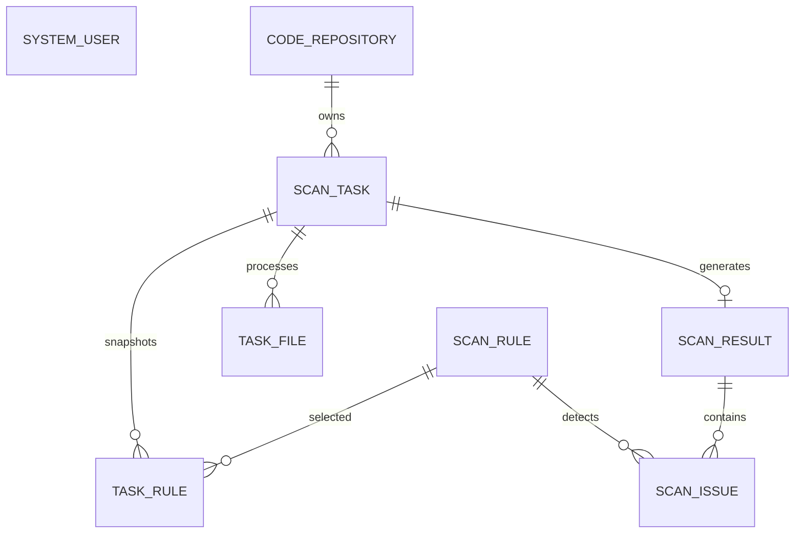

# 扫描中心代码架构

## 1. 文档目的

本文档描述当前仓库已经落地的代码架构，是开发、测试和部署的共同基线。内容以 `src/main`、`web/src`、`pom.xml` 和数据库脚本为准；尚未实现的能力会明确标注，不再将规划接口写成现状。

## 2. 架构约束与设计原则

### 2.1 技术基线

| 层次 | 当前选型 |
| --- | --- |
| 后端 | Spring Boot 2.0.9、Java 8、Spring MVC、Bean Validation |
| 持久层 | MyBatis 1.3.2、XML Mapper |
| 数据库 | 开发环境 H2 文件库（MySQL 兼容模式），生产环境 MySQL 8 |
| 扫描依赖 | JGit 5.13、Apache POI 4.1.2、PDFBox 2.0.30 |
| 前端 | Vue 2.7、Vue Router 3.6、Vuex 3.6、Axios 0.27、Element UI 2.15 |
| 构建 | Maven 单模块、Vue CLI 4 |

### 2.2 核心原则

1. 前后端通过 `/api/v1` REST 接口分离。
2. 后端保持 `Controller -> Service -> Mapper/XML` 分层，扫描执行器作为独立执行组件。
3. 管理操作同步完成，扫描通过 Spring 事件和固定线程池异步执行。
4. 任务创建时写入规则 JSON 快照；当前执行查询仍使用关联规则实体。
5. Git、上传 ZIP、数据库文档源统一转换为任务工作区文件后再扫描。
6. 文件级失败隔离，任务按成功/失败文件数汇总为成功、部分成功或失败。
7. 上传和解压路径必须留在受控目录，列表/详情对令牌和数据库密码做掩码。

## 3. 总体架构



### 3.1 运行形态

当前是单体应用：API 与扫描 Worker 运行在同一个 Spring Boot 进程中。`@EventListener` 接收任务排队事件，`@Async` 使用 2 个固定工作线程和容量为 100 的队列执行。当前没有独立 Worker、定时抢占、消息队列或跨进程恢复机制。

## 4. 工程与目录结构

### 4.1 仓库顶层结构

```text
Scanning Center/
├── pom.xml
├── README.md
├── src/main/java/com/scan/center
├── src/main/resources
├── src/test/java/com/scan/center
├── web
├── data                       # 运行时 H2、上传文件和工作区
└── ai-agent
    ├── rule
    └── spec
```

仓库目前没有 `db/`、`deploy/` 和后端 Maven 子模块；数据库初始化脚本位于 `src/main/resources/schema.sql` 与 `data.sql`。

### 4.2 后端包结构

```text
com.scan.center
├── common       # ApiResponse、PageResult、固定审计操作者
├── config       # CORS 与异步线程池
├── controller   # Rule/Repository/Task/Result/User REST 控制器
├── dto          # 保存、创建和状态更新请求对象
├── exception    # 业务异常与统一异常处理
├── execution    # ScanTaskExecutor、ZipExtractor
├── mapper       # MyBatis Mapper 接口
├── model        # 数据模型
└── service      # 业务服务实现

resources
├── mapper       # 五组业务 Mapper XML
├── application.yml
├── application-dev.yml
├── application-prod.yml
├── schema.sql
└── data.sql
```

当前代码采用全局分层包，而不是旧设计中的“按业务域分包、域内再分层”。Service 为具体类，未拆分接口与 `impl`。

### 4.3 前端目录结构

```text
web/src
├── api/index.js
├── router/index.js
├── utils/request.js
├── views
│   ├── RuleView.vue
│   ├── RepositoryView.vue
│   ├── TaskView.vue
│   ├── ResultView.vue
│   ├── IssueView.vue
│   └── UserView.vue
├── App.vue
├── main.js
└── styles.css
```

当前每个业务菜单由单个 View 组件承载列表、表单或详情交互；所有 API 集中在 `api/index.js`，尚未按领域拆文件，也没有独立组件、layout 或 store 模块目录。

## 5. 后端分层职责与依赖规则



Controller 负责参数绑定、校验和统一响应；Service 负责业务校验、事务和状态转换；Mapper/XML 负责查询与更新；执行器负责资源准备、解析、匹配、问题落库、进度及清理。`ScanTaskExecutor` 当前会直接调用 Mapper，并通过 `RepositoryService` 获取未掩码的内部配置。

## 6. 业务模块设计

### 6.1 规则模块 `rule`

已实现规则分页、详情、新增、编辑、逻辑删除、复制及启停。规则类型支持 `NORMAL` 和 `AI` 数据建模；普通规则执行支持 `KEYWORD` 与 `REGEX`，文件类型与排除模式用分隔字符串保存。AI 提示词可以维护，但执行器会跳过 `AI` 规则，尚未接入模型调用，也没有规则测试接口。

### 6.2 资源库模块 `repository`

已实现 `GIT`、`UPLOAD`、`DATABASE` 三种来源：

- Git：按地址、可选分支、用户名和令牌通过 JGit 克隆；
- 上传：每个资源库保存一个 ZIP，最大请求受 Spring 50 MB 单文件/100 MB 请求限制；
- 数据库：使用应用数据源只读连接执行配置查询，最多 10000 行、超时 60 秒，将名称/内容/类型列转为工作区文件。

数据库源目前使用应用自身 `DataSource`；已保存的 `databaseUrl`、用户名和密码并未用于创建独立连接。所谓 `encryptedToken`、`encryptedDatabasePassword` 当前仅是字段名，写入值尚未加密；对外读取会替换为 `******`。

### 6.3 任务模块 `task`

任务创建校验资源库启用状态、上传 ZIP 是否存在及所选规则是否有效，生成 `SCAN<时间戳>` 编号和规则快照。支持保存为 `PENDING` 或立即排队，待执行任务可执行、删除，排队或运行任务可请求取消。已执行任务不能再次执行，当前没有重新扫描、失败文件重试和 `task_run` 多批次模型。



### 6.4 扫描执行模块 `execution`



执行器默认排除 `.git`、`node_modules`、`target`；匹配资源库文件类型及排除片段。每个命中生成一条 `scan_issue`，单文件最多累计 10000 个命中。取消在文件处理边界检查，因此不会中断正在解析或扫描的单个文件。

### 6.5 文件解析模块 `parser`

当前解析逻辑内置于 `ScanTaskExecutor`：

| 文件 | 实现 |
| --- | --- |
| `java/js/vue/xml/yml/yaml/json/md/txt/sql/properties/html/css` | UTF-8 全量读取，单文件不超过 10 MB |
| `docx` | Apache POI 提取段落文本 |
| `pdf` | PDFBox 提取全文文本 |
| `zip` | `ZipExtractor` 安全解压后递归发现 |

普通文本问题提供行号；DOCX/PDF 目前也是按提取文本换行计算行号，不提供页码或段落号。解析失败记录为文件级失败。

### 6.6 AI 调用模块

当前仅有规则字段 `prompt_content` 和前端录入能力，没有 `AiModelClient`、模型配置或远程调用。执行扫描时明确跳过 `AI` 规则，因此 AI 扫描、Token 统计、分段和模型响应校验均属于后续能力。

### 6.7 结果模块 `result`

已实现结果分页与详情、问题分页与详情、问题状态更新以及 XLSX 导出。状态允许 `PENDING`、`CONFIRMED`、`RESOLVED`、`IGNORED`，服务当前只校验目标值，不限制状态转换路径；处理人固定写为 `system`。导出使用 Apache POI 在内存中生成工作簿，不是流式导出。

## 7. 核心数据模型

### 7.1 实体关系



数据库脚本未声明外键，关系由业务代码和 ID 字段维护。

### 7.2 核心表建议

当前实际表如下：

| 表 | 作用 |
| --- | --- |
| `system_user` | 用户资料、角色、启停及逻辑删除 |
| `scan_rule` | 普通/AI 规则及全部配置字段 |
| `code_repository` | Git、上传 ZIP、数据库文档源配置 |
| `scan_task` | 任务、范围 JSON、状态、文件与问题统计 |
| `task_rule` | 任务与规则关联及 JSON 快照 |
| `task_file` | 每个相对路径的执行状态、错误及问题数 |
| `scan_result` | 每个任务唯一一条结果汇总 |
| `scan_issue` | 命中位置、内容、建议与处理信息 |

当前没有 `normal_rule_config`、`ai_rule_config`、`repository_file`、`task_run` 或问题动作日志表。

### 7.3 索引原则

已创建规则编码和任务编号唯一约束、任务规则组合唯一约束、任务结果唯一约束，以及 `scan_task(status, create_time)`、`scan_issue(repository_id, status, create_time)`、`system_user(deleted, enabled, role_code)` 查询索引。常用关键字查询主要使用模糊匹配，尚无全文索引。

## 8. REST API 规划

所有 JSON 业务接口使用 `ApiResponse<T>`；分页使用 `PageResult<T>`，页码从 1 开始，页大小限制为 1～100。导出接口直接返回二进制响应。

### 8.1 规则接口

| 方法 | 路径 | 功能 |
| --- | --- | --- |
| GET/POST | `/api/v1/rules` | 分页/新增 |
| GET/PUT/DELETE | `/api/v1/rules/{id}` | 详情/更新/逻辑删除 |
| POST | `/api/v1/rules/{id}/copies` | 复制 |
| PUT | `/api/v1/rules/{id}/status?enabled=` | 启停 |

### 8.2 资源库接口

| 方法 | 路径 | 功能 |
| --- | --- | --- |
| GET/POST | `/api/v1/repositories` | 分页/新增 |
| GET/PUT/DELETE | `/api/v1/repositories/{id}` | 详情/更新/逻辑删除 |
| PUT | `/api/v1/repositories/{id}/status?enabled=` | 启停 |
| POST | `/api/v1/repositories/{id}/files` | 上传 ZIP |

### 8.3 任务接口

| 方法 | 路径 | 功能 |
| --- | --- | --- |
| GET/POST | `/api/v1/tasks` | 分页/创建 |
| GET/DELETE | `/api/v1/tasks/{id}` | 详情/删除待执行任务 |
| POST | `/api/v1/tasks/{id}/runs` | 执行待执行任务 |
| PUT | `/api/v1/tasks/{id}/cancellation` | 请求取消 |

### 8.4 结果与问题接口

| 方法 | 路径 | 功能 |
| --- | --- | --- |
| GET | `/api/v1/results`、`/results/{id}` | 结果分页、详情 |
| GET | `/api/v1/issues`、`/issues/{id}` | 问题分页、详情 |
| GET | `/api/v1/issues/export` | 按相同筛选条件导出 XLSX |
| PUT | `/api/v1/issues/{id}/status` | 更新状态及处理说明 |

用户管理另提供 `/api/v1/users` 的分页、新增、详情、更新、启停和删除接口。

### 8.5 接口通用约定

前端 Axios 基地址默认为 `http://localhost:8080/api/v1`。后端允许来自 `http://localhost:8081` 的带凭据跨域 GET/POST/PUT/DELETE。全局异常处理将校验错误、业务异常和系统异常转换为统一响应；当前没有认证头、登录态或权限拦截器。

## 9. 异步执行、并发与一致性

### 9.1 Worker 领取机制

任务先由条件更新从 `PENDING` 变为 `QUEUED`，执行器再以条件更新从 `QUEUED` 变为 `RUNNING`；受影响行数不是 1 时直接返回。事件仅存在于当前 JVM 内存中，应用在排队后、执行前退出会遗留 `QUEUED` 任务。

### 9.2 事务边界

任务创建/排队、规则/资源库/用户变更和问题处理由 Service 事务保护。扫描执行整体没有长事务，每个 Mapper 调用独立落库。当前事件在事务内发布，监听器也未使用 `@TransactionalEventListener(AFTER_COMMIT)`，这是现实现需要注意的一致性边界。

### 9.3 幂等与恢复

状态条件更新避免同一任务重复启动；执行开始后会删除该任务旧问题和旧汇总再重建结果。系统没有启动恢复、自动重试或运行批次历史；接口禁止已执行任务再次运行。

## 10. 文件存储与工作区

默认持久目录为 `./data/storage`，临时目录为 `./data/workspace/{taskId}`。上传文件使用 UUID 存储键；执行前后递归清理任务工作区。ZIP 解压需通过 `ZipExtractor` 的路径边界和压缩包安全检查。Git 凭据和数据库配置保存在数据库中，工作区只保留扫描期间文件。

## 11. 安全设计

### 11.1 认证与授权

当前实现了用户资料 CRUD 和 `ADMIN/USER` 等角色字段，但没有登录、密码、会话、令牌校验或接口鉴权。固定审计操作者为 `admin`，用户管理不能视为已完成的安全认证模块。

### 11.2 敏感信息

列表和详情返回前会把 Git token 与数据库密码掩码为 `******`，编辑时空值或掩码会保留旧值。但数据库列中的值当前是明文，字段名中的 `encrypted` 不代表已经加密。生产使用前应补充密钥管理和真正的加密存储。

### 11.3 输入与输出安全

DTO 有非空、长度和邮箱校验；文件名经过归一化，存储/工作区路径检查边界，ZIP 使用安全解压；数据库查询设置只读、行数和超时。当前未限制数据库查询只能为 SELECT，正则无超时保护，前端内容展示需继续依靠 Vue 默认转义。

## 12. 配置与外部依赖

| 配置 | 默认/来源 |
| --- | --- |
| 服务端口 | 8080 |
| 默认 profile | `dev` |
| H2 | `jdbc:h2:file:./data/scanning-center`，MySQL 兼容模式 |
| MySQL | `DB_URL`、`DB_USERNAME`、`DB_PASSWORD` |
| 上传限制 | 单文件 50 MB、请求 100 MB |
| 存储/工作区 | `./data/storage`、`./data/workspace` |
| 扫描线程 | 实际固定为 2；`worker-threads` 配置尚未接入线程池 |

## 13. 日志、监控与审计

### 13.1 日志

执行器记录任务级错误、文件级失败和清理失败，日志含任务 ID 与相对路径。当前没有请求追踪 ID、结构化日志配置和独立 `logback-spring.xml`。

### 13.2 核心指标

进度、成功/失败文件数和问题数持久化在任务及结果表，前端可轮询展示。当前没有 Actuator、Micrometer、外部指标系统或告警。

### 13.3 审计

规则、资源库、任务、结果和问题保存 `operator_user_id/name`，目前统一使用固定 admin；问题另保存 handler、处理时间和说明。没有独立审计日志或问题状态动作历史表。

## 14. 前端架构

### 14.1 页面与路由

Hash 路由包括 `/rules`、`/repositories`、`/tasks`、`/results`、`/issues`、`/users`，根路径重定向至规则页。`App.vue` 提供六个菜单，详情和编辑主要通过当前页面弹窗/区域完成。

### 14.2 状态管理

项目安装了 Vuex，但当前未创建 store，也没有全局用户或权限状态。页面以组件本地状态管理查询、分页、表单和对话框。

### 14.3 请求与进度展示

`utils/request.js` 统一处理 Axios 请求和业务响应；API 方法集中于 `api/index.js`。任务页通过定时刷新/手动查询获得进度，没有 SSE 或 WebSocket。

### 14.4 大内容展示

问题详情展示匹配内容和上下文，导出用于离线查看大量结果。当前没有虚拟滚动、代码高亮或超大文本分片组件。

## 15. 测试架构

现有测试包括 Spring 上下文启动测试和 `ZipExtractorTests`，覆盖正常解压、路径穿越及压缩炸弹保护。规则、资源库、任务状态、Mapper、REST 和前端尚无自动化测试。测试运行会使用 Spring 配置和本地数据目录，应继续补充隔离数据库与临时目录。

## 16. 构建、部署与环境

### 16.1 构建产物

后端通过 Maven 生成 `target/scanning-center-1.0.0.jar`；前端通过 `npm run build` 生成 `web/dist`。两者当前分别部署，后端不内嵌前端产物。

### 16.2 建议部署拓扑

当前可验证拓扑为浏览器访问 Vue 开发服务或静态站点，前端调用单个 Spring Boot 实例，后端连接 H2（开发）或 MySQL（生产），并使用本机持久目录。多实例部署会造成事件和本地工作区不共享，必须先引入可靠任务分发和共享存储。

## 17. 关键编码约定

### 17.1 命名示例

控制器以 `*Controller`、服务以 `*Service`、持久层以 `*Mapper` 命名；请求对象以 `*DTO` 命名；表字段使用下划线、Java 字段使用驼峰。状态和类型当前以大写字符串存储。

### 17.2 对象转换

资源库和规则保存使用 `BeanUtils.copyProperties`，Mapper 直接返回 model；当前没有 Entity/VO 分离或专用转换器。

### 17.3 枚举与状态

当前未定义 Java enum。主要字符串包括规则 `NORMAL/AI`、匹配 `KEYWORD/REGEX`、来源 `GIT/UPLOAD/DATABASE`、任务 `PENDING/QUEUED/RUNNING/SUCCESS/PARTIAL_SUCCESS/FAILED/CANCELLED`、问题 `PENDING/CONFIRMED/RESOLVED/IGNORED`。

## 18. 分阶段落地建议

### 18.1 第一阶段：形成最小业务闭环

当前已完成：规则、三类资源库、任务异步执行、关键字/正则扫描、文本/DOCX/PDF 解析、结果与问题处理、XLSX 导出、用户资料管理和基础前端页面。

### 18.2 第二阶段：文档与 AI 能力

优先补齐 AI 网关适配器、结构化响应校验、输入分段与位置映射；完善 DOCX 段落和 PDF 页码定位；让数据库文档源使用其独立连接配置，并增加连接测试。

### 18.3 第三阶段：规模化扩展

引入事务提交后可靠投递、队列任务恢复、运行批次与重扫、可配置 Worker、多实例共享存储、认证授权、凭据加密、审计历史、监控告警及更完整的自动化测试。

## 19. 架构决策总结

| 决策 | 当前结论 |
| --- | --- |
| 应用形态 | Spring Boot 模块化单体，API 与 Worker 同进程 |
| 扫描触发 | 事务内发布 Spring 应用事件，固定线程池异步消费 |
| 数据库 | H2 开发、MySQL 生产，共用一套初始化 SQL |
| 扫描来源 | Git、单 ZIP 上传、数据库查询结果 |
| 执行规则 | 普通关键字/正则已执行；AI 仅建模未执行 |
| 文件能力 | UTF-8 文本、DOCX、PDF；ZIP 为资源封装 |
| 历史模型 | 每任务单结果，无运行批次；规则快照已保存 |
| 前端 | 六个 Hash 路由页面，Axios 集中 API，轮询进度 |

本版本将“已经实现”和“后续建议”分开陈述，可直接作为当前代码维护基线。
