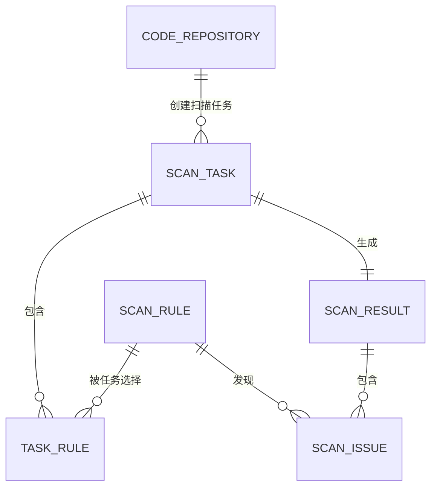

# 代码与文档扫描中心功能方案

## 1. 建设目标

建设一个统一的代码与文档扫描中心，用户可以维护扫描规则或 AI 提示词，维护需要扫描的代码库或文档库，创建并执行扫描任务，最后查看和处理扫描结果。

本方案只描述产品功能模块和页面功能，不涉及技术架构、部署方案、性能、安全等非功能设计。

## 2. 功能范围

扫描中心包含以下四个一级菜单：

1. 规则维护
2. 代码库维护
3. 扫描任务中心
4. 结果中心

整体业务流程如下：

## 3. 功能菜单总览

| 一级菜单 | 二级模块 | 功能说明 |
| --- | --- | --- |
| 规则维护 | 规则列表 | 查询、新增、编辑、复制、启用和停用规则 |
| 规则维护 | 规则编辑 | 维护普通规则或 AI 提示词 |
| 规则维护 | 规则测试 | 使用样例内容测试规则扫描效果 |
| 代码库维护 | 代码库列表 | 维护需要扫描的代码仓库或文档来源 |
| 代码库维护 | 代码库详情 | 维护连接信息、扫描范围和基础信息 |
| 扫描任务中心 | 任务列表 | 查看和管理所有扫描任务 |
| 扫描任务中心 | 新建任务 | 选择代码库、扫描范围和扫描规则 |
| 扫描任务中心 | 任务详情 | 查看扫描进度、执行信息和结果汇总 |
| 结果中心 | 结果列表 | 查看每次扫描任务的总体结果 |
| 结果中心 | 问题列表 | 查看扫描发现的全部问题 |
| 结果中心 | 问题详情 | 查看问题位置、命中内容和整改建议 |

## 4. 规则维护

规则维护用于管理扫描中心能够执行的检查规则。规则支持两种形式：普通规则和 AI 提示词规则。

### 4.1 规则列表

规则列表集中展示全部扫描规则。

#### 查询条件

- 规则名称
- 规则编码
- 规则类型
- 扫描对象类型
- 风险等级
- 启用状态

#### 列表字段

| 字段 | 说明 |
| --- | --- |
| 规则名称 | 规则的显示名称 |
| 规则编码 | 规则的唯一标识 |
| 规则类型 | 普通规则或 AI 提示词 |
| 扫描对象 | 代码、文档或全部 |
| 风险等级 | 高、中、低或提示 |
| 状态 | 启用或停用 |
| 更新时间 | 最近修改时间 |
| 操作 | 查看、编辑、复制、测试、启用、停用、删除 |

#### 主要操作

- 新增规则
- 编辑规则
- 查看规则
- 复制规则
- 测试规则
- 启用或停用规则
- 删除未被使用的规则

### 4.2 新增和编辑规则

#### 基本信息

- 规则名称
- 规则编码
- 规则说明
- 规则类型
- 扫描对象类型
- 风险等级
- 是否启用

#### 普通规则配置

普通规则主要用于内容关键字、正则表达式和文件条件等明确规则的扫描。

可维护内容包括：

- 匹配方式：关键字、正则表达式或文件条件
- 匹配内容
- 是否区分大小写
- 适用文件类型
- 排除文件或目录
- 问题说明
- 整改建议

例如：扫描代码中是否包含指定敏感关键字，或者扫描文档中是否缺少指定内容。

#### AI 提示词配置

AI 提示词规则用于需要理解代码或文档语义的扫描场景。

可维护内容包括：

- 提示词内容
- 检查目标
- 判定要求
- 输入内容说明
- 期望输出内容
- 问题说明模板
- 整改建议要求

提示词中可以引用扫描文件内容、文件名称、文件路径等变量。

### 4.3 规则测试

规则保存前可以使用样例内容进行测试。

#### 测试输入

- 选择规则
- 输入或粘贴代码、文档内容
- 上传测试文件
- 填写模拟文件名称和路径

#### 测试输出

- 是否命中规则
- 命中问题数量
- 命中内容
- 问题位置
- 风险等级
- 问题说明
- 整改建议
- AI 返回内容（仅 AI 提示词规则）

#### 主要操作

- 执行测试
- 清空测试内容
- 修改规则后重新测试
- 将测试通过的规则保存并启用

## 5. 代码库维护

代码库维护用于管理扫描对象。虽然菜单名称为“代码库维护”，但既可以维护代码仓库，也可以维护文档来源。

### 5.1 代码库列表

#### 查询条件

- 代码库名称
- 来源类型
- 仓库地址
- 状态

#### 列表字段

| 字段 | 说明 |
| --- | --- |
| 代码库名称 | 扫描对象名称 |
| 来源类型 | Git 代码仓库、文件上传或文档库 |
| 仓库地址 | 代码仓库或文档来源地址 |
| 默认分支 | 默认扫描的代码分支 |
| 最近扫描时间 | 最近一次扫描任务执行时间 |
| 状态 | 正常或停用 |
| 操作 | 查看、编辑、测试连接、创建扫描任务、删除 |

#### 主要操作

- 新增代码库
- 编辑代码库
- 查看代码库
- 测试连接
- 创建扫描任务
- 启用或停用代码库
- 删除代码库

### 5.2 新增和编辑代码库

#### 基本信息

- 代码库名称
- 来源类型
- 用途说明
- 是否启用

#### Git 代码仓库配置

- 仓库地址
- 访问账号或访问令牌
- 默认分支
- 默认扫描目录
- 排除目录
- 扫描文件类型

#### 文件或文档配置

- 上传代码压缩包或文档文件
- 文件名称
- 文件说明
- 文档分类

支持上传的内容可以包括代码压缩包、Markdown、Word、PDF 和文本文件。

### 5.3 代码库详情

详情页面展示：

- 代码库基本信息
- 仓库或文件信息
- 默认扫描范围
- 已创建的扫描任务
- 最近一次扫描结果
- 发现问题数量

详情页面可以直接发起新的扫描任务。

## 6. 扫描任务中心

扫描任务中心用于创建、执行和查看扫描任务。每个扫描任务需要明确扫描哪个代码库、扫描哪些内容以及使用哪些规则。

### 6.1 任务列表

#### 查询条件

- 任务名称
- 任务编号
- 代码库
- 任务状态
- 创建时间

#### 列表字段

| 字段 | 说明 |
| --- | --- |
| 任务编号 | 扫描任务唯一编号 |
| 任务名称 | 本次扫描任务名称 |
| 代码库 | 被扫描的代码库或文档来源 |
| 扫描规则数 | 本次使用的规则数量 |
| 任务状态 | 待执行、执行中、成功、部分成功、失败或已取消 |
| 扫描进度 | 已完成文件数和总体百分比 |
| 问题数量 | 本次扫描发现的问题数 |
| 创建时间 | 任务创建时间 |
| 操作 | 查看、执行、取消、重新扫描、删除 |

#### 主要操作

- 新建扫描任务
- 查看任务详情
- 执行待执行任务
- 取消执行中的任务
- 重新扫描
- 删除未执行任务

### 6.2 新建扫描任务

新建任务采用分步方式完成。

#### 第一步：填写任务信息

- 任务名称
- 任务说明
- 选择代码库

#### 第二步：选择扫描范围

代码仓库可以选择：

- 分支
- 指定目录
- 指定文件类型
- 排除目录或文件

上传文件可以选择：

- 一个或多个待扫描文件
- 指定文档或代码压缩包

#### 第三步：选择扫描规则

- 按规则名称查询
- 按普通规则或 AI 提示词筛选
- 按代码或文档规则筛选
- 勾选一个或多个扫描规则
- 查看已选规则数量和明细

#### 第四步：确认并执行

展示本次任务的：

- 代码库信息
- 扫描范围
- 已选规则
- 预计扫描文件

用户可以选择“保存任务”或“保存并立即执行”。

### 6.3 任务详情

#### 任务基本信息

- 任务编号和名称
- 代码库
- 扫描范围
- 使用的规则
- 创建人和创建时间
- 开始时间和结束时间
- 当前状态

#### 扫描进度

- 待扫描文件数
- 已扫描文件数
- 扫描成功文件数
- 扫描失败文件数
- 当前扫描进度

#### 扫描结果汇总

- 问题总数
- 高风险问题数
- 中风险问题数
- 低风险问题数
- 普通规则发现数
- AI 提示词发现数

#### 执行信息

- 当前执行步骤
- 文件扫描记录
- 扫描失败文件和失败原因
- 每条规则的执行情况

#### 主要操作

- 取消任务
- 重新扫描
- 只重新扫描失败文件
- 查看扫描结果

## 7. 结果中心

结果中心用于查看扫描任务的汇总结果和具体问题，并对问题进行简单处理。

### 7.1 扫描结果列表

扫描结果列表以扫描任务为单位展示。

#### 查询条件

- 任务名称或编号
- 代码库
- 扫描时间
- 是否存在高风险问题

#### 列表字段

| 字段 | 说明 |
| --- | --- |
| 任务编号 | 对应的扫描任务编号 |
| 任务名称 | 扫描任务名称 |
| 代码库 | 被扫描对象 |
| 扫描文件数 | 实际扫描文件数量 |
| 问题总数 | 本次发现的问题总数 |
| 高风险 | 高风险问题数量 |
| 中风险 | 中风险问题数量 |
| 低风险 | 低风险问题数量 |
| 扫描完成时间 | 任务完成时间 |
| 操作 | 查看结果、查看问题、导出结果 |

### 7.2 扫描结果详情

结果详情用于展示某次任务的整体扫描结果。

页面内容包括：

- 任务基本信息
- 扫描范围
- 使用的规则清单
- 扫描文件数量
- 扫描成功和失败数量
- 按风险等级统计的问题数量
- 按规则统计的问题数量
- 按文件统计的问题数量
- 问题明细列表

主要操作包括：

- 查看具体问题
- 按规则、文件和风险等级筛选问题
- 导出本次扫描结果
- 返回任务详情

### 7.3 问题列表

问题列表集中展示所有扫描任务发现的问题。

#### 查询条件

- 问题关键字
- 代码库
- 扫描任务
- 扫描规则
- 风险等级
- 问题状态
- 文件名称

#### 列表字段

| 字段 | 说明 |
| --- | --- |
| 问题标题 | 扫描发现的问题名称 |
| 风险等级 | 高、中、低或提示 |
| 代码库 | 问题所属代码库或文档来源 |
| 文件位置 | 文件名称和代码行、页码或段落 |
| 扫描规则 | 发现该问题的规则 |
| 规则类型 | 普通规则或 AI 提示词 |
| 问题状态 | 待处理、已确认、已处理或忽略 |
| 发现时间 | 问题产生时间 |
| 操作 | 查看、确认、处理、忽略 |

#### 主要操作

- 查看问题详情
- 确认问题
- 标记已处理
- 忽略问题
- 批量修改问题状态
- 导出问题列表

### 7.4 问题详情

#### 基本信息

- 问题标题
- 风险等级
- 问题状态
- 问题说明
- 整改建议
- 扫描规则及规则类型
- 所属扫描任务

#### 问题定位

- 代码库或文档名称
- 分支或文件版本
- 文件路径
- 代码行号、文档页码或段落位置
- 命中的代码或文档内容
- 问题上下文

#### 处理信息

- 处理状态
- 处理说明
- 处理人
- 处理时间

#### 主要操作

- 确认为问题
- 填写处理说明并标记已处理
- 标记忽略并填写原因
- 返回所属扫描结果

## 8. 四个模块之间的关系

| 来源模块 | 目标模块 | 关系说明 |
| --- | --- | --- |
| 规则维护 | 扫描任务中心 | 创建任务时选择已启用的扫描规则 |
| 代码库维护 | 扫描任务中心 | 创建任务时选择需要扫描的代码库或文件 |
| 扫描任务中心 | 结果中心 | 任务执行完成后生成扫描结果和问题 |
| 结果中心 | 扫描任务中心 | 可以从结果返回查看任务执行信息或重新扫描 |
| 结果中心 | 规则维护 | 可以从问题查看对应规则，辅助后续调整规则 |

## 9. 核心数据关系

主要数据对象如下：

- 扫描规则：保存普通规则或 AI 提示词。
- 代码库：保存代码仓库、上传文件或文档来源信息。
- 扫描任务：保存本次扫描的对象、范围、规则和执行状态。
- 扫描结果：保存一次任务的总体结果和统计数据。
- 扫描问题：保存具体问题、命中位置、说明、建议和处理状态。

## 10. 原型核心使用场景

### 场景一：使用普通规则扫描代码

1. 在规则维护中新增关键字或正则规则。
2. 在代码库维护中新增 Git 代码仓库。
3. 在扫描任务中心新建任务，选择代码库和规则。
4. 执行任务并等待扫描完成。
5. 在结果中心查看命中的文件、代码行和问题说明。

### 场景二：使用 AI 提示词扫描文档

1. 在规则维护中新增 AI 提示词规则。
2. 在代码库维护中上传待扫描文档。
3. 新建扫描任务，选择文档和 AI 提示词规则。
4. 执行任务。
5. 在结果中心查看 AI 识别的问题、依据和整改建议。

### 场景三：处理扫描问题

1. 在结果中心进入问题列表。
2. 筛选高风险或待处理问题。
3. 打开问题详情，查看命中内容和文件位置。
4. 确认问题后进行整改。
5. 填写处理说明并将问题标记为已处理。

## 11. 原型页面清单

原型建议设计以下 11 个页面：

| 序号 | 一级菜单 | 页面名称 |
| --- | --- | --- |
| 1 | 规则维护 | 规则列表 |
| 2 | 规则维护 | 新增/编辑规则 |
| 3 | 规则维护 | 规则测试 |
| 4 | 代码库维护 | 代码库列表 |
| 5 | 代码库维护 | 新增/编辑代码库 |
| 6 | 代码库维护 | 代码库详情 |
| 7 | 扫描任务中心 | 任务列表 |
| 8 | 扫描任务中心 | 新建扫描任务 |
| 9 | 扫描任务中心 | 任务详情 |
| 10 | 结果中心 | 扫描结果列表/详情 |
| 11 | 结果中心 | 问题列表/详情 |

以上四个功能模块可以形成完整的业务闭环：先维护规则和扫描对象，再创建扫描任务，最后查看并处理扫描结果。
