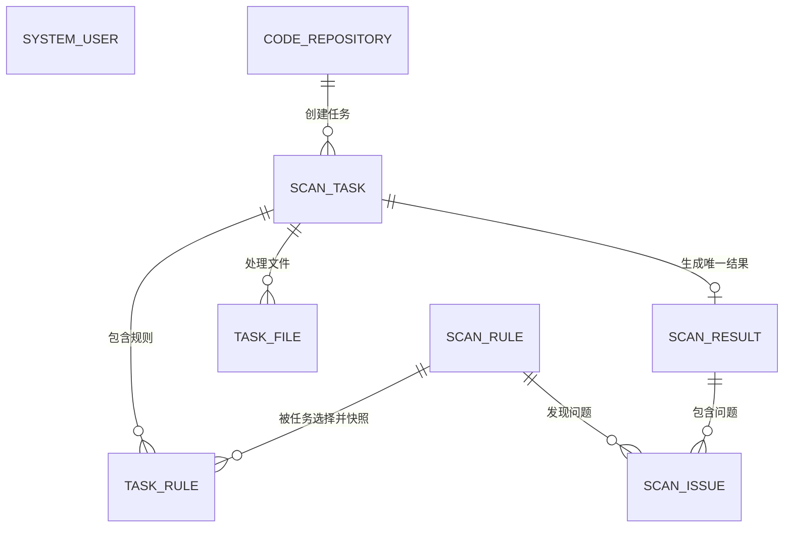

# 代码与文档扫描中心功能方案

## 1. 建设目标

建设一个可运行的代码与文档扫描中心：维护普通规则或 AI 提示词配置，接入 Git、上传 ZIP 或数据库文档源，异步执行扫描，查看结果、导出问题并维护处理状态；同时提供基础用户资料管理。

当前版本已经形成普通关键字/正则扫描闭环。AI 规则可以配置和选择，但扫描时暂不调用模型。

## 2. 功能范围

当前前端包含六个一级菜单：

1. 规则维护
2. 代码库维护
3. 扫描任务中心
4. 结果中心
5. 问题中心
6. 用户管理

本方案以当前界面和接口为准；规则测试、AI 实际调用、连接测试、重新扫描、失败文件重试、批量处理和结果级导出尚未实现。

## 3. 功能菜单总览

| 一级菜单 | 当前功能 |
| --- | --- |
| 规则维护 | 查询、新增、编辑、复制、启停、删除普通或 AI 规则 |
| 代码库维护 | 查询、新增、编辑、启停、删除 Git/上传 ZIP/数据库来源，上传 ZIP |
| 扫描任务中心 | 查询、创建、立即执行/手动执行、取消、删除待执行任务、查看进度 |
| 结果中心 | 查询任务结果汇总、查看统计和问题入口 |
| 问题中心 | 查询、查看详情、更新处理状态、按筛选条件导出 XLSX |
| 用户管理 | 查询、新增、编辑、启停和删除用户资料 |

## 4. 规则维护

规则维护统一保存普通规则和 AI 提示词规则。普通规则会参与扫描；AI 规则现阶段只完成数据与界面预留。

### 4.1 规则列表

#### 查询条件

- 关键字（规则名称或编码）
- 规则类型
- 启用状态
- 页码和每页条数

#### 列表字段

| 字段 | 说明 |
| --- | --- |
| 规则名称/编码 | 规则标识信息 |
| 规则类型 | `NORMAL` 或 `AI` |
| 扫描对象 | 代码、文档或全部 |
| 风险等级 | 高、中、低或提示 |
| 状态 | 启用/停用 |
| 更新时间 | 最近修改时间 |
| 操作 | 编辑、复制、启停、删除 |

#### 主要操作

- 新增、编辑规则；
- 复制规则，系统生成新的规则编码；
- 启用或停用；
- 逻辑删除规则。

当前没有独立查看页和规则测试入口。被任务引用规则的删除约束以当前 Service/Mapper 实现为准，历史任务仍保存规则关联和 JSON 快照。

### 4.2 新增和编辑规则

#### 基本信息

- 规则编码、规则名称、描述；
- 规则类型、扫描对象类型、风险等级；
- 是否启用。

#### 普通规则配置

- 匹配方式：关键字或正则表达式；
- 匹配内容、是否区分大小写；
- 适用文件类型、排除路径片段；
- 问题说明和整改建议。

普通规则逐行匹配，每个命中生成一条问题并记录文件路径、起止行、命中内容和所在行上下文。当前未实现“文件存在/缺失”条件规则，也没有正则超时保护。

#### AI 提示词配置

当前可维护提示词内容以及通用的问题说明、整改建议、文件类型和排除模式。AI 规则能被任务选择并生成快照，但执行器会跳过该类型，不会产生 AI 问题或返回模型原文。

### 4.3 规则测试

当前版本没有规则测试页面或 `/rules/{id}/test` 接口。

#### 测试输入

尚未实现样例文本、模拟文件名/路径和测试文件上传。

#### 测试输出

尚未实现命中数、位置、问题说明、建议和 AI 响应预览。

#### 主要操作

当前需创建实际资源库和扫描任务验证规则。后续规则测试应复用正式匹配逻辑，但不得生成正式任务、结果或问题。

## 5. 代码库维护

“代码库”是统一扫描源名称，当前支持 Git 仓库、上传 ZIP 和数据库文档源。

### 5.1 代码库列表

#### 查询条件

- 关键字（名称或地址）
- 来源类型
- 启用状态
- 页码和每页条数

#### 列表字段

| 字段 | 说明 |
| --- | --- |
| 代码库名称 | 扫描源名称 |
| 来源类型 | `GIT`、`UPLOAD`、`DATABASE` |
| 仓库/数据库地址 | 来源连接信息 |
| 默认分支 | Git 默认分支 |
| 上传文件 | ZIP 原始文件名 |
| 最近扫描时间 | 最近完成扫描时间（由持久数据决定） |
| 状态 | 启用/停用 |
| 操作 | 编辑、上传、启停、删除 |

#### 主要操作

- 新增、编辑、启停、逻辑删除扫描源；
- 为上传类资源库上传或替换 ZIP；
- 在任务中心选择启用的扫描源。

当前没有测试连接和从列表直接创建任务的专用接口。

### 5.2 新增和编辑代码库

#### 基本信息

- 名称、来源类型、说明、启用状态；
- 扫描路径、排除模式、文件类型。

#### Git 代码仓库配置

- 仓库地址；
- 用户名和访问令牌；
- 默认分支；
- 扫描路径、排除片段和文件扩展名。

执行时通过 JGit 克隆。对外详情将令牌显示为掩码；当前数据库中尚未真正加密存储。

#### 文件或文档配置

上传来源只接受 ZIP，必须先保存资源库再上传文件；创建任务前必须已有 ZIP。ZIP 内可包含支持的文本、代码、DOCX 和 PDF。

数据库文档源可配置数据库 URL、用户名、密码、查询 SQL，以及文档名称列、内容列、可选类型列。当前扫描实际使用应用自身数据源执行查询，独立 URL/账号/密码尚未生效；查询最多读取 10000 行并在 60 秒超时。

### 5.3 代码库详情

当前详情由编辑界面读取单条资源库数据，展示基础配置和上传文件名，敏感字段返回掩码。没有独立详情页、关联任务列表、最近结果和问题统计卡片。

## 6. 扫描任务中心

任务记录扫描源、范围 JSON、所选规则及规则快照，并异步形成文件记录、结果汇总和问题。

### 6.1 任务列表

#### 查询条件

- 关键字（任务名称或编号）
- 任务状态
- 页码和每页条数

#### 列表字段

| 字段 | 说明 |
| --- | --- |
| 任务编号/名称 | 创建时生成和填写 |
| 代码库 | 被扫描来源 |
| 状态 | 待执行、排队、执行中、成功、部分成功、失败、已取消 |
| 文件进度 | 总数、已完成、成功、失败 |
| 问题数量 | 当前命中数 |
| 开始/结束时间 | 执行时间 |
| 操作 | 查看、执行、取消、删除（按状态开放） |

#### 主要操作

- 新建任务；
- 执行 `PENDING` 任务；
- 对排队或运行任务请求取消；
- 删除未执行任务；
- 刷新列表查看异步进度。

当前已执行任务不能重新执行，也没有复制任务或只重扫失败文件。

### 6.2 新建扫描任务

当前在同一表单中完成创建，而不是四步向导。

#### 第一步：填写任务信息

- 任务名称；
- 任务说明；
- 选择一个启用的资源库。

#### 第二步：选择扫描范围

可填写 `scopeJson` 保存范围配置，但当前执行器主要使用资源库上的文件类型和排除模式；任务范围 JSON 尚未驱动分支、目录或文件筛选。上传来源使用资源库中已上传的单个 ZIP。

#### 第三步：选择扫描规则

选择一个或多个启用规则。系统校验规则 ID，并在 `task_rule` 中保存关联和规则 JSON 快照。

#### 第四步：确认并执行

可保存为 `PENDING`，也可勾选立即执行，使任务直接进入 `QUEUED`。上传来源没有 ZIP、资源库停用或规则无效时禁止创建。

### 6.3 任务详情

#### 任务基本信息

展示任务编号、名称、说明、资源库、范围 JSON、状态、操作者及创建/更新时间、开始/结束时间和错误信息。

#### 扫描进度

展示总文件数、已完成文件数、成功数、失败数和问题数。进度由后端逐文件更新，取消也在文件边界生效。

#### 扫描结果汇总

任务完成后生成单条结果，统计已扫描/成功/失败文件数以及高、中、低、提示问题数。结果中心负责展示该汇总。

#### 执行信息

后端保存 `task_file` 文件记录及错误原因，但当前任务详情接口只返回任务模型，前端尚未提供文件记录和逐规则执行清单。

#### 主要操作

- 执行待执行任务；
- 请求取消排队或运行任务；
- 删除待执行任务；
- 前往结果/问题菜单查询结果。

重新扫描和失败文件重试尚未实现。

## 7. 结果中心

结果按任务汇总，问题中心承载跨任务问题查询、详情处理和导出。

### 7.1 扫描结果列表

#### 查询条件

- 关键字（任务名称或编号）
- 页码和每页条数

#### 列表字段

| 字段 | 说明 |
| --- | --- |
| 任务编号/名称 | 对应扫描任务 |
| 代码库 | 扫描来源 |
| 扫描/成功/失败文件数 | 执行统计 |
| 问题总数 | 全部命中数 |
| 高/中/低/提示 | 风险统计 |
| 创建时间 | 结果生成时间 |
| 操作 | 查看结果详情或进入问题筛选 |

### 7.2 扫描结果详情

详情接口返回一条结果汇总，包含任务和资源库展示字段以及各项统计。问题可用 `resultId` 过滤。当前没有按规则、按文件统计图，也没有单独导出“结果汇总”；导出能力位于问题中心。

### 7.3 问题列表

#### 查询条件

- 关键字；
- 处理状态；
- 风险等级；
- 结果 ID；
- 页码和每页条数。

#### 列表字段

| 字段 | 说明 |
| --- | --- |
| 问题标题 | 来自规则名称 |
| 风险等级 | 规则风险等级 |
| 任务/代码库 | 所属扫描上下文 |
| 文件位置 | 相对路径及起止行 |
| 扫描规则/类型 | 规则名称及普通/AI 类型 |
| 问题状态 | 待处理、已确认、已处理、已忽略 |
| 创建时间 | 命中写入时间 |
| 操作 | 查看详情、更新状态 |

#### 主要操作

- 查看问题详情；
- 更新为 `PENDING`、`CONFIRMED`、`RESOLVED` 或 `IGNORED` 并填写说明；
- 按当前关键字、状态、风险和结果条件导出 XLSX。

当前只支持单条状态更新，不支持批量处理。

### 7.4 问题详情

#### 基本信息

- 标题、风险等级、状态；
- 问题说明、整改建议；
- 扫描规则、规则类型和所属任务。

#### 问题定位

- 代码库、文件相对路径；
- 起止行；
- 匹配内容和所在行上下文。

DOCX/PDF 当前展示提取文本的行号，不提供文档页码或段落编号。

#### 处理信息

- 处理状态；
- 处理说明；
- 处理人和处理时间。

当前处理人由后端写为固定 `system`，未与用户管理中的选择或登录用户联动。

#### 主要操作

- 确认、标记已处理、忽略或重置为待处理；
- 填写不超过 2000 字的处理说明；
- 返回问题列表。

## 8. 四个模块之间的关系

| 来源模块 | 目标模块 | 当前关系 |
| --- | --- | --- |
| 规则维护 | 扫描任务中心 | 任务选择启用规则并保存快照 |
| 代码库维护 | 扫描任务中心 | 任务选择一个启用扫描源 |
| 扫描任务中心 | 结果中心 | 首次执行重建该任务唯一结果汇总 |
| 扫描任务中心 | 问题中心 | 普通规则命中生成问题并更新任务计数 |
| 结果中心 | 问题中心 | 以 `resultId` 查看本次扫描问题 |

用户管理是当前新增的辅助模块，但尚未与认证、权限和审计操作者联动。

## 9. 核心数据关系

当前核心对象共八类：系统用户、扫描规则、代码库、扫描任务、任务规则、任务文件、扫描结果和扫描问题。没有任务运行批次、资源文件清单和问题动作日志对象。

## 10. 原型核心使用场景

### 场景一：使用普通规则扫描代码

1. 新增 `NORMAL` 关键字或正则规则并启用。
2. 新增 Git 资源库，填写地址、分支及可选凭据。
3. 新建任务，选择资源库和规则，选择立即执行。
4. 任务异步克隆、过滤并扫描支持文件。
5. 在结果中心查看汇总，在问题中心查看文件行号、命中内容和建议。

### 场景二：使用 AI 提示词扫描文档

1. 新增 `AI` 规则并填写提示词。
2. 新增上传类资源库并上传含 DOCX/PDF 的 ZIP，或配置数据库文档源。
3. 新建任务并选择 AI 规则。
4. 当前执行器会解析文件但跳过 AI 规则，因此不会产生 AI 命中。
5. 接入企业 AI 网关后，此场景才能形成完整业务闭环。

### 场景三：处理扫描问题

1. 在问题中心按关键字、风险、状态或结果筛选。
2. 打开详情查看文件位置、上下文、问题说明和整改建议。
3. 更新为已确认、已处理或已忽略，并填写处理说明。
4. 按相同筛选条件导出“扫描结果明细.xlsx”。

## 11. 原型页面清单

当前实际为 6 个路由页面：

| 序号 | 一级菜单 | 路由 | 页面 |
| --- | --- | --- | --- |
| 1 | 规则维护 | `/rules` | `RuleView.vue` |
| 2 | 代码库维护 | `/repositories` | `RepositoryView.vue` |
| 3 | 扫描任务中心 | `/tasks` | `TaskView.vue` |
| 4 | 结果中心 | `/results` | `ResultView.vue` |
| 5 | 问题中心 | `/issues` | `IssueView.vue` |
| 6 | 用户管理 | `/users` | `UserView.vue` |

编辑、详情和状态操作集中在对应页面内完成，尚未拆分为原方案中的 11 个独立页面。当前版本已经完成普通规则扫描的最小闭环；AI、认证授权、任务重扫和更细粒度详情是下一阶段重点。
