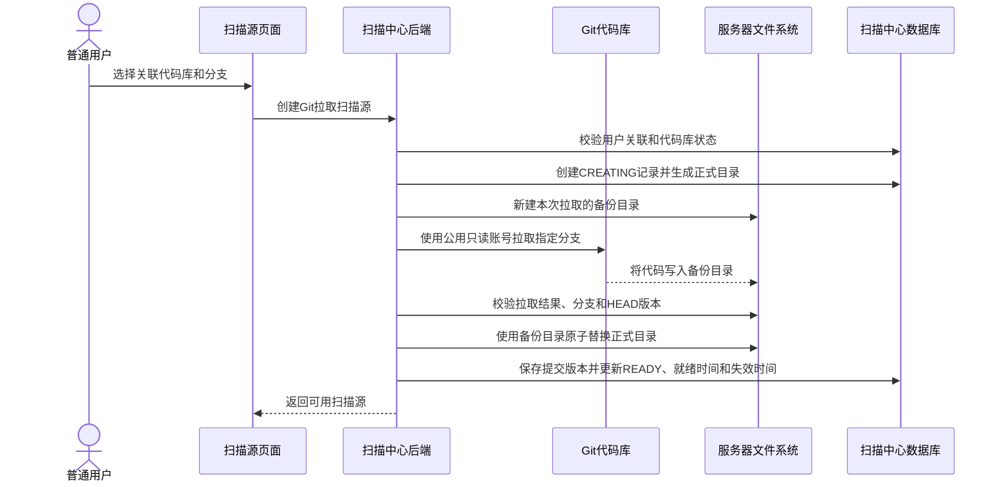
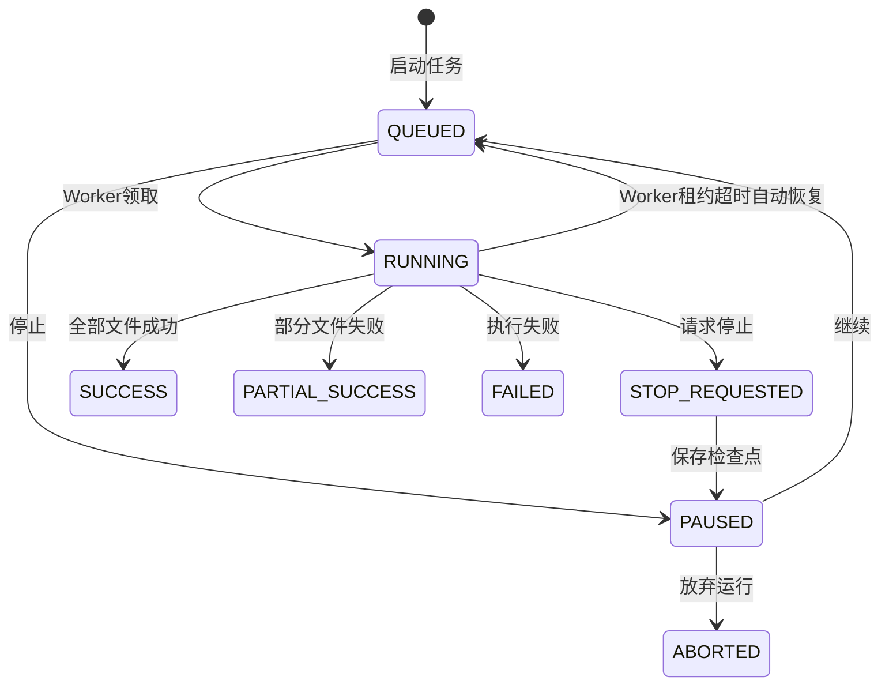
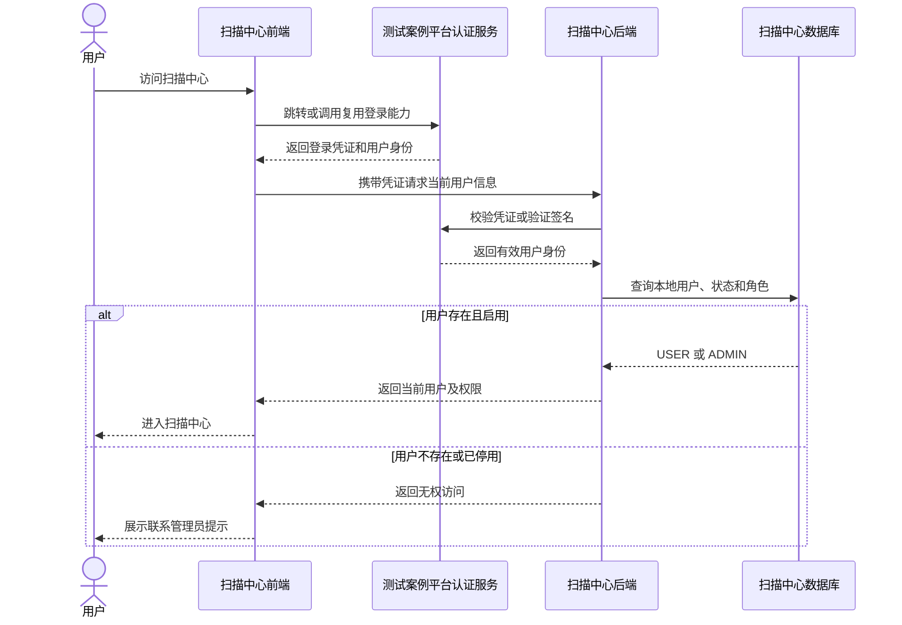
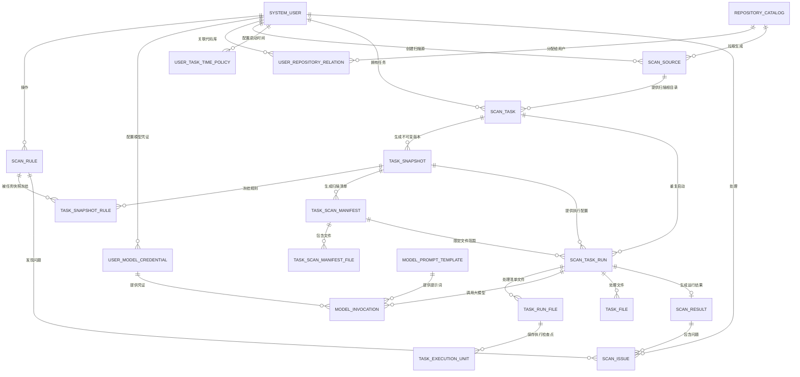

# 代码与文档扫描中心详细方案设计

## 1. 建设目标

建设一个可运行的代码与文档扫描中心：维护普通规则和 AI 规则，支持用户私有规则与管理员共享规则；扫描源按扫描内容区分为 CODE 和 MD，CODE 内容通过 Git 拉取或 ZIP 上传准备，MD 内容按应用和版本通过 HTTP 接口获取；系统异步执行扫描，查看结果、导出问题并维护处理状态，同时复用测试案例平台的登录认证能力，并提供用户、代码库、AI 调用凭证及内置提示词管理。

系统只提供 `NORMAL` 和 `AI` 两类规则。`NORMAL` 规则仅用于 CODE 扫描源；`AI` 规则既可扫描 CODE，也可扫描 MD。AI 规则扫描 CODE 时执行代码 AI 检查和结果更新两阶段流程，扫描 MD 时执行文档检查流程。

## 2. 功能范围

前端包含八个一级菜单：

1. 规则维护
2. 扫描源维护
3. 扫描任务中心
4. 结果中心
5. 问题中心
6. 大模型配置
7. 用户管理
8. 代码库维护

系统登录不作为一级业务菜单。登录页面、账号认证、登录态和退出能力复用测试案例平台；用户登录成功后进入扫描中心，根据其在扫描中心维护的用户状态和角色显示可访问菜单及操作。


系统范围包括规则所有权与共享、NORMAL/AI 规则执行、CODE/MD 扫描源、按应用和版本通过 HTTP 接口获取 MD 文档、用户 UCID/Token 凭证池、内置提示词、登录授权、异步任务、结果汇总、问题处理和用户管理，各项能力按照本方案对应章节实现。

## 3. 功能菜单总览

| 一级菜单 | 功能说明 |
| --- | --- |
| 规则维护 | 管理 NORMAL、AI 规则；普通用户维护本人私有规则，管理员维护全部规则及共享范围 |
| 扫描源维护 | 按扫描内容维护 CODE、MD 扫描源；CODE 支持 Git 拉取和 ZIP 上传，MD 按应用和版本通过 HTTP 接口获取；扫描源保留 14 天 |
| 扫描任务中心 | 查询、创建、编辑、复制、删除任务；维护不可变任务快照，预览扫描清单，启动、停止、继续任务并查看运行历史与进度 |
| 结果中心 | 查询任务结果汇总、查看统计和问题入口 |
| 问题中心 | 查询、查看详情、更新处理状态、按筛选条件导出 XLSX |
| 大模型配置 | 用户维护本人 UCID 和 Token 凭证池；管理员额外维护 CODE AI 检查、结果更新和 MD 文档检查内置提示词 |
| 用户管理 | 仅管理员可见；查询、新增、编辑、启停和删除用户，维护用户类型、所属应用、关联代码库和分类型任务启动时间 |
| 代码库维护 | 仅管理员可见，菜单位于用户管理下方；维护代码库名称、地址、应用和启停状态 |

## 4. 规则维护

规则维护统一管理 NORMAL 规则和 AI 规则。每条规则必须具有明确的所有者和可见范围；规则的查看、编辑、共享、启停、删除和任务选择均由当前登录用户及角色决定。

规则类型定义如下：

| 规则类型 | 类型编码 | 核心配置 |
| --- | --- | --- |
| 普通规则 | `NORMAL` | 匹配方式、匹配内容、是否区分大小写 |
| AI 规则 | `AI` | 检查规则、结果更新 |

### 4.1 规则所有权与共享机制

规则可见范围分为：

| 可见范围 | 范围编码 | 说明 |
| --- | --- | --- |
| 私有规则 | `PRIVATE` | 默认仅规则创建人可见；管理员因治理职责可以查看和管理 |
| 共享规则 | `SHARED` | 所有普通用户和管理员均可查看，并可在扫描任务中选择使用 |

权限规则如下：

| 操作 | 普通用户 | 管理员 |
| --- | --- | --- |
| 查看私有规则 | 仅本人创建的规则 | 可查看全部用户的私有规则 |
| 查看共享规则 | 允许 | 允许 |
| 创建私有规则 | 允许 | 允许 |
| 创建共享规则 | 禁止 | 允许 |
| 编辑私有规则 | 仅本人创建的规则 | 允许管理全部私有规则 |
| 编辑共享规则 | 禁止 | 允许 |
| 将私有规则调整为共享 | 禁止 | 允许 |
| 将共享规则调整为私有 | 禁止 | 允许，调整时必须指定规则所有者 |
| 启停或删除规则 | 仅本人私有规则 | 允许管理全部规则 |
| 复制规则 | 允许复制本人规则或共享规则 | 允许复制全部规则 |

普通用户创建规则时，可见范围固定为 `PRIVATE`，前端不展示共享选项，后端也必须强制写入私有范围。管理员创建规则时可以选择 `PRIVATE` 或 `SHARED`；管理员也可以在规则列表或编辑页面把已有私有规则调整为共享规则。

共享操作不改变原规则所有者。系统需要记录共享操作人和共享时间，以便审计。共享规则由管理员统一维护，普通用户只能查看、选择和复制，不能直接修改共享规则内容。

复制规则时生成新的规则编码和新规则记录。普通用户复制共享规则后，新规则所有者为当前用户且默认为私有；管理员复制时可以选择私有或共享。

### 4.2 规则列表

#### 查询条件

- 关键字：规则名称或规则编码；
- 规则类型：`NORMAL` 或 `AI`；
- 可见范围：私有或共享；
- 所有者：管理员可按用户筛选，普通用户不展示该条件；
- 启用状态；
- 页码和每页条数。

普通用户的查询条件由后端自动追加为“本人私有规则或共享规则”，不得依赖前端传入用户 ID 实现数据隔离。管理员可以查询全部规则。

#### 列表字段

| 字段 | 说明 |
| --- | --- |
| 规则名称/编码 | 规则标识信息 |
| 规则类型 | NORMAL 规则或 AI 规则 |
| 可见范围 | 私有或共享 |
| 所有者 | 创建规则的用户；普通用户查看共享规则时可展示 |
| 扫描对象 | 代码、文档或全部 |
| 风险等级 | 高、中、低或提示 |
| 状态 | 启用或停用 |
| 更新时间 | 最近修改时间 |
| 操作 | 根据当前用户权限展示查看、编辑、复制、共享、启停或删除 |

#### 主要操作

- 新增、查看和编辑规则；
- 复制本人可见的规则；
- 管理员调整规则的私有或共享范围；
- 按权限启用或停用规则；
- 按权限逻辑删除规则。

规则采用逻辑删除；被任务引用的规则不得物理删除。历史任务保存完整规则快照，规则修改、共享范围变化、停用或逻辑删除均不改变历史任务的执行内容和问题展示。

### 4.3 新增和编辑规则

#### 4.3.1 公共字段

| 字段 | 必填 | 说明 |
| --- | --- | --- |
| 规则编码 | 是 | 全局唯一，只允许字母、数字、下划线和短横线 |
| 规则名称 | 是 | 规则展示名称 |
| 规则描述 | 否 | 规则用途和适用场景 |
| 规则类型 | 是 | `NORMAL` 或 `AI` |
| 扫描对象 | 是 | `ALL`、`CODE` 或 `DOCUMENT` |
| 风险等级 | 是 | `HIGH`、`MEDIUM`、`LOW` 或 `INFO` |
| 文件类型 | 否 | 规则适用的文件扩展名集合 |
| 排除路径 | 否 | 不执行该规则的路径片段 |
| 问题说明 | 否 | 规则命中后的问题描述 |
| 整改建议 | 否 | 规则命中后的处理建议 |
| 可见范围 | 是 | 普通用户固定为私有；管理员可选择私有或共享 |
| 是否启用 | 是 | 新增时默认启用 |

所有者由后端根据当前登录用户写入，前端不得提交或修改规则所有者。管理员将共享规则调整为私有规则时，使用单独的所有者选择字段和受控接口处理。

#### 4.3.2 普通规则配置

- 匹配方式：关键字或正则表达式；
- 匹配内容；
- 是否区分大小写。

普通规则扫描时先根据文件语言剔除注释，再对去除注释后的有效内容执行关键字或正则匹配。注释剔除采用语言词法解析，不使用简单正则统一删除，必须正确区分注释、字符串、字符常量和转义字符。系统至少支持 Java、JavaScript/TypeScript、Vue、XML/HTML、Python/Shell、SQL、YAML 等已纳管文件类型的单行注释、块注释和文档注释。

为保证问题定位准确，注释内容使用等长空白替换并保留全部换行符，处理后的字符位置与原文件保持对应。普通规则逐行匹配，每个命中生成一条问题并记录原文件路径、起止行、命中内容和所在行上下文。普通规则仅支持关键字和正则匹配，不包含“文件存在/缺失”条件；正则执行必须具备单文件超时、最大回溯和单文件最大命中数保护。无法识别语言或注释解析失败时，该文件记录解析失败原因，不得退化为包含注释的扫描结果。

#### 4.3.3 AI 规则配置

AI 规则必须维护以下两个独立部分：

| 字段 | 必填 | 说明 |
| --- | --- | --- |
| 检查规则 | 是 | 描述需要检查的内容、判断标准、约束条件和期望识别的问题 |
| 结果更新 | 是 | 描述如何整理、补充或更新检查结果，以及结果输出要求 |

“检查规则”和“结果更新”必须使用两个独立表单字段和两个独立数据库字段，不再使用单一的通用提示词字段承载全部内容。任务快照规则必须同时保存这两部分。

AI 执行模块使用管理员维护的内置提示词，将规则的“检查规则”、文件元数据、分段内容和固定 JSON 输出约束组装为检查请求，通过任务所有者启用的 UCID/Token 调用大模型。模型检查响应必须是系统可解析的 JSON；系统完成 JSON 提取、结构校验和字段类型校验后，再将初步结果与规则的“结果更新”内容组装为结果更新请求，生成最终标准问题 JSON。

AI 执行模块负责模型调用、内容分段、上下文拼装、凭证租约、结果解析、结果更新和失败重试。任务保存时冻结检查规则、结果更新及内置提示词版本，任务运行只读取任务快照。模型返回无法解析、字段缺失或越过文件范围的数据时，本次调用判定为失败并记录明确的文件级、规则级错误，不得静默跳过 AI 规则。

AI 规则与扫描源组合后的执行方式如下：

| 规则类型 | 扫描源内容类型 | 执行方式 |
| --- | --- | --- |
| `AI` | `CODE` | 使用 `AI_CHECK` 内置提示词执行检查，再结合“结果更新”使用 `AI_RESULT_UPDATE` 生成最终问题 JSON |
| `AI` | `MD` | 使用 `MD_CHECK` 内置提示词、规则“检查规则”、应用和版本上下文执行文档检查；不执行结果更新第二阶段 |

#### 4.3.4 类型切换和校验

- `NORMAL` 必须填写匹配方式和匹配内容，清空 AI 专用字段；
- `AI` 必须填写检查规则和结果更新，清空普通规则匹配字段；
- 已被任务引用的规则允许编辑，但不影响已有任务快照；任务必须在编辑页面重新选择或刷新规则并保存新快照后才使用新规则内容；
- 普通用户不能通过构造请求把规则保存为共享，也不能修改其他用户规则；
- 管理员执行共享范围变更时需记录审计信息。

### 4.4 数据模型和接口调整

`scan_rule` 使用以下规则扩展字段：

| 字段 | 类型 | 说明 |
| --- | --- | --- |
| `rule_type` | VARCHAR(20) | 仅支持 `NORMAL`、`AI` |
| `visibility` | VARCHAR(20) | `PRIVATE` 或 `SHARED` |
| `owner_user_id` | BIGINT | 规则所有者用户 ID |
| `owner_user_name` | VARCHAR(128) | 所有者名称快照 |
| `check_rule_content` | LONGTEXT/CLOB | AI 规则的检查规则 |
| `result_update_content` | LONGTEXT/CLOB | AI 规则的结果更新 |
| `shared_by_user_id` | BIGINT | 最近共享操作人，可为空 |
| `shared_by_user_name` | VARCHAR(128) | 最近共享操作人名称，可为空 |
| `shared_time` | TIMESTAMP | 最近调整为共享的时间，可为空 |

原 `prompt_content` 字段中的存量 AI 提示词迁入 `check_rule_content`。迁移后的 `result_update_content` 初始为空，由管理员补充完整后方可启用对应 AI 规则。

规则接口定义如下：

| 方法 | 路径 | 功能 |
| --- | --- | --- |
| GET | `/api/v1/rules` | 按当前用户和角色自动过滤可见规则 |
| POST | `/api/v1/rules` | 创建规则，后端写入所有者并强制校验共享权限 |
| GET/PUT/DELETE | `/api/v1/rules/{id}` | 按所有权和角色查看、编辑或删除规则 |
| POST | `/api/v1/rules/{id}/copies` | 复制可见规则，新规则归当前用户所有 |
| PUT | `/api/v1/rules/{id}/status` | 按所有权和角色启停规则 |
| PUT | `/api/v1/rules/{id}/visibility` | 仅管理员调整私有或共享范围 |

所有规则接口都必须在后端实施行级数据权限校验。规则 ID 可被猜测，因此只在列表过滤数据是不够的，详情、更新、复制、启停、共享和删除接口均需重复校验访问权限。

### 4.5 规则测试

规则测试应支持 `NORMAL` 和 `AI` 两种类型，并复用正式执行逻辑，但不得生成正式任务、结果或问题。AI 规则测试必须选择模拟的 `CODE` 或 `MD` 扫描源内容类型。

#### 测试输入

- 样例文本；
- 模拟文件名和文件路径；
- 测试文件上传；
- AI 执行所需的扫描源内容类型、应用和版本等上下文。

#### 测试输出

- 命中数量和位置；
- 问题说明和整改建议；
- AI 检查结果及结果更新后的最终内容；
- AI 规则扫描 MD 内容时的文档检查结果；
- 执行耗时和错误信息。

规则测试同样遵守可见范围：普通用户只能测试本人私有规则或共享规则，管理员可以测试全部规则。

### 4.6 验收标准

- 普通用户创建规则后，该规则自动归当前用户所有并保存为私有规则。
- 普通用户不能在列表、详情或任务规则选择器中看到其他普通用户的私有规则。
- 普通用户可以查看和选择共享规则，但不能编辑、启停、删除或取消共享。
- 管理员可以查看全部规则、创建共享规则，并把私有规则调整为共享规则。
- 普通用户通过伪造用户 ID、规则 ID 或可见范围参数，不能越权读取或修改规则。
- 规则列表、详情、复制、启停、共享、删除、测试和任务选择接口使用一致的数据权限规则。
- AI 规则必须分别保存检查规则和结果更新，缺少任一字段时不能保存或启用。
- 规则类型切换后，无关类型字段不会残留并参与后续执行。
- 任务快照完整保存规则类型专用字段和内置提示词，规则或提示词后续修改不影响已保存任务及其运行。

## 5. 扫描源维护

扫描源维护用于准备扫描任务实际读取的代码或文档目录。扫描源首先按扫描内容区分为 CODE 和 MD，再记录具体获取方式：

| 扫描内容 | 内容编码 | 获取方式 |
| --- | --- | --- |
| 代码 | `CODE` | 通过 Git 拉取或 ZIP 上传获取 |
| 文档 | `MD` | 按扫描源配置的应用和版本，通过 HTTP 接口获取 |

每次 Git 拉取、ZIP 上传或 MD HTTP 获取生成一条独立的扫描源实例。扫描源实例拥有独立的服务器根目录，有效期为 14 天。扫描任务直接以扫描源实例的服务器根目录作为文件发现和扫描的起点。`scan_source_type` 保存 `CODE/MD`，`source_type` 保存 `GIT/UPLOAD/HTTP`，两个字段不得混用。扫描源维护页面不维护扫描路径、文件类型和排除目录，这三类扫描范围统一在扫描任务中配置。

### 5.1 代码库配置与用户关联

#### 5.1.1 Git 公用只读账号

系统配置一个 Git 公用账号，该账号具备全部纳管代码库的只读权限。所有代码库连接测试、远程分支查询和代码拉取均使用该公用账号，普通用户和管理员不填写、不选择也不能查看 Git 凭据。

公用账号遵循以下规则：

- 账号只授予代码读取、分支查询和克隆权限，不授予提交、推送、合并、标签修改和代码库管理权限；
- 公用账号凭据通过系统密钥配置提供，不保存在代码库配置表和扫描源表中；
- 公用账号用户名、访问令牌或 SSH 私钥不得通过前端接口返回；
- 日志、异常、审计记录和 Git 远程地址中不得包含明文凭据；
- 公用账号凭据失效时，连接测试、分支查询和代码拉取统一返回认证失败，已生成的扫描源不受影响；
- 业务审计记录发起拉取的真实登录用户，技术认证记录使用公用账号，两者不得混淆。

#### 5.1.2 代码库配置

代码库配置由管理员统一维护，普通用户不能新增、修改或删除代码库配置。代码库配置包含：

| 字段 | 必填 | 说明 |
| --- | --- | --- |
| 代码库名称 | 是 | 使用 `xxx/xxx` 格式，全局唯一 |
| 所属应用 | 是 | 下拉选择 `F-BASE`、`F-GMO`、`F-GMRM`、`F-FMPV`、`F-EFM`、`F-SCIS` 或 `ALL` |
| 仓库地址 | 是 | Git 仓库地址 |
| 是否启用 | 是 | 停用后用户不能查询分支或发起拉取 |

代码库维护菜单仅对管理员展示，并固定放在用户管理菜单下方。后端对查询、新增、修改、启停和删除接口再次校验管理员权限。

#### 5.1.3 用户关联代码库

管理员在用户管理的新增或编辑页面中选择用户应用。应用字段统一使用固定下拉选项：`F-BASE`、`F-GMO`、`F-GMRM`、`F-FMPV`、`F-EFM`、`F-SCIS`、`ALL`。选择应用后，代码库字段自动展示并关联该应用下全部已启用代码库，不提供手工勾选。`ALL` 用户关联全部已启用代码库；所属应用为 `ALL` 的代码库对所有应用用户可用。数据库使用用户代码库关联表保存多对多关系。

用户关联规则如下：

- 普通用户只能查看与本人所属应用一致或所属应用为 `ALL`、且处于启用状态的代码库；
- 普通用户不能通过构造代码库 ID 查询未关联代码库、分支或发起拉取；
- 用户保存或应用变更时，系统先删除原代码库关联，再按新应用全量关联已启用代码库；
- 代码库新增、修改所属应用或启停时，系统同步刷新受影响用户的关联关系；
- 停用或删除用户后，该用户不能继续拉取代码，但其已生成的扫描源仍按原失效时间执行清理；
- 取消用户与代码库的关联后，用户不能再次拉取该代码库，已生成的扫描源在有效期内仍可用于已创建任务。

### 5.2 扫描源列表

#### 查询条件

- 关键字：扫描源名称、代码库名称、分支或 ZIP 文件名；
- 扫描内容类型：CODE 或 MD；
- 获取方式：Git 拉取、ZIP 上传或 HTTP 获取；
- 应用和版本：MD 扫描源使用；
- 状态：创建中、可用、创建失败、已过期或已清理；
- 创建时间和失效时间；
- 页码和每页条数。

普通用户只能查询本人创建的扫描源；管理员可以查询全部用户的扫描源。

#### 列表字段

| 字段 | 说明 |
| --- | --- |
| 扫描源编号/名称 | 扫描源唯一标识和系统按“代码库@分支”“ZIP@文件名”或“应用@版本”生成的名称 |
| 扫描内容类型 | `CODE` 或 `MD` |
| 获取方式 | Git 拉取、ZIP 上传或 HTTP 获取 |
| 所有者 | 创建扫描源的用户 |
| 代码库 | Git 拉取对应的代码库，ZIP 上传时为空 |
| 分支 | Git 拉取选择的分支，ZIP 上传时为空 |
| 提交版本 | Git 实际拉取的 HEAD 提交版本，ZIP 上传时为空 |
| ZIP 文件名 | ZIP 上传的原始文件名，Git 拉取时为空 |
| 应用/版本 | MD HTTP 文档对应的应用和版本，CODE 类型版本为空 |
| 服务器根目录 | 扫描源在服务器上的规范化绝对路径 |
| 状态 | `CREATING`、`READY`、`FAILED`、`EXPIRED` 或 `CLEANED` |
| 就绪时间 | 拉取或解压成功时间 |
| 失效时间 | 就绪时间加 14 天 |
| 剩余有效期 | 根据当前时间与失效时间计算 |
| 操作 | 查看详情、重新拉取、删除或查看失败原因 |

普通用户不能编辑服务器根目录、所有者、就绪时间和失效时间。管理员查看服务器根目录时仅用于运维定位，前端不得把该字段作为文件系统访问入口。

### 5.3 Git 拉取

#### 5.3.1 拉取表单

普通用户通过扫描源维护页面创建 Git 拉取扫描源，填写以下内容：

| 字段 | 必填 | 说明 |
| --- | --- | --- |
| 代码库 | 是 | 仅展示管理员为当前用户关联的启用代码库 |
| 分支 | 是 | 根据所选代码库实时查询远程分支 |
| 说明 | 否 | 本次拉取用途说明 |

分支必须来自后端返回的远程分支列表。后端在执行拉取前再次校验用户与代码库的关联关系、代码库状态和分支有效性，不接受未经校验的任意仓库地址或分支。

#### 5.3.2 拉取流程



Git 拉取在后台任务中执行，并严格按照以下顺序处理：

1. 校验当前用户与代码库的关联关系、代码库启用状态和所选分支。
2. 创建状态为 `CREATING` 的扫描源记录，生成正式目录和本次拉取专用备份目录。
3. 使用系统 Git 公用只读账号，将用户选择的代码库和分支拉取到备份目录。
4. 确认 Git 命令成功结束，并校验备份目录存在、目标分支检出成功、`HEAD` 提交可解析且代码目录可读。
5. 获取扫描源目录替换锁，阻止扫描任务和清理任务同时访问正在替换的目录。
6. 将备份目录原子移动并替换为正式目录；`server_root_path` 始终指向正式目录。
7. 保存实际拉取的 `HEAD` 提交版本，将扫描源更新为 `READY`，写入就绪时间和失效时间。
8. 释放目录替换锁，并清理本次操作产生的临时目录。

正式目录和备份目录必须位于同一文件系统，以保证目录移动使用原子操作。正式目录固定为 `${scan-center.source-root}/{ownerUserId}/{scanSourceId}/current/`，备份目录固定为同级的 `backup-{uuid}/`。

首次拉取时正式目录不存在，校验成功后直接将备份目录移动为正式目录。正式目录已经存在时，先将原正式目录原子重命名为 `previous-{uuid}/`，再将备份目录原子移动为正式目录；新目录替换成功并完成数据库状态更新后删除旧目录。新目录替换失败时恢复原正式目录。

Git 拉取、分支检出或结果校验失败时，不得替换正式目录。系统将扫描源更新为 `FAILED`，记录不包含凭据的失败原因，并删除本次备份目录。重新拉取生成新的扫描源实例和新的 14 天有效期，不覆盖其他扫描源目录。

### 5.4 ZIP 上传与自动解压

#### 5.4.1 上传表单

| 字段 | 必填 | 说明 |
| --- | --- | --- |
| 应用 | 是 | 普通用户固定为本人所属应用，管理员使用统一应用下拉框选择 |
| ZIP 文件 | 是 | 已打包的代码文件，只允许 ZIP 格式 |
| 说明 | 否 | 本次上传用途说明 |

#### 5.4.2 上传处理

1. 前端校验文件扩展名和文件大小。
2. 后端校验文件签名、扩展名、文件大小和当前用户权限。
3. 后端创建状态为 `CREATING` 的扫描源记录并生成服务器根目录。
4. ZIP 文件上传完成后，系统在扫描源根目录中自动安全解压。
5. 解压成功后删除临时 ZIP 文件，将扫描源更新为 `READY`，并写入就绪时间和失效时间。
6. 解压失败时将扫描源更新为 `FAILED`，记录失败原因并清理临时文件和不完整目录。

ZIP 解压必须防止路径穿越、符号链接逃逸和压缩炸弹，限制压缩包大小、解压后总大小、文件数量、单文件大小和目录深度。所有解压路径经过规范化后必须位于该扫描源服务器根目录之内。

### 5.5 MD 应用版本 HTTP 文档获取

MD 扫描源以“应用＋版本”为维度，通过系统配置的 HTTP 接口获取版本列表和文档内容，不从代码库聚合设计文档，也不在代码库表中维护概要设计或详细设计目录。

#### 5.5.1 扫描源表单

| 字段 | 必填 | 说明 |
| --- | --- | --- |
| 应用 | 是 | 普通用户固定为本人所属应用且不可修改；管理员使用统一应用下拉框选择 |
| 版本 | 是 | 选择应用后通过版本接口加载，只展示 `YYYYMM` 格式值，例如 `202608` |
| 说明 | 否 | 本次 MD 扫描源用途说明 |

后端不得信任普通用户提交的应用值，必须使用登录用户当前所属应用覆盖并校验；管理员可以选择固定应用选项中的任意应用。扫描源保存时再次调用版本接口，确认版本仍在接口返回范围内，并将应用、版本、`scan_source_type=MD`、`source_type=HTTP` 保存到扫描源记录。

#### 5.5.2 HTTP 接口配置与协议

版本接口和文档接口均抽取为部署配置项：

- `MD_VERSIONS_URL`：版本列表接口地址，系统以 GET 请求调用并携带查询参数 `application`；
- `MD_DOCUMENTS_URL`：文档获取接口地址，系统以 GET 请求调用并携带查询参数 `application`、`version`；
- `MD_CONNECT_TIMEOUT_MS`：连接超时时间，默认 10000 毫秒；
- `MD_READ_TIMEOUT_MS`：读取超时时间，默认 120000 毫秒。

版本接口支持直接返回数组，或在 `data`、`versions`、`data.versions` 中返回数组；数组项可以是版本字符串，也可以是包含 `version` 或 `versionNo` 的对象。系统只接收六位 `YYYYMM` 值，去重后按倒序展示。

文档接口支持直接返回数组，或在 `data`、`documents`、`data.documents` 中返回数组。每项文档包含名称、类型和内容：名称支持 `name`、`documentName`、`title`，类型支持 `type`、`fileType`，文本内容支持 `content`、`documentContent`，Base64 内容支持 `contentBase64`、`base64Content`。接口未返回类型时根据文件扩展名识别，无法识别时按 Markdown 文本处理。

#### 5.5.3 文档准备流程

任务生成快照和扫描清单时，系统执行以下流程：

1. 校验发起人权限、MD 扫描源状态、应用和版本；普通用户当前所属应用必须与扫描源应用一致。
2. 使用扫描源快照中的应用和版本调用文档接口，设置连接、读取超时及响应体大小限制。
3. 校验 HTTP 状态、响应结构、文档名称和内容，接口无数据、字段缺失、内容无法解码或超出限制时准备失败。
4. 对文件名进行安全规范化，为同名文档增加稳定序号，禁止绝对路径、父目录跳转和符号链接逃逸。
5. 将文本按 UTF-8、Base64 内容按解码后的原始字节写入受控备份目录。
6. 全部文档落盘后生成包含应用、版本、文件相对路径、类型、大小和摘要的清单，再原子替换正式目录。

MD 正式目录固定为 `${scan-center.md-source-root}/{applicationCode}/{version}/{scanSourceId}/current/`，`server_root_path` 指向本次 HTTP 获取生成的 `current/`。使用 MD 扫描源的任务只能选择 AI 规则。任务快照保存应用、版本和 HTTP 来源标识；接口数据后续变化不影响已经生成的任务快照、扫描清单和执行结果。

### 5.6 服务器根目录

扫描源表必须保存 `server_root_path` 字段，用于记录该扫描源在服务器文件系统上的根目录。扫描执行器读取扫描源时，以该字段作为唯一根目录，不再根据上传文件名、代码库名称或用户输入临时拼接扫描路径。

根目录规则如下：

- 根目录由后端生成并写入数据库，前端不得传入或修改；
- 根目录采用规范化绝对路径，长度不超过 1000 个字符；
- Git 拉取和 ZIP 上传根目录必须位于 `scan-center.source-root` 下，MD HTTP 文档根目录必须位于 `scan-center.md-source-root` 下；
- 扫描源基础目录固定为 `${scan-center.source-root}/{ownerUserId}/{scanSourceId}/`，正式目录为其下的 `current/`；
- Git 拉取备份目录和旧目录位于扫描源基础目录下，分别使用 `backup-{uuid}/` 和 `previous-{uuid}/` 命名；
- 创建、扫描、删除和清理前均根据扫描源类型校验规范化路径位于对应受控根目录下；
- 扫描执行器只读取 `current/` 正式目录，不读取备份目录或旧目录；
- 扫描范围中的相对路径只能在根目录内部解析，不允许绝对路径或 `..` 越界；
- 数据库中的根目录字段只用于后端扫描和运维定位，不通过普通用户接口返回完整物理路径。

扫描任务开始时必须校验根目录字段非空、目录真实存在、扫描源状态为 `READY` 且未过期。任一条件不满足时任务不得进入扫描阶段。

### 5.7 有效期和自动清理

Git 拉取、ZIP 上传和 MD HTTP 获取形成的扫描源目录有效期统一为 14 天：

- `ready_time` 为 Git 拉取、ZIP 解压或 MD HTTP 文档准备成功时间；
- `expire_time = ready_time + 14 天`；
- 扫描、查看详情和创建任务不会延长有效期；
- 用户重新拉取、重新上传或重新查询 MD 文档时创建新的扫描源实例，并重新计算 14 天有效期；
- 到达失效时间后，扫描源立即不可用于创建或启动扫描任务。

系统每小时执行一次自动清理任务：

1. 查询 `expire_time <= 当前时间` 且状态为 `READY` 的扫描源。
2. 将扫描源状态原子更新为 `EXPIRED`，阻止新的扫描任务使用。
3. 检查是否存在 `QUEUED`、`RUNNING`、`STOP_REQUESTED` 或 `PAUSED` 状态的关联任务运行。
4. 没有活动任务时，校验根目录安全边界并递归删除服务器目录。
5. 删除成功后将状态更新为 `CLEANED`，清空 `server_root_path` 并记录 `clean_time`。
6. 删除失败时保留 `EXPIRED` 状态和根目录，记录清理错误，由后续清理周期重试。
7. 存在执行中或暂停待继续的任务时暂缓物理删除，任务进入终态后的下一次清理周期继续处理。

排队中的新任务运行在执行前发现扫描源已经过期时，运行状态直接更新为 `FAILED`，错误信息为“扫描源已过期，请重新准备扫描源”。已经开始执行或处于 `PAUSED` 的可继续运行持续持有扫描源清理锁，清理任务不得删除其根目录；运行完成或放弃后释放清理锁。

### 5.8 数据模型

#### 5.8.1 Git 公用账号配置

Git 公用账号凭据通过部署环境的密钥配置注入，配置项包括公用账号用户名、认证类型以及访问令牌或 SSH 私钥。凭据不写入业务数据库，应用启动时加载到受控的 Git 认证组件，所有 Git 操作统一调用该组件。

#### 5.8.2 固定应用选项

本期不设置可维护的应用表和应用管理页面。前端共享应用常量，后端使用同一白名单校验，固定值为 `F-BASE`、`F-GMO`、`F-GMRM`、`F-FMPV`、`F-EFM`、`F-SCIS`、`ALL`。`repository_catalog.application`、`system_user.application` 和扫描源的 `application` 均直接保存上述编码。

#### 5.8.3 代码库配置表 `repository_catalog`

| 字段 | 类型 | 说明 |
| --- | --- | --- |
| `id` | BIGINT | 主键 |
| `repository_name` | VARCHAR(255) | 代码库名称，`xxx/xxx` 格式，全局唯一 |
| `application` | VARCHAR(20) | 固定应用选项之一 |
| `repository_url` | VARCHAR(1000) | Git 仓库地址 |
| `enabled` | BOOLEAN/TINYINT | 是否启用 |
| `deleted` | BOOLEAN/TINYINT | 是否逻辑删除 |
| `operator_user_id` | BIGINT | 最近操作用户 ID |
| `operator_user_name` | VARCHAR(128) | 最近操作用户名称 |
| `create_time` | TIMESTAMP | 创建时间 |
| `update_time` | TIMESTAMP | 更新时间 |

#### 5.8.4 用户代码库关联表 `user_repository_relation`

| 字段 | 类型 | 说明 |
| --- | --- | --- |
| `id` | BIGINT | 主键 |
| `user_id` | BIGINT | 普通用户 ID |
| `repository_id` | BIGINT | 代码库配置 ID |
| `create_user_id` | BIGINT | 建立关联的管理员 ID |
| `create_user_name` | VARCHAR(128) | 建立关联的管理员名称 |
| `create_time` | TIMESTAMP | 建立关联时间 |

`user_id` 与 `repository_id` 建立组合唯一约束。删除关联记录不删除代码库配置和已生成的扫描源实例。

#### 5.8.5 扫描源实例表 `scan_source`

| 字段 | 类型 | 说明 |
| --- | --- | --- |
| `id` | BIGINT | 主键 |
| `source_no` | VARCHAR(64) | 扫描源唯一编号 |
| `source_name` | VARCHAR(128) | 扫描源名称 |
| `scan_source_type` | VARCHAR(20) | 扫描内容类型：`CODE` 或 `MD` |
| `source_type` | VARCHAR(20) | 获取方式：`GIT`、`UPLOAD` 或 `HTTP` |
| `owner_user_id` | BIGINT | 创建用户 ID |
| `owner_user_name` | VARCHAR(128) | 创建用户名称快照 |
| `repository_id` | BIGINT | CODE Git 扫描源对应的代码库配置 ID，其他方式可为空 |
| `branch_name` | VARCHAR(255) | Git 分支，ZIP 上传为空 |
| `commit_id` | VARCHAR(64) | Git 实际拉取的 HEAD 提交版本，ZIP 上传为空 |
| `original_file_name` | VARCHAR(255) | ZIP 原始文件名，Git 拉取为空 |
| `application_id` | BIGINT | 扫描源所属应用 ID |
| `application_code` | VARCHAR(64) | 应用编码快照 |
| `version_no` | VARCHAR(20) | MD HTTP 文档版本，例如 `202608`；CODE 为空 |
| `server_root_path` | VARCHAR(1000) | 服务器上的扫描根目录 |
| `status` | VARCHAR(20) | `CREATING`、`READY`、`FAILED`、`EXPIRED`、`CLEANED` |
| `error_message` | VARCHAR(2000) | 创建或清理失败原因 |
| `ready_time` | TIMESTAMP | 就绪时间 |
| `expire_time` | TIMESTAMP | 失效时间 |
| `clean_time` | TIMESTAMP | 物理目录清理时间 |
| `description` | VARCHAR(1000) | 说明 |
| `create_time` | TIMESTAMP | 创建时间 |
| `update_time` | TIMESTAMP | 更新时间 |

`expire_time`、`status` 建立联合索引供清理任务查询；`owner_user_id`、`status`、`create_time` 建立联合索引供用户列表查询。扫描任务通过 `scan_source_id` 关联扫描源实例。

### 5.9 接口定义

| 方法 | 路径 | 权限 | 功能 |
| --- | --- | --- | --- |
| GET | `/api/v1/repository-catalogs` | 管理员 | 查询全部代码库配置 |
| POST | `/api/v1/repository-catalogs` | 管理员 | 新增代码库配置 |
| GET/PUT/DELETE | `/api/v1/repository-catalogs/{id}` | 管理员 | 查询、更新或逻辑删除代码库配置 |
| PUT | `/api/v1/repository-catalogs/{id}/status` | 管理员 | 启用或停用代码库并同步用户关联 |
| GET | `/api/v1/repository-catalogs/available?application={application}` | 管理员 | 查询指定应用自动关联的已启用代码库 |
| GET | `/api/v1/repository-catalogs/mine` | 已登录用户 | 查询当前用户有权拉取的启用代码库 |
| GET | `/api/v1/repository-catalogs/{id}/branches` | 已关联用户、管理员 | 查询远程分支 |
| GET | `/api/v1/scan-sources` | 已登录用户 | 查询有权查看的扫描源 |
| GET | `/api/v1/scan-sources/{id}` | 所有者、管理员 | 查询扫描源详情 |
| POST | `/api/v1/scan-sources/git-pulls` | 已登录用户 | 创建 Git 拉取扫描源 |
| POST | `/api/v1/scan-sources/zip-uploads` | 已登录用户 | 上传 ZIP 并创建扫描源 |
| GET | `/api/v1/repositories/md/versions?application={application}` | 已登录用户 | 通过配置的 HTTP 接口查询应用版本列表 |
| POST | `/api/v1/repositories` | 已登录用户 | 提交 `sourceType=HTTP`、应用和版本并创建 MD 扫描源 |
| DELETE | `/api/v1/scan-sources/{id}` | 所有者、管理员 | 提前清理扫描源目录并逻辑删除记录 |

### 5.10 验收标准

- 管理员可以维护应用和 CODE 代码库配置，代码库表不维护概要设计或详细设计目录。
- 用户选择应用后，页面自动填入该应用下全部已启用代码库名称，后端全量同步关联表。
- 普通用户只能查询和拉取与本人所属应用一致、已关联且启用的代码库。
- 普通用户可以选择特定代码库和远程分支发起后台拉取。
- 所有连接测试、分支查询和代码拉取均使用系统公用只读账号，代码库配置和扫描源记录不保存独立 Git 凭据。
- 代码先完整拉取到备份目录，校验成功后再原子替换正式目录；拉取失败不会污染正式目录。
- 拉取成功后保存实际 HEAD 提交版本，扫描任务读取的目录与该提交版本一致。
- 普通用户可以上传 ZIP，系统自动完成安全解压并形成可扫描根目录。
- Git 拉取、ZIP 上传和 MD HTTP 文档准备成功后均写入服务器根目录、就绪时间和 14 天失效时间。
- 普通用户只能查询并扫描本人所属应用的指定版本文档，管理员可以查询并扫描全部有权限应用文档。
- MD 扫描源按应用和版本通过配置的 HTTP 接口读取文档，不执行任何 Git 拉取、数据库查询或代码库目录聚合。
- 扫描执行器只从数据库记录的服务器根目录开始扫描，并阻止所有越界路径。
- 已过期扫描源不能创建或启动扫描任务。
- 清理任务自动删除过期目录并保留扫描源业务记录和清理时间。
- 活动任务使用的目录不会被自动清理，任务完成后继续执行过期清理。
- 用户不能通过篡改代码库 ID、分支、扫描源 ID 或服务器路径访问未授权代码。

## 6. 扫描任务中心

扫描任务是可重复执行的版本化扫描配置，包含任务所有者、扫描源、任务类型、同类型规则集合、内置提示词、扫描路径、文件类型和排除路径。任务每次创建或编辑生成不可变快照及可预览扫描清单；每次启动绑定具体快照和清单生成独立运行记录，运行进度、检查点、结果和问题均归属于该次运行。

### 6.1 任务所有权与权限

普通用户创建的任务为本人私有任务，仅创建人可见。管理员可以查看和管理全部用户的任务。

| 操作 | 普通用户 | 管理员 |
| --- | --- | --- |
| 查看任务 | 仅本人创建的任务 | 全部任务 |
| 创建任务 | 允许 | 允许 |
| 编辑任务 | 仅本人任务 | 全部任务 |
| 复制任务 | 仅本人任务 | 全部任务 |
| 删除任务 | 仅本人任务 | 全部任务 |
| 预览扫描清单 | 仅本人任务 | 全部任务 |
| 启动任务 | 仅本人任务，并受本人任务启动时间限制 | 全部任务，不受普通用户启动时间限制 |
| 停止任务 | 仅本人任务的活动运行 | 全部任务的活动运行 |
| 继续或放弃运行 | 仅本人任务的暂停运行 | 全部任务的暂停运行 |
| 查看运行历史和结果 | 仅本人任务 | 全部任务 |

所有任务接口均由后端根据登录用户执行行级数据权限校验。普通用户不能通过任务 ID、所有者 ID、运行 ID 或结果 ID 访问其他用户的任务配置、运行进度、结果和问题。

任务所有者在创建时由后端写入。复制任务生成新任务，新任务所有者为执行复制操作的当前用户；复制管理员或其他用户任务时不会继承原所有者。

### 6.2 任务列表

#### 查询条件

- 关键字：任务名称或任务编号；
- 规则执行类型：`NORMAL` 或 `AI`；
- 扫描内容类型：`CODE` 或 `MD`；
- 最近运行状态；
- 扫描源；
- 所有者：仅管理员展示；
- 创建时间；
- 页码和每页条数。

#### 列表字段

| 字段 | 说明 |
| --- | --- |
| 任务编号/名称 | 任务唯一编号和名称 |
| 所有者 | 任务创建用户，管理员列表展示 |
| 规则执行类型 | `NORMAL` 或 `AI`，由所选规则类型确定 |
| 扫描内容类型 | `CODE` 或 `MD`，由所选扫描源确定 |
| 扫描源 | 扫描源名称、来源类型、代码库和分支或 ZIP 文件名 |
| 规则数量 | 任务维护的同类型规则数量 |
| 扫描范围 | 扫描路径、文件类型和排除路径摘要 |
| 扫描清单 | 清单生成中、可预览、生成失败或已失效，以及纳入扫描的文件数量 |
| 最近运行状态 | 未运行、排队中、执行中、停止中、已暂停、已放弃、成功、部分成功或失败 |
| 最近运行进度 | 文件总数、已完成数和百分比 |
| 最近问题数量 | 最近一次运行生成的问题数 |
| 最近开始/结束时间 | 最近一次运行时间 |
| 操作 | 查看、编辑、复制、删除、预览扫描清单、启动、停止、继续、放弃运行和查看结果 |

普通用户列表查询自动限定 `owner_user_id = 当前用户ID`。管理员列表默认查询全部任务，并可按所有者筛选。

### 6.3 创建和编辑任务

任务采用单一表单创建和编辑，字段如下：

| 字段 | 必填 | 说明 |
| --- | --- | --- |
| 任务名称 | 是 | 长度不超过 128 个字符 |
| 任务说明 | 否 | 长度不超过 1000 个字符 |
| 扫描源 | 是 | 状态为 `READY`、未过期且当前用户有权使用的扫描源 |
| 扫描规则 | 是 | 至少选择一条；所有规则必须属于同一规则类型 |
| 任务类型 | 是 | 根据所选规则自动计算，不允许手工输入 |
| 扫描路径 | 是 | 多值配置，默认为扫描源根目录 |
| 文件类型 | 是 | 多选适用的文件类型集合，默认选中系统支持的全部文件类型 |
| 排除路径 | 否 | 多值配置，相对于扫描源根目录 |

任务按规则类型和扫描源内容类型执行组合校验：`NORMAL` 规则只能选择 `CODE` 扫描源；`AI` 规则可以选择 `CODE` 或 `MD` 扫描源。`CODE` 扫描源通过 Git 或 ZIP 获取；`MD` 扫描源固定通过 HTTP 获取，应用和版本均从扫描源读取并设为只读，任务页面不再单独填写版本。普通用户只能选择本人所属应用的 MD 扫描源，管理员可以选择任意有权限的 MD 扫描源。

任务创建或编辑保存时，系统生成一个不可变的任务快照版本。快照完整保存规则执行类型、扫描内容类型、扫描源获取方式及提交版本或 HTTP 来源参数、应用、版本、扫描路径、文件类型、排除路径、全部规则内容、规则顺序、AI 检查规则、结果更新内容、内置提示词 ID、版本和完整内容。任务运行始终读取指定任务快照，不查询规则表或当前启用提示词；规则和提示词后续修改、停用、删除或版本切换均不改变已保存任务的扫描行为。

每次成功编辑任务都生成新快照版本并更新任务的 `current_snapshot_id`，旧快照永久只读并继续供历史运行使用。任务需要采用更新后的规则或提示词时，用户必须在编辑页面执行“刷新规则快照”或“刷新提示词版本”并保存；系统不得自动更新已有任务快照。仅修改任务名称或说明时同样生成新版本，保证审计链完整。

保存“AI 规则＋CODE 扫描源”任务时必须取得当时启用的 `AI_CHECK`、`AI_RESULT_UPDATE` 提示词；保存“AI 规则＋MD 扫描源”任务时必须取得当时启用的 `MD_CHECK` 提示词；缺少对应启用提示词时任务保存失败。`NORMAL` 任务的提示词快照为空。UCID 和 Token 不进入任务快照，模型调用时仍从任务所有者当前启用的凭证池领取空闲凭证。

任务快照保存成功后，系统根据快照中的扫描源、扫描路径、文件类型、排除路径和规则文件类型异步生成扫描清单。清单生成成功前任务不能启动。任务存在 `QUEUED`、`RUNNING`、`STOP_REQUESTED` 或可继续的 `PAUSED` 运行时，不允许编辑或删除。其他状态下可以编辑任务配置并生成新快照和新扫描清单。

### 6.4 多规则与任务类型

每个任务可以维护一条或多条扫描规则，但同一任务内所有规则的 `rule_type` 必须一致：

- 全部为 `NORMAL` 时，任务类型为 `NORMAL`；
- 全部为 `AI` 时，任务类型为 `AI`；
- `NORMAL` 和 `AI` 之间不得混合选择；
- 选择 MD 扫描源时，规则选择器只展示 AI 规则，后端再次强制校验；选择 CODE 扫描源时可以使用 NORMAL 或 AI 规则。

前端选择第一条规则后锁定任务类型，规则选择器只展示相同类型的可见且启用规则。用户清空全部规则后解除类型锁定。后端保存时重新查询规则并校验可见性、启用状态和类型一致性，不信任前端提交的任务类型。

普通用户可以选择本人私有规则和共享规则；管理员可以选择全部有权管理的规则。任务复制后以原任务当前快照为基础创建一份新的不可变快照，并重新生成扫描清单。复制人必须对关联规则和扫描源具有查看权限；存在无权访问的规则或扫描源时阻止复制结果保存，页面提示具体名称。

### 6.5 扫描范围

#### 6.5.1 扫描路径

- 扫描路径支持维护多条相对路径；
- 默认值为根目录，页面显示为 `/`，数据库存储为 `.`；
- 路径基于扫描源 `server_root_path` 解析；
- 不允许绝对路径、`..`、空路径片段或越过扫描源根目录；
- 路径不存在时任务启动失败，并返回不存在的路径列表；
- 多条路径重叠时执行器去重，避免重复扫描同一文件。

#### 6.5.2 文件类型

- 文件类型采用多选集合保存，例如 `java`、`js`、`vue`、`xml`、`yaml`、`json`、`md`、`txt`、`sql`、`docx`、`pdf`；
- 默认选中系统支持的全部文件类型；
- 文件扩展名统一转换为小写并移除前导点；
- 执行器只发现任务文件类型集合内的文件；
- 单条规则配置了文件类型时，该规则的实际适用范围为“任务文件类型集合与规则文件类型集合的交集”；
- 交集为空的规则不执行，并在运行详情中标记为无适用文件类型。

#### 6.5.3 排除路径

- 排除路径支持维护多条相对路径或路径片段；
- 默认排除 `.git`、`node_modules` 和 `target`；
- 排除规则应用于文件发现阶段，优先级高于扫描路径和文件类型；
- 排除路径不得为绝对路径或包含 `..`；
- 命中排除路径的目录不继续递归遍历。

#### 6.5.4 扫描清单生成与预览

任务快照保存后立即创建状态为 `BUILDING` 的扫描清单，并由后台清单生成器执行以下处理：

1. 从快照记录的 `server_root_path` 开始，校验扫描源状态、有效期和根目录安全边界。
2. 解析快照中的扫描路径，合并重叠目录并按规范化相对路径去重。
3. 在文件发现阶段应用排除路径，不进入被排除目录。
4. 按任务文件类型过滤文件，忽略符号链接、设备文件和越过根目录的路径。
5. 为每个纳入扫描的文件保存相对路径、文件类型、文件大小、最后修改时间和 SHA-256 摘要。
6. 保存扫描路径不存在、文件类型不匹配、命中排除路径、文件过大或不支持读取等排除统计和原因。
7. 全部文件落库后写入文件总数、总大小和清单摘要，将状态更新为 `READY`；生成失败时更新为 `FAILED` 并保存错误原因。

任务页提供“预览扫描清单”操作。点击后弹出扫描清单表单，不跳转新页面，内容包括：任务快照版本、扫描源、应用和版本、扫描路径、文件类型、排除路径、清单状态、纳入文件数、排除数量、文件总大小、生成时间和清单摘要。文件明细支持按相对路径和文件类型筛选、分页浏览，并展示序号、相对路径、类型、大小、摘要和适用规则数量；排除统计按原因展示数量，用户可以展开查看排除文件或目录样例。

清单只允许预览，不允许在弹窗中单独勾选或删除文件。需要改变扫描范围时，用户返回任务编辑页面修改扫描路径、文件类型或排除路径并保存，新任务快照生成新的扫描清单。清单状态为 `BUILDING`、`FAILED` 或 `INVALID` 时任务不能启动；用户可以点击“重新生成清单”，重新生成仍归属于同一任务快照并递增清单版本。

任务启动前重新校验扫描源和清单内文件摘要。文件缺失、摘要变化或扫描源提交版本与快照不一致时，将清单标记为 `INVALID` 并拒绝启动，系统不得临时发现或扫描清单之外的文件。一次运行处理的文件集合严格等于该运行引用的 `READY` 清单。

### 6.6 普通用户任务启动时间

管理员在用户管理页面按规则执行类型维护普通用户允许启动任务的时间。每个普通用户分别维护 `NORMAL`、`AI` 两条启动时间策略；AI 策略同时适用于 AI 规则扫描 CODE 和 MD。

默认时间策略如下：

| 任务类型 | 默认允许启动时间 | 说明 |
| --- | --- | --- |
| `NORMAL` | 全天 | 每天任意时间均可启动 |
| `AI` | 18:00 至次日 08:00 | 跨日时间窗口 |

时间判断统一使用系统时区 `Asia/Shanghai`：

- 全天策略在任意时间允许启动；
- 跨日窗口的判断条件为 `当前时间 >= 18:00` 或 `当前时间 < 08:00`；
- 18:00:00 可以启动，08:00:00 不可以启动；
- 时间限制只校验启动请求发生的时刻，任务在允许时间内启动后可以跨越窗口结束时间继续运行；
- 暂停运行的“继续”请求视为一次启动请求，普通用户同样按任务类型校验当前时间窗口；
- 管理员启动任何用户的任务时不受普通用户时间策略限制；
- 管理员修改时间策略后，新策略立即作用于后续启动请求，不影响已经排队或运行的任务；
- 用户没有单独保存时间策略时使用上述默认策略。

普通用户在禁止时间启动任务时，接口返回任务类型、当前时间和允许时间范围，任务运行记录不创建。

### 6.7 任务复制、删除、启动、停止和继续

#### 6.7.1 复制任务

复制任务生成新的任务编号，任务名称默认为“原任务名称-副本”，并以原任务当前快照为基础生成新任务的第一个快照和扫描清单。运行历史、结果、问题、文件进度和执行检查点不复制。

复制后的扫描源已经过期或无权访问时，扫描源字段置空，用户重新选择有效扫描源后才能保存并启动。

#### 6.7.2 删除任务

任务采用逻辑删除。不存在排队、执行、停止中或暂停待继续运行时，任务所有者或管理员可以删除任务；历史快照、扫描清单、运行、结果和问题保留并继续用于审计，但不再出现在普通任务列表中。

#### 6.7.3 启动任务

启动任务按以下顺序校验：

1. 校验当前用户对任务的操作权限。
2. 校验任务不存在 `QUEUED`、`RUNNING`、`STOP_REQUESTED` 或 `PAUSED` 运行。
3. 校验扫描源状态为 `READY`、未过期、正式目录存在且位于受控根目录内。
4. 使用 MD 扫描源时校验扫描源应用和版本完整、获取方式为 HTTP 且所选规则全部为 AI；普通用户任务所有者的当前所属应用必须与扫描源应用一致。
5. 校验 `current_snapshot_id` 对应任务快照完整，至少包含一条同类型规则及任务类型所需的内置提示词。
6. 校验任务快照对应扫描清单状态为 `READY`，重新校验扫描源版本、清单摘要和全部文件摘要。
7. 普通用户按任务类型校验允许启动时间，管理员跳过该项校验。
8. `AI` 任务校验任务所有者至少存在一条启用且可用的 UCID/Token；没有可用凭证时拒绝启动。
9. 创建任务运行记录并绑定不可变任务快照和扫描清单，按清单文件及规则生成持久化执行单元，将运行状态设置为 `QUEUED`。
10. 异步执行器领取任务运行记录并开始扫描。

同一任务同一时间只允许存在一个未完成或可继续运行。存在 `PAUSED` 运行时页面展示“继续”而不是“启动”；重复启动请求通过数据库条件更新和唯一未完成运行约束保证幂等。

#### 6.7.4 停止任务

- `QUEUED` 运行收到停止请求后直接更新为 `PAUSED`；
- `RUNNING` 运行收到停止请求后更新为 `STOP_REQUESTED`；
- 执行器在文件、规则、文档分段和模型调用边界检查停止标记，保存当前检查点并更新为 `PAUSED`；
- 停止操作保留已经完成的文件记录、结果和问题，不执行回滚；
- 已进入终态的运行不能重复停止；
- `PAUSED` 不是终态，暂停运行持续锁定其任务快照、扫描清单和扫描源目录，不能编辑、删除任务或创建新运行。

#### 6.7.5 断点继续与放弃运行

- 用户点击“继续”时，系统在同一 `run_id` 下将 `PAUSED` 更新为 `QUEUED`，清除停止标记并从未完成执行单元继续，不创建新运行或新结果；
- 继续前校验任务所有权、启动时间、AI 可用凭证、扫描源目录、文件摘要和检查点完整性；任务使用原任务快照，不读取当前规则、提示词或当前任务配置；
- 暂停期间扫描源到达 14 天失效时间时禁止新任务使用，但本次暂停运行因持有清理锁仍可继续；继续接口不要求扫描源恢复为 `READY`，只允许读取该运行原清单文件并校验内容摘要；
- 已完成执行单元保持 `SUCCESS`，不得重复扫描或重复写入问题；失败且未超过重试上限的执行单元可以重试；
- 用户选择“放弃本次运行”时将 `PAUSED` 更新为 `ABORTED`，保留已经生成的结果和检查点用于审计，但该运行不能再次继续；
- `ABORTED` 后解除任务锁，用户可以编辑任务生成新快照，或启动一次全新的运行。

### 6.8 运行状态与任务详情

任务运行状态如下：



任务详情包含以下区域：

- 任务基本信息：编号、名称、所有者、类型、说明和创建/更新时间；
- 扫描源：扫描源、代码库、分支或 ZIP 文件名、提交版本和有效期；
- 扫描配置：当前任务快照版本、规则和提示词快照、扫描路径、文件类型及排除路径；
- 扫描清单：清单版本、状态、摘要、文件和排除统计，以及扫描清单预览入口；
- 运行历史：运行编号、状态、启动人、开始/结束时间、耗时和错误信息；
- 当前进度：总文件数、已完成数、成功数、失败数和问题数；
- 文件明细：相对路径、规则、分段、处理状态、最后检查点、重试次数、问题数和失败原因；
- 结果入口：进入该次运行对应的结果汇总和问题列表。

普通用户页面不展示完整服务器物理路径。管理员可以查看所有任务及其运行历史。

### 6.9 数据模型

#### 6.9.1 扫描任务表 `scan_task`

| 字段 | 类型 | 说明 |
| --- | --- | --- |
| `id` | BIGINT | 主键 |
| `task_no` | VARCHAR(64) | 任务唯一编号 |
| `task_name` | VARCHAR(128) | 任务名称 |
| `description` | VARCHAR(1000) | 任务说明 |
| `owner_user_id` | BIGINT | 任务所有者 ID |
| `owner_user_name` | VARCHAR(128) | 任务所有者名称快照 |
| `current_snapshot_id` | BIGINT | 当前生效的不可变任务快照 ID |
| `deleted` | BOOLEAN/TINYINT | 是否逻辑删除 |
| `create_time` | TIMESTAMP | 创建时间 |
| `update_time` | TIMESTAMP | 更新时间 |

#### 6.9.2 任务快照表 `task_snapshot`

| 字段 | 类型 | 说明 |
| --- | --- | --- |
| `id` | BIGINT | 主键 |
| `task_id` | BIGINT | 任务 ID |
| `snapshot_version` | INT | 任务内递增快照版本 |
| `task_name_snapshot` | VARCHAR(128) | 保存时任务名称快照 |
| `description_snapshot` | VARCHAR(1000) | 保存时任务说明快照 |
| `task_type` | VARCHAR(20) | 规则执行类型：`NORMAL` 或 `AI` |
| `scan_source_type` | VARCHAR(20) | 扫描内容类型：`CODE` 或 `MD` |
| `scan_source_id` | BIGINT | 扫描源实例 ID |
| `source_snapshot` | LONGTEXT/JSON | 扫描内容类型、获取方式、提交版本或 HTTP 来源参数和根目录标识快照 |
| `application_id` | BIGINT | MD 应用 ID，其他类型为空 |
| `version_no` | VARCHAR(20) | MD 版本，其他类型为空 |
| `scan_paths` | LONGTEXT/JSON | 扫描路径数组，默认 `["."]` |
| `file_types` | VARCHAR(1000) | 文件类型集合 |
| `exclude_paths` | LONGTEXT/JSON | 排除路径数组 |
| `prompt_snapshot` | LONGTEXT/JSON | AI 规则按 CODE/MD 扫描方式所需提示词 ID、类型、版本和完整内容 |
| `snapshot_hash` | VARCHAR(64) | 快照规范化内容 SHA-256 |
| `created_by_user_id` | BIGINT | 保存该版本的用户 ID |
| `created_by_user_name` | VARCHAR(128) | 保存用户名称 |
| `create_time` | TIMESTAMP | 快照创建时间 |

`task_id + snapshot_version` 建立组合唯一约束。快照创建后禁止更新和删除，任何任务配置变化均新增快照版本。

#### 6.9.3 任务快照规则表 `task_snapshot_rule`

| 字段 | 类型 | 说明 |
| --- | --- | --- |
| `id` | BIGINT | 主键 |
| `task_snapshot_id` | BIGINT | 任务快照 ID |
| `rule_id` | BIGINT | 原规则 ID |
| `rule_type` | VARCHAR(20) | 规则类型 |
| `rule_order` | INT | 规则执行顺序 |
| `rule_snapshot` | LONGTEXT/JSON | 完整规则快照 |

同一任务快照中的 `rule_type` 必须一致，`task_snapshot_id + rule_id` 建立组合唯一约束。

#### 6.9.4 扫描清单表 `task_scan_manifest`

| 字段 | 类型 | 说明 |
| --- | --- | --- |
| `id` | BIGINT | 主键 |
| `task_snapshot_id` | BIGINT | 任务快照 ID |
| `manifest_version` | INT | 同一快照内重新生成的清单版本 |
| `status` | VARCHAR(20) | `BUILDING`、`READY`、`FAILED` 或 `INVALID` |
| `file_count` | INT | 纳入扫描的文件数 |
| `excluded_count` | INT | 被排除的文件或目录数量 |
| `total_size` | BIGINT | 纳入扫描的文件总字节数 |
| `exclude_summary` | LONGTEXT/JSON | 按排除原因统计及样例 |
| `manifest_hash` | VARCHAR(64) | 按排序后的文件路径和摘要计算的清单 SHA-256 |
| `error_message` | VARCHAR(2000) | 生成或校验失败原因 |
| `start_time` | TIMESTAMP | 开始生成时间 |
| `finish_time` | TIMESTAMP | 完成生成时间 |
| `create_time` | TIMESTAMP | 创建时间 |

`task_snapshot_id + manifest_version` 建立组合唯一约束。任务启动时选择该快照最新的 `READY` 清单。

#### 6.9.5 扫描清单文件表 `task_scan_manifest_file`

| 字段 | 类型 | 说明 |
| --- | --- | --- |
| `id` | BIGINT | 主键 |
| `manifest_id` | BIGINT | 扫描清单 ID |
| `relative_path` | VARCHAR(1000) | 相对于扫描源根目录的规范化路径 |
| `file_type` | VARCHAR(32) | 规范化文件扩展名 |
| `file_size` | BIGINT | 文件字节数 |
| `last_modified_time` | TIMESTAMP | 生成清单时的修改时间 |
| `content_hash` | VARCHAR(64) | 文件内容 SHA-256 |
| `applicable_rule_count` | INT | 对该文件适用的规则数量 |

`manifest_id + relative_path` 建立组合唯一约束，并按 `manifest_id + file_type` 建立预览筛选索引。

#### 6.9.6 任务运行表 `scan_task_run`

| 字段 | 类型 | 说明 |
| --- | --- | --- |
| `id` | BIGINT | 主键 |
| `run_no` | VARCHAR(64) | 运行唯一编号 |
| `task_id` | BIGINT | 任务 ID |
| `task_snapshot_id` | BIGINT | 本次运行绑定的不可变任务快照 ID |
| `manifest_id` | BIGINT | 本次运行绑定的扫描清单 ID |
| `task_type` | VARCHAR(20) | 本次运行规则执行类型：`NORMAL` 或 `AI` |
| `scan_source_type` | VARCHAR(20) | 本次运行扫描内容类型：`CODE` 或 `MD` |
| `application_id` | BIGINT | MD 运行应用 ID 快照 |
| `version_no` | VARCHAR(20) | MD 运行版本快照 |
| `status` | VARCHAR(30) | `QUEUED`、`RUNNING`、`STOP_REQUESTED`、`PAUSED`、`SUCCESS`、`PARTIAL_SUCCESS`、`FAILED` 或 `ABORTED` |
| `stop_requested` | BOOLEAN/TINYINT | 是否请求停止 |
| `resume_count` | INT | 已继续执行次数 |
| `worker_id` | VARCHAR(128) | 当前执行器标识 |
| `worker_lease_expire_time` | TIMESTAMP | 执行器租约失效时间 |
| `last_heartbeat_time` | TIMESTAMP | 最近执行心跳时间 |
| `last_checkpoint_time` | TIMESTAMP | 最近成功保存检查点时间 |
| `total_files` | INT | 文件总数 |
| `completed_files` | INT | 已完成文件数 |
| `success_files` | INT | 成功文件数 |
| `failed_files` | INT | 失败文件数 |
| `issue_count` | INT | 问题数量 |
| `started_by_user_id` | BIGINT | 启动用户 ID |
| `started_by_user_name` | VARCHAR(128) | 启动用户名称 |
| `error_message` | VARCHAR(2000) | 运行错误信息 |
| `queue_time` | TIMESTAMP | 排队时间 |
| `start_time` | TIMESTAMP | 开始时间 |
| `end_time` | TIMESTAMP | 结束时间 |
| `create_time` | TIMESTAMP | 创建时间 |

任务运行只引用不可变任务快照和扫描清单。`PAUSED`、`SUCCESS`、`PARTIAL_SUCCESS`、`FAILED`、`ABORTED` 状态的运行不持有 Worker 租约。

#### 6.9.7 运行文件表 `task_run_file`

| 字段 | 类型 | 说明 |
| --- | --- | --- |
| `id` | BIGINT | 主键 |
| `run_id` | BIGINT | 任务运行 ID |
| `manifest_file_id` | BIGINT | 扫描清单文件 ID |
| `relative_path` | VARCHAR(1000) | 文件相对路径快照 |
| `content_hash` | VARCHAR(64) | 文件摘要快照 |
| `status` | VARCHAR(20) | `PENDING`、`RUNNING`、`SUCCESS`、`PARTIAL_SUCCESS` 或 `FAILED` |
| `total_units` | INT | 文件执行单元数 |
| `completed_units` | INT | 已完成执行单元数 |
| `issue_count` | INT | 已产生问题数 |
| `last_checkpoint_time` | TIMESTAMP | 最近检查点时间 |
| `error_message` | VARCHAR(2000) | 文件级失败原因 |

`run_id + manifest_file_id` 建立组合唯一约束。

#### 6.9.8 执行单元与检查点表 `task_execution_unit`

| 字段 | 类型 | 说明 |
| --- | --- | --- |
| `id` | BIGINT | 主键 |
| `run_id` | BIGINT | 任务运行 ID |
| `run_file_id` | BIGINT | 运行文件 ID |
| `task_snapshot_rule_id` | BIGINT | 任务快照规则 ID |
| `segment_no` | INT | 文件或文档分段序号，NORMAL 固定为 0 |
| `stage` | VARCHAR(30) | `NORMAL_MATCH`、`AI_CHECK`、`AI_RESULT_UPDATE` 或 `MD_CHECK` |
| `status` | VARCHAR(20) | `PENDING`、`RUNNING`、`SUCCESS` 或 `FAILED` |
| `checkpoint_data` | LONGTEXT/JSON | 当前阶段可恢复检查点 |
| `preliminary_result` | LONGTEXT/JSON | AI 检查阶段已校验的初步 JSON |
| `retry_count` | INT | 已重试次数 |
| `lease_id` | VARCHAR(64) | 执行单元租约标识 |
| `lease_expire_time` | TIMESTAMP | 执行单元租约失效时间 |
| `result_commit_key` | VARCHAR(128) | 结果幂等提交键 |
| `error_message` | VARCHAR(2000) | 执行失败原因 |
| `start_time` | TIMESTAMP | 首次开始时间 |
| `finish_time` | TIMESTAMP | 完成时间 |
| `update_time` | TIMESTAMP | 最近更新时间 |

`run_id + run_file_id + task_snapshot_rule_id + segment_no + stage` 建立组合唯一约束。问题表保存 `result_commit_key` 并建立唯一约束，保证故障恢复时重复提交不会产生重复问题。

#### 6.9.9 用户任务启动时间表 `user_task_time_policy`

| 字段 | 类型 | 说明 |
| --- | --- | --- |
| `id` | BIGINT | 主键 |
| `user_id` | BIGINT | 普通用户 ID |
| `task_type` | VARCHAR(20) | `NORMAL` 或 `AI` |
| `all_day` | BOOLEAN/TINYINT | 是否全天允许 |
| `start_time` | TIME | 允许开始时间 |
| `end_time` | TIME | 允许结束时间，可小于开始时间表示跨日 |
| `timezone` | VARCHAR(64) | 固定为 `Asia/Shanghai` |
| `operator_user_id` | BIGINT | 配置管理员 ID |
| `operator_user_name` | VARCHAR(128) | 配置管理员名称 |
| `create_time` | TIMESTAMP | 创建时间 |
| `update_time` | TIMESTAMP | 更新时间 |

`user_id` 与 `task_type` 建立组合唯一约束。普通用户创建时自动生成两条默认时间策略。

扫描结果和扫描问题增加 `run_id`，所有运行过程数据通过任务运行 ID 隔离；问题同时关联执行单元，支持从问题追溯到任务快照、清单文件、规则和分段检查点。

### 6.10 接口定义

| 方法 | 路径 | 权限 | 功能 |
| --- | --- | --- | --- |
| GET | `/api/v1/tasks` | 已登录用户 | 普通用户查询本人任务，管理员查询全部任务 |
| GET | `/api/v1/tasks/{id}` | 所有者、管理员 | 查询任务详情和运行历史 |
| POST | `/api/v1/tasks` | 已登录用户 | 创建任务、首个不可变快照并触发清单生成 |
| PUT | `/api/v1/tasks/{id}` | 所有者、管理员 | 编辑任务、生成新快照并触发新清单生成 |
| GET | `/api/v1/tasks/{id}/snapshots` | 所有者、管理员 | 查询任务快照版本历史 |
| GET | `/api/v1/tasks/{id}/snapshots/{snapshotId}` | 所有者、管理员 | 查询指定任务快照详情 |
| GET | `/api/v1/tasks/{id}/manifests/current` | 所有者、管理员 | 查询当前快照的最新扫描清单统计 |
| GET | `/api/v1/task-manifests/{manifestId}/files` | 所有者、管理员 | 分页筛选扫描清单文件，供预览弹窗使用 |
| POST | `/api/v1/tasks/{id}/manifests` | 所有者、管理员 | 为当前任务快照重新生成扫描清单 |
| POST | `/api/v1/tasks/{id}/copies` | 所有者、管理员 | 按当前快照复制任务并生成新清单 |
| DELETE | `/api/v1/tasks/{id}` | 所有者、管理员 | 逻辑删除无未完成或暂停运行的任务 |
| POST | `/api/v1/tasks/{id}/runs` | 所有者、管理员 | 校验时间策略并启动一次新运行 |
| GET | `/api/v1/tasks/{id}/runs` | 所有者、管理员 | 查询任务运行历史 |
| GET | `/api/v1/task-runs/{runId}` | 所有者、管理员 | 查询运行进度和详情 |
| PUT | `/api/v1/task-runs/{runId}/stop` | 所有者、管理员 | 保存检查点并暂停排队或运行中的任务 |
| PUT | `/api/v1/task-runs/{runId}/resume` | 所有者、管理员 | 从检查点继续同一次运行 |
| PUT | `/api/v1/task-runs/{runId}/abort` | 所有者、管理员 | 放弃暂停运行并解除任务锁 |
| GET | `/api/v1/users/{id}/task-time-policies` | 管理员 | 查询普通用户两类启动时间策略 |
| PUT | `/api/v1/users/{id}/task-time-policies` | 管理员 | 全量保存普通用户启动时间策略 |

### 6.11 扫描执行实现

#### 6.11.1 通用执行管线

异步执行器领取任务运行后，按以下顺序处理：

1. 读取运行绑定的任务快照和扫描清单，不读取任务当前配置、规则当前内容或当前启用提示词。
2. 根据清单文件、快照规则和文档分段读取已持久化的运行文件及执行单元；执行过程中不临时扩展扫描文件范围。
3. 根据规则执行类型和扫描内容类型进入 `NORMAL+CODE`、`AI+CODE` 或 `AI+MD` 执行流程；`NORMAL+MD` 为非法组合。
4. 按“文件＋规则”生成执行单元，持续更新完成数、成功数、失败数和问题数。
5. 对模型结果或普通规则命中结果执行字段标准化、重复问题合并和数据库批量写入。
6. 每个执行单元结束时以事务方式提交问题、执行状态和检查点，并检查停止标记；全部执行单元完成后汇总运行结果并进入终态。

问题去重键由 `run_id + rule_id + file_path + start_line + normalized_issue_title` 组成。同一文件分段重叠造成的重复问题只保留一条，并保留置信度最高、证据最完整的结果。

#### 6.11.2 NORMAL 扫描实现

NORMAL 执行器按文件逐个完成字符集识别、换行标准化、语言识别和注释剔除，再执行规则匹配：

- 根据扩展名选择对应语言词法器，识别单行注释、块注释、文档注释和语言特有注释；
- 注释字符替换为空格，原有 `\r`、`\n` 和非注释内容位置保持不变，保证命中位置可以映射回原文件；
- 字符串、模板字符串、正则字面量、字符常量中的注释符号不作为注释删除；
- 关键字规则根据是否区分大小写执行文本查找，正则规则使用预编译表达式执行；
- 每次命中从原文件读取证据和上下文，注释区内不产生问题；
- 单文件规则执行达到超时、最大回溯或最大命中数时停止该执行单元并记录明确错误，不阻断其他文件和规则。

注释解析失败、二进制文件、字符集无法识别或文件超过系统限制时，文件状态更新为失败并记录原因，不使用未去除注释的原文继续扫描。

#### 6.11.3 AI 扫描实现

AI 扫描采用“两阶段模型调用”方式：

1. **检查阶段**：使用启用版本的 `AI_CHECK` 内置提示词，注入规则的 `check_rule_content`、文件路径、语言、分段编号、行号范围和文件内容，要求模型返回初步问题 JSON。
2. **结果更新阶段**：使用启用版本的 `AI_RESULT_UPDATE` 内置提示词，注入规则的 `result_update_content`、初步问题 JSON 和文件元数据，要求模型完成字段补充、修正和标准化，返回最终问题 JSON。

大模型服务地址、模型标识、请求超时、最大输入长度、分段重叠长度和重试次数由部署配置统一提供；调用适配器将领取到的 UCID 和 Token 写入模型服务规定的认证头，不允许业务代码自行拼装或记录认证信息。

模型最终响应统一使用以下逻辑结构：

```json
{
  "issues": [
    {
      "title": "问题标题",
      "description": "问题说明",
      "severity": "HIGH|MEDIUM|LOW|INFO",
      "filePath": "相对路径",
      "startLine": 1,
      "endLine": 1,
      "evidence": "原文证据",
      "suggestion": "整改建议"
    }
  ]
}
```

系统不直接信任模型响应。每次响应必须完成代码围栏清理、JSON 提取、JSON Schema 校验、枚举校验、路径校验、行号范围校验和证据回查。检查阶段或结果更新阶段解析失败时，使用同一凭证重试一次；再次失败后将该执行单元标记为失败并保存脱敏错误信息和响应摘要。模型返回的文件路径不得覆盖系统传入的真实文件路径，模型返回的行号必须位于当前文件或分段范围内。

文本文件按配置的最大字符数和重叠行数分段，分段边界优先选择方法、类、段落或自然换行。文件元数据和规则内容在每个分段调用中携带；重叠区域产生的问题在入库前去重。AI 扫描的每一个模型请求都必须先取得任务所有者的空闲凭证租约。

#### 6.11.4 AI 规则扫描 MD 实现

AI 规则扫描 MD 时只读取 `scan_source_type=MD`、`source_type=HTTP` 的扫描源。运行上下文固定包含应用编码、应用名称、版本、HTTP 来源参数快照和文档相对路径。普通用户的任务应用必须与本人所属应用一致，管理员可以创建和启动任意有权限应用的 AI+MD 任务。

系统读取已经按应用和版本通过 HTTP 获取、落盘并纳入清单的 Markdown、DOCX、PDF、TXT 等文档：Markdown/TXT 保留标题和行号，DOCX 保留标题层级和段落编号，PDF 保留页码和文本块位置。文档解析后按章节和最大上下文长度分段，使用 `MD_CHECK` 内置提示词、AI 规则的 `check_rule_content`、应用版本上下文和文档分段调用大模型，并按 AI+CODE 相同的 JSON 结构、凭证租约、校验、重试和去重机制生成问题。

AI+MD 问题除通用问题字段外，还保存 `application_id`、`application_code`、`version_no`、`document_path`、`page_no` 或 `paragraph_no`，用于按应用、版本和文档位置追溯。AI 规则扫描 MD 不执行“结果更新”第二阶段。

#### 6.11.5 断点续扫与故障恢复实现

断点续扫以持久化执行单元为最小恢复粒度，不依赖单个进程内存状态：

1. Worker 通过数据库条件更新领取运行和执行单元租约，领取条件为 `PENDING` 或租约已过期；租约包含随机 `lease_id`、Worker ID 和到期时间。
2. Worker 执行期间定时写入心跳并续租。监控任务每分钟检查过期租约，将异常中断的 `RUNNING` 执行单元恢复为 `PENDING`；未收到停止请求的运行重新进入 `QUEUED` 自动续扫，已经收到停止请求的运行进入 `PAUSED`。
3. 执行单元完成时，在同一数据库事务中写入问题、更新 `result_commit_key` 和单元状态。事务失败则全部回滚；事务成功后即使 Worker 退出，该单元也不会重复执行。
4. NORMAL+CODE 以“文件＋规则”为检查点。AI+CODE 以“文件分段＋规则＋调用阶段”为检查点；`AI_CHECK` 成功后保存已校验的初步 JSON，恢复时直接进入 `AI_RESULT_UPDATE`。AI+MD 以“文档分段＋AI规则”为检查点。
5. 模型调用、模型凭证租约和执行单元使用关联租约标识。租约过期后的迟到模型响应因 `lease_id` 不匹配而禁止提交，新的 Worker 可以安全重试该阶段。
6. 人工停止时不回收已成功单元，将运行更新为 `PAUSED`。继续后按照 `PENDING`、可重试 `FAILED` 的顺序领取执行单元；已成功单元、问题和统计值保持不变。
7. 扫描源自动清理将 `PAUSED` 视为未完成运行并延迟物理删除，确保继续时原文件仍存在。运行完成或被放弃后，扫描源再按有效期规则清理。
8. 服务重启不需要人工修复运行状态；启动恢复任务和定时监控共同回收过期 Worker、执行单元及模型凭证租约并继续执行。

断点数据、问题写入和统计更新必须幂等。运行进度由执行单元实时汇总或通过事务增量更新，禁止仅依赖内存计数。只有任务快照、扫描清单或文件内容校验失败等不可恢复错误才将运行更新为 `FAILED`；节点退出、网络暂时中断和租约超时均进入自动恢复流程。

#### 6.11.6 用户 UCID/Token 凭证池与并发

每个用户在大模型配置页面维护本人一条或多条 UCID/Token 凭证。UCID 和 Token 成对使用，Token 必须加密存储，列表只显示脱敏值；接口、日志、错误信息、运行快照和模型调用记录均不得返回或保存明文 Token。用户只能查看、测试、新增、更新、启停和删除本人凭证，管理员也不能查看其他用户的明文 Token。

启用且测试有效的凭证数量等于该用户全部 AI 规则任务共享的最大模型调用并发数。例如用户启用 3 条凭证，则该用户 AI+CODE 与 AI+MD 任务合计最多同时发起 3 个模型调用。并发调度规则如下：

1. AI 执行单元提交模型调用前，按最久未使用顺序查询任务所有者的启用凭证。
2. 通过数据库条件更新原子取得一条 `AVAILABLE` 或租约已过期的凭证，写入随机 `lease_id`、运行 ID、租约到期时间和心跳时间。
3. 没有空闲凭证时，执行单元进入等待队列，不创建超出启用凭证数的模型调用线程。
4. 调用期间定时续租；调用成功、失败、超时或任务停止时均在 `finally` 流程释放租约。
5. 调用返回限流时，凭证进入短暂 `COOLDOWN`，到期后自动恢复；认证失败时凭证标记为 `INVALID` 并停止参与调度，用户重新测试成功后才能启用。
6. 进程异常导致租约未释放时，其他执行器只能在租约过期后重新领取，原 `lease_id` 的迟到响应不得写入结果。

任务使用任务所有者的凭证池。管理员启动其他普通用户的任务时仍使用该任务所有者的凭证，不读取或改用管理员凭证；管理员创建的任务使用管理员本人的凭证。用户停用凭证时，已取得租约的当前调用允许结束，后续调用不再领取该凭证。用户没有启用且有效的凭证时不能启动任何 AI 任务。

#### 6.11.7 内置提示词配置

管理员在大模型配置页面维护三类内置提示词：

| 提示词类型 | 用途 |
| --- | --- |
| `AI_CHECK` | AI 检查阶段，输出初步问题 JSON |
| `AI_RESULT_UPDATE` | AI 结果更新阶段，输出最终问题 JSON |
| `MD_CHECK` | MD 文档检查阶段，输出最终问题 JSON |

每次修改生成新版本，管理员可以编辑草稿、测试并启用一个版本；同一提示词类型同一时间只能有一个启用版本。提示词支持受控变量，例如 `${checkRule}`、`${resultUpdateRule}`、`${filePath}`、`${content}`、`${application}` 和 `${version}`，保存时校验变量名称，禁止未知变量。

任务创建或编辑保存时，将当时启用的提示词 ID、版本和内容写入不可变任务快照。管理员切换启用版本不影响已保存任务及其后续运行；任务只有在编辑页面执行“刷新提示词版本”并保存新快照后才采用新版本。内置提示词必须明确要求只返回符合 JSON Schema 的结果，不输出 Markdown 代码围栏或额外说明；业务规则内容与内置提示词分开维护，管理员修改提示词不会修改用户规则。

#### 6.11.8 大模型配置数据模型

用户模型凭证表 `user_model_credential`：

| 字段 | 类型 | 说明 |
| --- | --- | --- |
| `id` | BIGINT | 主键 |
| `user_id` | BIGINT | 凭证所有者 ID |
| `credential_name` | VARCHAR(128) | 凭证名称 |
| `ucid` | VARCHAR(255) | 大模型调用 UCID |
| `token_ciphertext` | VARCHAR(2000) | 使用系统密钥加密后的 Token |
| `token_masked` | VARCHAR(64) | 前端展示的脱敏 Token |
| `enabled` | BOOLEAN/TINYINT | 用户是否启用 |
| `runtime_status` | VARCHAR(20) | `AVAILABLE`、`BUSY`、`COOLDOWN` 或 `INVALID` |
| `lease_id` | VARCHAR(64) | 当前租约随机标识 |
| `leased_run_id` | BIGINT | 当前占用运行 ID |
| `lease_expire_time` | TIMESTAMP | 租约失效时间 |
| `last_heartbeat_time` | TIMESTAMP | 最近续租时间 |
| `cooldown_until` | TIMESTAMP | 限流冷却结束时间 |
| `last_used_time` | TIMESTAMP | 最近使用时间 |
| `last_test_time` | TIMESTAMP | 最近连通性测试时间 |
| `create_time` | TIMESTAMP | 创建时间 |
| `update_time` | TIMESTAMP | 更新时间 |

`user_id` 与 `ucid` 建立组合唯一约束。Token 更新时覆盖密文并立即使旧租约失效。

内置提示词表 `model_prompt_template` 保存 `prompt_type`、`version_no`、`prompt_content`、`status`、JSON Schema、操作管理员和创建更新时间；`prompt_type + version_no` 建立唯一约束。模型调用记录表 `model_invocation` 保存运行、规则、文件、凭证 ID、提示词版本、调用阶段、耗时、状态、错误码、请求和响应摘要，不保存 Token 明文及完整敏感文档内容。

#### 6.11.9 大模型配置接口

| 方法 | 路径 | 权限 | 功能 |
| --- | --- | --- | --- |
| GET/POST | `/api/v1/model-credentials` | 已登录用户 | 查询或新增本人 UCID/Token 凭证 |
| PUT/DELETE | `/api/v1/model-credentials/{id}` | 凭证所有者 | 更新或删除本人凭证 |
| PUT | `/api/v1/model-credentials/{id}/status` | 凭证所有者 | 启用或停用本人凭证 |
| POST | `/api/v1/model-credentials/{id}/connection-test` | 凭证所有者 | 测试本人凭证有效性 |
| GET/POST | `/api/v1/model-prompts` | 管理员 | 查询提示词版本或新建提示词草稿 |
| PUT | `/api/v1/model-prompts/{id}` | 管理员 | 编辑提示词草稿 |
| POST | `/api/v1/model-prompts/{id}/tests` | 管理员 | 使用样例内容测试提示词和 JSON 输出 |
| PUT | `/api/v1/model-prompts/{id}/activation` | 管理员 | 启用指定提示词版本 |

### 6.12 验收标准

- 普通用户只能查看、编辑、复制、删除、预览清单、启动、停止、继续和放弃本人创建的任务或运行。
- 管理员可以查看并执行普通用户拥有的全部任务操作。
- 任务至少包含一条规则，且一个任务中的规则只能属于同一类型。
- 任务类型由后端根据规则类型计算，不能由前端伪造。
- 扫描路径默认为根目录，文件类型支持多选，排除路径在文件发现前生效。
- 任务每次创建或编辑均生成不可变版本快照，完整冻结规则和内置提示词；规则或提示词修改不改变已有任务的后续扫描行为。
- 每个任务快照根据扫描路径、文件类型和排除路径生成可预览扫描清单，清单未就绪或校验失效时不能启动。
- 任务页点击“预览扫描清单”后以弹窗表单展示清单配置、统计和分页文件明细。
- 任务存在排队、执行、停止中或暂停待继续运行时不能编辑或删除。
- 每次启动绑定指定的不可变任务快照和扫描清单，并生成独立运行记录、结果和问题，历史运行互不覆盖。
- 普通用户启动任务时按用户和任务类型校验时间策略。
- 默认 `NORMAL` 任务全天允许启动，`AI` 任务仅允许在 18:00 至次日 08:00 启动，不因扫描内容为 `CODE` 或 `MD` 而改变。
- 管理员启动任务不受普通用户时间策略限制。
- 停止任务保存执行单元检查点并进入 `PAUSED`，继续时使用相同运行 ID 从未完成文件、规则、分段或 AI 调用阶段续扫。
- Worker 或服务异常后系统通过租约和心跳自动回收任务，从持久化检查点恢复；已完成单元和已写入问题不重复处理。
- 列表、详情、快照、清单预览、复制、编辑、删除、启动、停止、继续、放弃、结果和问题接口使用一致的任务所有权校验。
- NORMAL 扫描在匹配前按文件语言剔除注释，注释中的关键字或正则内容不产生问题，原文件行号保持准确。
- `AI+CODE` 扫描依次执行检查和结果更新两个模型调用阶段；`AI+MD` 扫描执行 MD 检查阶段。两者均只将通过 JSON Schema、文档位置和证据校验的结果写入问题表。
- `AI+MD` 扫描按应用和版本从数据库读取文档，不从代码库拉取或聚合；普通用户不能扫描其他应用，管理员可以扫描全部应用。
- 用户可以维护多条 UCID/Token，启用且有效的凭证数量严格限制该用户全部 AI 规则模型调用的总并发数。
- 模型调用只领取任务所有者的空闲凭证，任何接口、日志和运行记录均不泄露明文 Token。
- 管理员可以维护并启用 AI 检查、AI 结果更新和 MD 检查三类内置提示词，任务保存时冻结提示词版本及内容。

## 7. 结果中心

结果按任务运行汇总。每次任务启动产生独立结果，问题中心承载跨任务、跨运行的问题查询、详情处理和导出。普通用户只能查看本人任务的结果和问题，管理员可以查看全部结果和问题。

### 7.1 扫描结果列表

#### 查询条件

- 关键字：任务名称、任务编号或运行编号；
- 任务类型；
- 应用和版本：用于 MD 结果筛选；
- 运行状态；
- 任务所有者：仅管理员展示；
- 页码和每页条数

#### 列表字段

| 字段 | 说明 |
| --- | --- |
| 任务编号/名称 | 对应扫描任务 |
| 运行编号 | 对应任务运行记录 |
| 所有者 | 任务所有者 |
| 规则类型 | `NORMAL` 或 `AI` |
| 扫描内容类型 | `CODE` 或 `MD` |
| 应用/版本 | `MD` 扫描源运行对应的应用和版本，`CODE` 扫描源为空 |
| 扫描源 | 本次运行使用的扫描来源 |
| 运行状态 | 排队中、执行中、停止中、已暂停、已放弃、成功、部分成功或失败 |
| 扫描/成功/失败文件数 | 执行统计 |
| 问题总数 | 全部命中数 |
| 高/中/低/提示 | 风险统计 |
| 创建时间 | 结果生成时间 |
| 操作 | 查看结果详情或进入问题筛选 |

### 7.2 扫描结果详情

详情接口返回一条任务运行结果汇总，包含任务、运行编号、任务类型、任务快照版本、扫描清单版本及摘要、扫描源、运行状态、暂停和继续次数、规则与提示词快照及各项统计字段。问题通过 `resultId` 或 `runId` 过滤，问题明细导出统一由问题中心提供。

### 7.3 问题列表

#### 查询条件

- 关键字；
- 处理状态；
- 风险等级；
- 结果 ID；
- 运行 ID；
- 应用和版本：用于 MD 扫描源问题筛选；
- 页码和每页条数。

#### 列表字段

| 字段 | 说明 |
| --- | --- |
| 问题标题 | 来自规则名称 |
| 风险等级 | 规则风险等级 |
| 任务/运行/扫描源 | 所属扫描上下文 |
| 文件位置 | 相对路径及起止行 |
| 应用/版本 | MD 问题对应的应用和版本，其他类型为空 |
| 扫描规则/类型 | 规则名称及 `NORMAL` 或 `AI` 类型 |
| 问题状态 | 待处理、已确认、已处理、已忽略 |
| 创建时间 | 命中写入时间 |
| 操作 | 查看详情、更新状态 |

#### 主要操作

- 查看问题详情；
- 更新为 `PENDING`、`CONFIRMED`、`RESOLVED` 或 `IGNORED` 并填写说明；
- 按当前关键字、状态、风险和结果条件导出 XLSX。

问题状态采用单条处理模式，本期不提供批量处理。

### 7.4 问题详情

#### 基本信息

- 标题、风险等级、状态；
- 问题说明、整改建议；
- 扫描规则、规则类型和所属任务。

#### 问题定位

- 代码库、文件相对路径；
- 起止行；
- MD 扫描源问题对应的应用、版本、页码或段落编号；
- 匹配内容和所在行上下文。

`AI+CODE` 问题展示提取文本行号；`AI+MD` 问题同时展示应用、版本以及可用的 DOCX 段落编号或 PDF 页码，无法取得页码或段落编号时展示文本块序号。

#### 处理信息

- 处理状态；
- 处理说明；
- 处理人和处理时间。

处理人由后端从登录上下文读取真实用户，禁止前端直接传入处理人。

#### 主要操作

- 确认、标记已处理、忽略或重置为待处理；
- 填写不超过 2000 字的处理说明；
- 返回问题列表。

## 8. 登录与用户管理

### 8.1 设计目标

登录认证能力复用测试案例平台，扫描中心不重复建设账号密码认证体系，也不保存用户密码。扫描中心负责维护登录用户在本系统中的基本资料、启停状态和角色，并根据角色实施页面、接口和操作级权限控制。

用户分为以下两类：

| 用户类型 | 角色编码 | 说明 |
| --- | --- | --- |
| 普通用户 | `USER` | 使用规则、扫描源、任务、结果和问题处理等扫描业务功能，不能进入用户管理模块 |
| 管理员 | `ADMIN` | 拥有普通用户全部权限，并可进入用户管理模块维护用户、角色和启停状态 |

系统仅保留 `USER` 和 `ADMIN` 两种角色。现有 `OPERATOR`、`VIEWER` 等角色值不再使用，存量数据在上线前统一迁移为 `USER`，系统管理员保留为 `ADMIN`。

### 8.2 登录功能

#### 8.2.1 复用范围

以下能力直接复用测试案例平台的既有实现和规范，扫描中心不单独设计：

- 登录页面及登录交互；
- 用户名、密码或测试案例平台支持的其他认证方式；
- 登录凭证的签发、刷新、失效和退出；
- 密码规则、密码找回、连续失败锁定和验证码策略；
- 会话有效期、单点登录及统一退出策略；
- 认证失败错误码和安全审计规范。

登录接入使用测试案例平台提供的认证接口、凭证格式、用户唯一标识、用户信息字段、凭证校验方式、过期处理方式和环境地址。扫描中心通过适配层完成接入，不复制测试案例平台的认证代码。

#### 8.2.2 扫描中心接入职责

扫描中心需要实现以下接入逻辑：

1. 未登录用户访问扫描中心时，跳转至测试案例平台登录入口。
2. 登录成功后，前端携带测试案例平台签发的登录凭证访问扫描中心接口。
3. 后端统一校验凭证，解析平台用户唯一标识、用户名和显示名称。
4. 后端根据平台用户唯一标识或用户名查询扫描中心本地用户。
5. 本地用户不存在或已停用时拒绝访问，并展示明确提示。
6. 本地用户有效时，将用户 ID、用户名和角色写入当前请求上下文。
7. 所有新增、修改、执行、停止和问题处理操作记录真实登录用户，不再使用固定的 `admin` 或 `system`。
8. 凭证失效时统一返回未登录状态，由前端清理本地状态并重新进入登录流程。

扫描中心采用“管理员预先创建本地用户”的准入方式：只有已存在且启用的本地用户可以访问扫描中心。测试案例平台负责身份认证，扫描中心本地用户表负责访问准入和角色授权。

#### 8.2.3 登录流程



#### 8.2.4 当前用户和退出

- 系统顶部展示当前用户显示名称和角色，不再展示固定的“用户ID 1 / admin”。
- 前端启动时调用当前用户接口恢复用户信息和菜单权限。
- 退出操作复用测试案例平台的退出机制，并清理扫描中心前端保存的登录状态。
- 前端隐藏菜单和按钮仅用于改善体验，最终权限必须由后端接口校验。

### 8.3 用户管理

用户管理仅对管理员开放，用于维护允许访问扫描中心的用户及其角色，不负责维护登录密码。

#### 8.3.1 用户列表

##### 查询条件

- 关键字：匹配用户名或显示名称；
- 用户类型：普通用户或管理员；
- 用户状态：启用或停用；
- 页码和每页条数。

##### 列表字段

| 字段 | 说明 |
| --- | --- |
| 用户名 | 与测试案例平台用户身份对应的唯一账号 |
| 显示名称 | 用户中文名或展示名称 |
| 用户类型 | 普通用户或管理员 |
| 应用 | 固定应用选项；管理员固定为 `ALL` |
| 代码库 | 按用户应用自动关联的全部已启用代码库名称 |
| 任务启动时间 | 普通用户 `NORMAL`、`AI` 两类任务的允许启动时间摘要 |
| 状态 | 启用或停用 |
| 创建时间 | 本地用户创建时间 |
| 更新时间 | 最近修改时间 |
| 操作 | 编辑、启停、删除 |

##### 主要操作

- 新增用户；
- 编辑显示名称、说明、用户类型、应用和任务启动时间；代码库由应用自动关联；
- 启用或停用用户；
- 逻辑删除用户；
- 按条件查询和分页浏览用户。

#### 8.3.2 新增和编辑用户

| 字段 | 必填 | 校验规则 |
| --- | --- | --- |
| 用户名 | 是 | 与测试案例平台账号一致；全局唯一；创建后不允许修改 |
| 显示名称 | 是 | 长度不超过 128 个字符 |
| 用户类型 | 是 | 只能选择 `USER` 或 `ADMIN` |
| 应用 | 是 | 下拉选择 `F-BASE`、`F-GMO`、`F-GMRM`、`F-FMPV`、`F-EFM`、`F-SCIS` 或 `ALL`；管理员只能选择 `ALL` |
| 说明 | 否 | 长度不超过 500 个字符 |
| 代码库 | 自动填入 | 根据应用自动展示并关联全部已启用代码库，不允许手工修改 |
| 任务启动时间 | 普通用户必填 | 分别维护 `NORMAL`、`AI` 两类任务的允许启动时间 |
| 是否启用 | 是 | 新增时默认启用 |

用户管理表单不包含密码、确认密码、密码重置等字段。密码相关能力全部由测试案例平台负责。

管理员保存用户时，系统按应用自动查询全部已启用代码库，清除原关联后全量写入新关联。用户应用变更后，原应用下已生成的扫描源和历史任务继续保留，但该用户不能再创建或启动原应用的 `AI+MD` 任务。用户类型调整为管理员时，应用自动设为 `ALL`并关联全部已启用代码库。

#### 8.3.3 用户状态和保护规则

- 停用用户后，该用户的新请求立即被拒绝；已存在登录凭证是否同时失效由测试案例平台能力决定，扫描中心每次请求仍需校验本地启用状态。
- 禁止管理员停用或删除当前登录账号，避免误操作导致自身无法继续管理系统。
- 系统至少保留一个启用状态的管理员；将最后一个管理员改为普通用户、停用或删除时必须拒绝。
- 删除用户采用逻辑删除，历史任务、规则、扫描源、结果和问题中的操作者名称继续保留。
- 用户名不得重复；逻辑删除后是否允许复用用户名，默认不允许。

#### 8.3.4 任务启动时间配置

管理员在普通用户新增和编辑页面中维护任务启动时间，配置表固定展示两行：

| 任务类型 | 默认配置 | 可维护内容 |
| --- | --- | --- |
| `NORMAL` | 全天允许 | 全天或指定开始、结束时间 |
| `AI` | 18:00 至次日 08:00 | 全天或指定开始、结束时间 |

开始时间大于结束时间表示跨日窗口。管理员用户不维护任务启动时间，管理员启动任务不受普通用户时间策略限制。

### 8.4 权限矩阵

| 功能 | 普通用户 `USER` | 管理员 `ADMIN` |
| --- | --- | --- |
| 登录并访问扫描中心 | 允许 | 允许 |
| 查看和维护扫描规则 | 维护本人私有规则；查看、使用共享规则 | 管理全部规则，并可创建或调整共享规则 |
| 查看和维护扫描源 | 拉取关联代码库的指定分支；上传 ZIP；管理本人扫描源 | 查看全部扫描源；维护代码库配置和用户关联 |
| 创建 MD HTTP 扫描源和 `AI+MD` 任务 | 仅本人所属应用 | 全部应用 |
| 维护 UCID/Token | 仅维护本人多条凭证 | 仅维护本人多条凭证，不查看其他用户明文 Token |
| 维护内置提示词 | 禁止 | 维护 AI 检查、AI 结果更新和 MD 检查提示词 |
| 创建、编辑、复制和删除扫描任务 | 仅本人任务 | 全部任务 |
| 预览任务快照和扫描清单 | 仅本人任务 | 全部任务 |
| 启动、停止、继续和放弃扫描运行 | 仅本人任务，启动和继续按任务类型校验允许时间 | 全部任务，不受普通用户时间策略限制 |
| 查看扫描结果和问题 | 允许 | 允许 |
| 更新问题处理状态 | 允许 | 允许 |
| 导出问题明细 | 允许 | 允许 |
| 查看用户列表 | 禁止 | 允许 |
| 新增、编辑、启停和删除用户 | 禁止 | 允许 |
| 查看和维护代码库目录 | 禁止 | 允许 |

系统采用基于角色的模块级权限控制，仅设置普通用户和管理员两种角色，不设置规则管理员、任务操作员、只读用户或独立权限点。

### 8.5 后端接口与安全要求

登录与用户管理接口定义如下：

| 方法 | 路径 | 权限 | 功能 |
| --- | --- | --- | --- |
| GET | `/api/v1/auth/current-user` | 已登录用户 | 返回当前用户资料、角色和权限 |
| POST | `/api/v1/auth/logout` | 已登录用户 | 调用或衔接测试案例平台退出能力 |
| GET | `/api/v1/users` | 管理员 | 分页查询用户 |
| GET | `/api/v1/users/{id}` | 管理员 | 查询用户详情 |
| POST | `/api/v1/users` | 管理员 | 新增本地准入用户 |
| PUT | `/api/v1/users/{id}` | 管理员 | 更新用户资料和角色 |
| GET | `/api/v1/users/{id}/task-time-policies` | 管理员 | 查询用户任务启动时间 |
| PUT | `/api/v1/users/{id}/task-time-policies` | 管理员 | 全量保存用户任务启动时间 |
| PUT | `/api/v1/users/{id}/status` | 管理员 | 启用或停用用户 |
| DELETE | `/api/v1/users/{id}` | 管理员 | 逻辑删除用户 |

后端应通过统一认证过滤器或拦截器完成登录凭证校验，通过统一授权组件校验 `ADMIN` 权限。Controller 不应自行解析前端传入的用户 ID、用户名或角色，也不得信任前端传入的操作者信息。

### 8.6 数据设计调整

`system_user` 至少保留以下核心字段：

- `id`：扫描中心本地用户 ID；
- `username`：测试案例平台用户名，建立唯一约束；
- `external_user_id`：测试案例平台用户唯一标识，建立唯一约束；
- `display_name`：显示名称；
- `role_code`：仅允许 `USER` 或 `ADMIN`；
- `application`：固定应用选项，管理员为 `ALL`；
- `description`：本地扩展说明；
- `enabled`、`deleted`：启停和逻辑删除状态；
- `create_time`、`update_time`：创建和更新时间。

扫描中心不设置密码字段。规则、扫描源、任务、结果和问题表中的 `operator_user_id`、`operator_user_name` 写入当前登录用户；问题处理人 `handler` 同样写入当前登录用户。

### 8.7 验收标准

- 未登录用户不能直接调用扫描中心业务接口。
- 测试案例平台认证成功、且本地用户存在并启用时，可以进入扫描中心。
- 本地用户不存在、已停用或已删除时，即使平台认证成功也不能访问。
- 普通用户看不到用户管理菜单，直接调用用户管理接口时返回无权限。
- 管理员可以完成用户查询、新增、编辑、启停和删除，用户选择应用后自动展示并保存全部可用代码库关联。
- 手机号和邮箱不在用户页面、接口模型和新建数据库结构中保留。
- 仅管理员可见代码库维护菜单并调用对应接口，菜单位于用户管理下方。
- 普通用户只能拉取和扫描本人所属应用的代码与 MD 文档，管理员可以处理全部应用。
- 用户可以维护本人多条 UCID/Token，其他用户及管理员均不能读取其明文 Token。
- 系统始终至少存在一个启用的管理员，且管理员不能停用或删除自己。
- 所有业务数据的操作用户均来自真实登录上下文，不允许由前端伪造。
- 系统数据库中不保存测试案例平台用户密码或登录凭据；大模型 Token 仅以密文保存在专用凭证表中，并由独立系统密钥加解密。

## 9. 核心模块之间的关系

| 来源模块 | 目标模块 | 模块关系 |
| --- | --- | --- |
| 规则维护 | 扫描任务中心 | 按用户可见范围选择启用规则并保存完整规则快照 |
| 固定应用选项 | 用户管理与代码库维护 | 所有应用字段统一使用预定义下拉选项 |
| 用户管理 | 代码库维护 | 选择应用后自动关联该应用下全部已启用代码库 |
| 用户管理 | 扫描任务中心 | 管理员按 `NORMAL`、`AI` 配置普通用户任务启动时间 |
| 代码库配置 | 扫描源维护 | 用户从关联代码库选择分支生成 Git 拉取扫描源 |
| MD HTTP 接口配置 | MD 扫描源 | 按应用查询版本，并按应用和版本获取文档 |
| 大模型配置 | 扫描任务中心 | 用户凭证池控制所有 AI 规则任务的共享并发，管理员内置提示词控制模型请求和 JSON 输出 |
| 扫描源维护 | 扫描任务中心 | 任务选择一条已就绪且未过期的扫描源实例 |
| 任务配置 | 任务快照 | 每次创建或编辑生成不可变配置、规则和提示词版本 |
| 任务快照 | 扫描清单 | 按目录、文件类型和排除路径生成可预览文件集合 |
| 扫描清单 | 任务运行 | 运行只处理绑定清单中的文件，并持久化执行检查点 |
| 扫描任务中心 | 结果中心 | 每次任务启动生成独立运行和结果汇总 |
| 扫描任务中心 | 问题中心 | `NORMAL` 或 `AI` 规则任务运行后生成独立问题记录 |
| 结果中心 | 问题中心 | 以 `resultId` 查看本次扫描问题 |
| 登录认证 | 全部业务模块 | 复用测试案例平台认证结果，为每个请求提供当前用户身份 |
| 用户管理 | 全部业务模块 | 控制本地访问资格、用户启停状态和 `USER/ADMIN` 角色 |

登录认证与用户管理共同形成访问控制边界：测试案例平台负责身份认证，扫描中心负责本地准入、角色授权和操作审计。

## 10. 核心数据关系



核心对象包括应用、系统用户、用户任务启动时间、用户模型凭证、内置提示词、模型调用记录、扫描规则、代码库配置、用户代码库关联、扫描源实例、扫描任务、不可变任务快照、任务快照规则、扫描清单、扫描清单文件、任务运行、运行文件、执行单元检查点、扫描结果和扫描问题。本期数据模型不设置问题动作日志对象。

## 11. 原型核心使用场景

### 场景一：使用普通规则扫描代码

1. 新增 `NORMAL` 关键字或正则规则并启用。
2. 管理员为普通用户指定所属应用，并关联同应用代码库。
3. 普通用户在扫描源维护页面选择关联代码库和分支，发起 Git 拉取。
4. 系统使用 Git 公用只读账号将代码拉取到备份目录，校验成功后以备份目录替换正式目录。
5. 系统保存实际 HEAD 提交版本，并生成有效期为 14 天的扫描源。
6. 新建 `NORMAL` 任务，选择有效扫描源和一条或多条普通规则，配置扫描路径、文件类型和排除路径，系统保存任务快照并生成扫描清单。
7. 在任务页打开扫描清单预览弹窗，确认纳入扫描的文件、排除统计和清单摘要后启动任务。
8. 任务严格处理清单文件，按语言词法规则去除注释后执行关键字或正则匹配；停止后可从已保存检查点继续。
9. 在结果中心查看汇总，在问题中心查看文件行号、命中内容和整改建议。

### 场景二：使用 AI 规则扫描文档

1. 用户在大模型配置页面新增并测试一条或多条 UCID/Token，启用所需并发数量的凭证。
2. 管理员维护并启用 `AI_CHECK` 和 `AI_RESULT_UPDATE` 内置提示词版本。
3. 新增 `AI` 规则并分别填写检查规则和结果更新。
4. 在扫描源维护页面上传包含 DOCX/PDF 的 ZIP，由系统自动解压生成扫描源。
5. 新建 `AI` 任务并选择一条或多条 AI 规则，所有规则类型保持一致。
6. 普通用户在 18:00 至次日 08:00 启动任务，管理员启动不受该时间限制。
7. 系统按空闲凭证调度检查和结果更新两阶段模型调用，校验模型 JSON 后写入标准问题结果。
8. 结果中心展示最终问题、模型执行状态及必要的错误信息。

### 场景三：使用 AI 规则扫描 MD 文档

1. 运维人员配置 MD 版本列表和文档获取 HTTP 接口，管理员选择应用和 `YYYYMM` 版本创建 MD 扫描源。
2. 管理员为普通用户指定所属应用；用户配置并启用本人 UCID/Token，管理员启用 `MD_CHECK` 内置提示词。
3. 新增 `AI` 规则并填写检查规则和结果更新，根据当前用户角色保存为私有或共享。
4. 普通用户选择本人所属应用的 MD 扫描源和版本，例如 `202608`；管理员可以选择任意有权限应用。
5. 新建 `AI` 任务，选择 MD 扫描源及一条或多条同类型 AI 规则。
6. 普通用户在 18:00 至次日 08:00 启动任务，管理员启动不受该时间限制。
7. 系统通过 HTTP 接口按应用和版本获取文档，按章节分段并选取空闲凭证调用大模型，校验 JSON 后生成带应用、版本和文档位置的问题。
8. 在结果中心和问题中心按应用、版本查看执行结果。

### 场景四：处理扫描问题

1. 在问题中心按关键字、风险、状态或结果筛选。
2. 打开详情查看文件位置、上下文、问题说明和整改建议。
3. 更新为已确认、已处理或已忽略，并填写处理说明。
4. 按相同筛选条件导出“扫描结果明细.xlsx”。

### 场景五：登录与用户授权

1. 用户访问扫描中心，系统进入测试案例平台的复用登录流程。
2. 登录成功后，扫描中心后端校验平台凭证并查询本地用户。
3. 普通用户进入扫描业务页面，不展示用户管理菜单。
4. 管理员除扫描业务功能外，还可进入用户管理页面维护本地准入用户，并在其下方的代码库维护页面维护代码库目录。
5. 用户被停用或删除后，后续请求被拒绝并提示联系管理员。

## 12. 原型页面清单

扫描中心保留 8 个业务路由页面；登录入口和登录页面复用测试案例平台，不在扫描中心重复建设独立账号密码页面。

| 序号 | 一级菜单 | 路由 | 页面 | 访问角色 |
| --- | --- | --- | --- | --- |
| 1 | 规则维护 | `/rules` | `RuleView.vue` | 普通用户、管理员 |
| 2 | 扫描源维护 | `/repositories` | `RepositoryView.vue` | 普通用户、管理员；应用字段使用固定下拉选项 |
| 3 | 扫描任务中心 | `/tasks` | `TaskView.vue` | 普通用户仅管理本人任务；管理员管理全部任务；页面弹窗预览任务快照和扫描清单 |
| 4 | 结果中心 | `/results` | `ResultView.vue` | 普通用户、管理员 |
| 5 | 问题中心 | `/issues` | `IssueView.vue` | 普通用户、管理员 |
| 6 | 大模型配置 | `/model-settings` | `ModelSettingsView.vue` | 用户维护本人 UCID/Token；管理员额外维护内置提示词 |
| 7 | 用户管理 | `/users` | `UserView.vue` | 仅管理员；维护用户应用，并自动展示和关联该应用全部已启用代码库 |
| 8 | 代码库维护 | `/repository-catalogs` | `RepositoryCatalogView.vue` | 仅管理员；菜单位于用户管理下方，维护代码库名称、地址、应用和状态 |

编辑、详情和状态操作集中在对应页面内完成，不拆分为独立路由页面。各页面统一实现规则所有权与共享、登录认证、两类用户授权、`NORMAL/AI` 规则和 `CODE/MD` 扫描源的相关交互。
